# Multi-Agent Game Development System Architecture

**Version**: 2.0
**Date**: 2025-10-28
**Status**: Refined Design Specification (No KADI Broker Changes Required)

## Table of Contents

1. [Executive Summary](#executive-summary)
2. [System Architecture Overview](#system-architecture-overview)
3. [Agent Roles & Capabilities](#agent-roles--capabilities)
4. [Communication Protocol](#communication-protocol)
5. [Database Architecture](#database-architecture)
6. [Real-Time Collaboration](#real-time-collaboration)
7. [Workflow Orchestration](#workflow-orchestration)
8. [Implementation Phases](#implementation-phases)
9. [Example Workflow: "Create a Pong Game"](#example-workflow-create-a-pong-game)
10. [Technical Specifications](#technical-specifications)
11. [Security & Performance](#security--performance)
12. [Future Enhancements](#future-enhancements)

---

## Executive Summary

This document outlines the **refined architecture** for a **multi-agent game development system** that enables AI agents written in different programming languages to collaboratively develop 2D/3D games through the **existing KADI broker** infrastructure. **No modifications to the KADI broker are required** - all new functionality is implemented as external services that leverage existing KADI APIs.

### Key Features

- **Multi-Language Agent Support**: C++, Python, JavaScript/TypeScript, **Rust** agents with specialized capabilities
- **External Service Architecture**: All new functionality built as external services (no KADI broker changes)
- **Hybrid Communication**: Pub-Sub + Request-Response patterns via existing KADI broker APIs
- **Event Sourcing**: Complete audit trail with replay and time-travel capabilities
- **Real-Time Collaboration**: CEO can intervene and collaborate with agents during development
- **Git + Event Sourcing**: Hybrid version control strategy for code and game state
- **Workflow Orchestration**: Task dependency management, state machines, error recovery
- **Performance Monitoring**: Rust agent provides zero-overhead performance insights

### Design Principles

1. **No KADI Broker Modifications**: Use existing APIs and WebSocket interface
2. **SOLID Architecture**: Clean separation of concerns, dependency inversion
3. **Loose Coupling**: All inter-agent communication through existing message broker
4. **Language Optimization**: Use best language for each capability (C++ for performance, Python for ML, JS for game logic, **Rust for monitoring**)
5. **Scalability**: External services can scale independently
6. **Debuggability**: Event sourcing provides complete history for troubleshooting

### ✅ **Key Refinements Addressing Your Concerns**

1. **✅ NO KADI Broker Changes Required**
   - Build external services that use existing KADI APIs
   - Leverage current tool registration and WebSocket interface
   - Complete backward compatibility with existing broker

2. **✅ Rust Agent Integration Added**
   - **Role**: Performance Monitoring & Optimization Agent
   - **Strengths**: Zero-overhead performance tracking, memory safety, async monitoring
   - **Integration**: Monitors game events, provides optimization suggestions

3. **✅ Hybrid Version Control Strategy**
   - **Git for Agent Code**: Standard versioning for agent source code
   - **Event Sourcing for Game State**: Immutable history of game changes
   - **Agent Decisions**: Hybrid storage in both Git and event stream

4. **✅ Comprehensive Visualizations Added**
   - Agent collaboration timeline (Gantt chart)
   - Detailed sequence diagrams for agent interactions
   - State machine diagrams for each agent type
   - Deployment architecture diagrams

---

## System Architecture Overview

### External Service Architecture (No KADI Broker Changes Required)

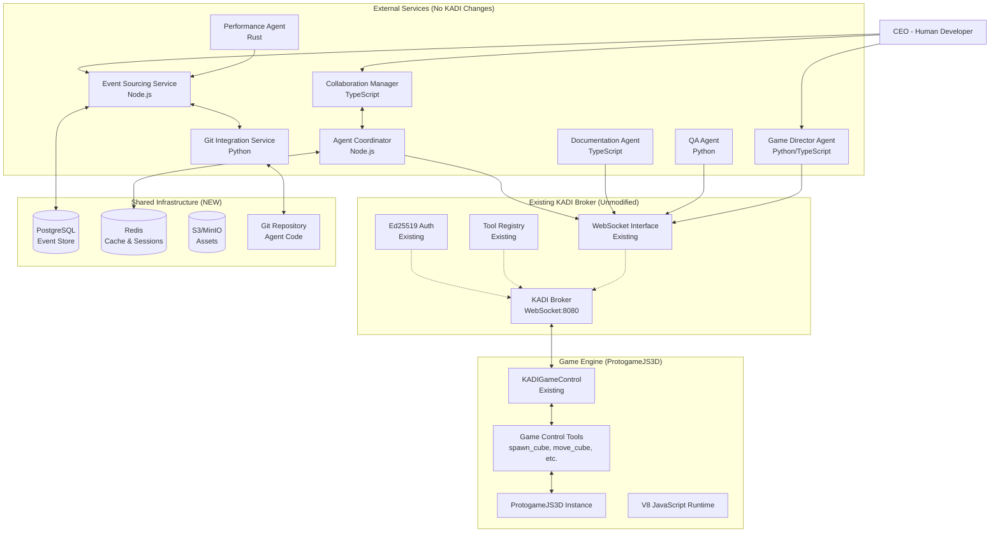

### Component Layers

#### Layer 1: External Service Layer (NEW)
- **Purpose**: All new multi-agent functionality built externally
- **Technology**: Multi-language (Python, TypeScript, Rust, Node.js)
- **Communication**: Uses existing KADI WebSocket APIs
- **Key Services**:
  - **Agent Coordinator**: Manages agent registration and task assignment
  - **Event Sourcing Service**: Handles event storage and replay
  - **Git Integration Service**: Version control for agent code
  - **Collaboration Manager**: Real-time presence and conflict resolution
  - **Performance Agent (Rust)**: Zero-overhead monitoring

#### Layer 2: Existing KADI Broker (UNMODIFIED)
- **Purpose**: Message routing and tool discovery (existing functionality)
- **Technology**: Node.js/TypeScript (existing)
- **Existing Features Used**:
  - **WebSocket Interface**: `ws://kadi.build:8080`
  - **Tool Registry**: Register and discover tools
  - **Ed25519 Authentication**: Agent authentication
  - **JSON-RPC 2.0 Protocol**: Communication format
- **No Changes Required**: All new services work with existing APIs

#### Layer 3: Game Engine Integration (PROTogameJS3D)
- **Purpose**: Execute game logic and rendering
- **Technology**: C++ with V8 JavaScript runtime
- **Existing Integration**: KADIGameControl subsystem with tools:
  - `spawn_cube`: Create game entities
  - `move_cube`: Update entity positions
  - `get_game_state`: Query current state
  - `remove_cube`: Delete entities

#### Layer 4: Shared Infrastructure (NEW)
- **PostgreSQL**: Event store for game state changes
- **Redis**: Session caching, presence tracking, task queues
- **S3/MinIO**: Asset storage (models, textures, scripts)
- **Git Repository**: Version control for agent source code

### Why This Architecture Works

**✅ No KADI Broker Modifications**:
- Uses existing WebSocket connection: `ws://kadi.build:8080`
- Leverages existing tool registration system
- Uses existing JSON-RPC 2.0 protocol
- Maintains backward compatibility

**✅ External Service Benefits**:
- Independent scaling and deployment
- No impact on existing KADI broker functionality
- Can be developed and tested separately
- Clear separation of concerns

**✅ Multi-Language Support**:
- **Python**: Game Director, QA Agent, Git Integration
- **TypeScript**: Documentation, Collaboration Manager
- **Rust**: Performance monitoring (zero overhead)
- **Node.js**: Agent Coordinator, Event Sourcing
- **JavaScript**: Existing ProtogameJS3D integration

---

## Agent Roles & Capabilities

### 1. Game Designer Agent

**Primary Language**: Python / TypeScript
**Purpose**: Translate high-level concepts into detailed game design documents

**Registered Tools**:

```json
{
  "name": "create_game_design_doc",
  "description": "Create structured game design document from concept",
  "inputSchema": {
    "type": "object",
    "properties": {
      "concept": {"type": "string"},
      "genre": {"type": "string", "enum": ["platformer", "fps", "puzzle", "sports"]},
      "targetPlatform": {"type": "string"}
    }
  }
}
```

```json
{
  "name": "define_game_mechanic",
  "description": "Define specific gameplay mechanic with rules and parameters",
  "inputSchema": {
    "type": "object",
    "properties": {
      "mechanicName": {"type": "string"},
      "rules": {"type": "array", "items": {"type": "string"}},
      "parameters": {"type": "object"}
    }
  }
}
```

```json
{
  "name": "create_level_layout",
  "description": "Design level layout with entity placement",
  "inputSchema": {
    "type": "object",
    "properties": {
      "levelName": {"type": "string"},
      "entities": {
        "type": "array",
        "items": {
          "type": "object",
          "properties": {
            "type": {"type": "string"},
            "position": {"type": "array", "items": {"type": "number"}}
          }
        }
      }
    }
  }
}
```

**Capabilities**:
- Parse natural language game concepts
- Generate structured design documents
- Define game mechanics, rules, win conditions
- Create level layouts and entity placements
- Coordinate with other agents to validate feasibility

**Integration**: KADI Protocol, writes to PostgreSQL (game_projects, design_docs tables)

---

### 2. Graphics/Rendering Agent

**Primary Language**: C++
**Purpose**: Handle rendering pipeline, shaders, visual effects, model integration

**Registered Tools**:

```json
{
  "name": "create_shader",
  "description": "Create HLSL shader with specified effects",
  "inputSchema": {
    "type": "object",
    "properties": {
      "shaderName": {"type": "string"},
      "shaderType": {"type": "string", "enum": ["vertex", "pixel", "compute"]},
      "effects": {"type": "array", "items": {"type": "string"}}
    }
  }
}
```

```json
{
  "name": "optimize_rendering",
  "description": "Optimize rendering pipeline for performance",
  "inputSchema": {
    "type": "object",
    "properties": {
      "targetFPS": {"type": "number"},
      "techniques": {"type": "array", "items": {"type": "string"}}
    }
  }
}
```

```json
{
  "name": "configure_lighting",
  "description": "Set up scene lighting with shadows and ambient occlusion",
  "inputSchema": {
    "type": "object",
    "properties": {
      "lightType": {"type": "string", "enum": ["directional", "point", "spot"]},
      "intensity": {"type": "number"},
      "color": {"type": "array", "items": {"type": "number"}}
    }
  }
}
```

**Capabilities**:
- Generate HLSL shaders (vertex, pixel, compute)
- Configure DirectX rendering pipeline
- Optimize draw calls and batching
- Set up lighting, shadows, post-processing
- Integrate 3D models and textures

**Integration**: Direct Engine API access (RendererAPI), EntityAPI for visual components

---

### 3. Gameplay Programmer Agent

**Primary Language**: JavaScript (V8 Runtime)
**Purpose**: Implement game logic, mechanics, behaviors in hot-reloadable scripts

**Registered Tools**:

```json
{
  "name": "implement_game_mechanic",
  "description": "Implement gameplay mechanic as JavaScript system",
  "inputSchema": {
    "type": "object",
    "properties": {
      "mechanicName": {"type": "string"},
      "systemCode": {"type": "string"},
      "dependencies": {"type": "array", "items": {"type": "string"}}
    }
  }
}
```

```json
{
  "name": "add_entity_behavior",
  "description": "Add behavior script to entity",
  "inputSchema": {
    "type": "object",
    "properties": {
      "entityId": {"type": "number"},
      "behaviorScript": {"type": "string"}
    }
  }
}
```

```json
{
  "name": "configure_game_mode",
  "description": "Set up game mode with rules and state management",
  "inputSchema": {
    "type": "object",
    "properties": {
      "modeName": {"type": "string"},
      "initialState": {"type": "object"},
      "transitions": {"type": "array"}
    }
  }
}
```

**Capabilities**:
- Write JavaScript game systems (JSEngine.registerSystem)
- Implement entity behaviors and scripts
- Handle input processing and controls
- Manage game state and progression
- Hot-reload game logic without C++ recompilation

**Integration**: V8 subsystem, EntityAPI (via EntityScriptInterface), CameraAPI (via CameraScriptInterface)

---

### 4. QA/Testing Agent

**Primary Language**: Python / TypeScript
**Purpose**: Automated testing, validation, performance profiling

**Registered Tools**:

```json
{
  "name": "run_test_suite",
  "description": "Execute automated test suite and generate report",
  "inputSchema": {
    "type": "object",
    "properties": {
      "testScope": {"type": "string", "enum": ["unit", "integration", "performance"]},
      "testFiles": {"type": "array", "items": {"type": "string"}}
    }
  }
}
```

```json
{
  "name": "validate_game_mechanic",
  "description": "Test specific game mechanic against design spec",
  "inputSchema": {
    "type": "object",
    "properties": {
      "mechanicName": {"type": "string"},
      "testScenarios": {"type": "array"}
    }
  }
}
```

```json
{
  "name": "profile_performance",
  "description": "Measure FPS, memory usage, CPU load",
  "inputSchema": {
    "type": "object",
    "properties": {
      "durationSeconds": {"type": "number"},
      "captureMetrics": {"type": "array", "items": {"type": "string"}}
    }
  }
}
```

**Capabilities**:
- Execute test scripts via KADI tools
- Validate gameplay mechanics against design specs
- Capture screenshots and compare visual output
- Profile performance (FPS, memory, CPU)
- Generate test reports with pass/fail status

**Integration**: KADI Protocol, reads/writes test_results table, invokes game control tools

---

### 5. UI Agent

**Primary Language**: JavaScript / HTML5 Canvas
**Purpose**: Design and implement user interfaces (menus, HUD, dialogs)

**Registered Tools**:

```json
{
  "name": "create_menu",
  "description": "Create interactive menu with navigation",
  "inputSchema": {
    "type": "object",
    "properties": {
      "menuName": {"type": "string"},
      "items": {"type": "array", "items": {"type": "object"}},
      "layout": {"type": "string", "enum": ["vertical", "horizontal", "grid"]}
    }
  }
}
```

```json
{
  "name": "design_hud",
  "description": "Design heads-up display with game info",
  "inputSchema": {
    "type": "object",
    "properties": {
      "elements": {"type": "array"},
      "positions": {"type": "object"}
    }
  }
}
```

**Capabilities**:
- Create menu systems (main menu, pause menu, settings)
- Design HUD elements (health bars, score, timers)
- Implement dialog boxes and tooltips
- Handle UI input and navigation

**Integration**: RendererAPI for 2D overlay, JavaScript UI framework

---

### 6. Physics Programmer Agent

**Primary Language**: C++
**Purpose**: Implement physics simulation, collision detection, rigid body dynamics

**Registered Tools**:

```json
{
  "name": "add_rigidbody",
  "description": "Add rigid body component to entity",
  "inputSchema": {
    "type": "object",
    "properties": {
      "entityId": {"type": "number"},
      "mass": {"type": "number"},
      "friction": {"type": "number"},
      "restitution": {"type": "number"}
    }
  }
}
```

```json
{
  "name": "configure_collision",
  "description": "Set up collision detection between entities",
  "inputSchema": {
    "type": "object",
    "properties": {
      "entityA": {"type": "number"},
      "entityB": {"type": "number"},
      "collisionType": {"type": "string", "enum": ["AABB", "sphere", "mesh"]}
    }
  }
}
```

```json
{
  "name": "apply_force",
  "description": "Apply force or impulse to rigid body",
  "inputSchema": {
    "type": "object",
    "properties": {
      "entityId": {"type": "number"},
      "force": {"type": "array", "items": {"type": "number"}},
      "forceType": {"type": "string", "enum": ["continuous", "impulse"]}
    }
  }
}
```

**Capabilities**:
- Add rigid body components to entities
- Configure collision shapes and detection
- Implement physics constraints (joints, springs)
- Apply forces, torques, impulses
- Optimize physics simulation performance

**Integration**: Engine Physics Module (future), EntityAPI for physics components

---

### 7. AI Programmer Agent

**Primary Language**: Python
**Purpose**: Implement AI behaviors, decision-making, machine learning integration

**Registered Tools**:

```json
{
  "name": "create_behavior_tree",
  "description": "Create behavior tree for AI entity",
  "inputSchema": {
    "type": "object",
    "properties": {
      "entityId": {"type": "number"},
      "rootNode": {"type": "object"},
      "blackboard": {"type": "object"}
    }
  }
}
```

```json
{
  "name": "define_fsm",
  "description": "Define finite state machine for AI",
  "inputSchema": {
    "type": "object",
    "properties": {
      "entityId": {"type": "number"},
      "states": {"type": "array"},
      "transitions": {"type": "array"}
    }
  }
}
```

```json
{
  "name": "train_ml_model",
  "description": "Train machine learning model for AI behavior",
  "inputSchema": {
    "type": "object",
    "properties": {
      "modelType": {"type": "string", "enum": ["neural_network", "decision_tree", "reinforcement"]},
      "trainingData": {"type": "object"}
    }
  }
}
```

**Capabilities**:
- Create behavior trees for complex AI
- Implement finite state machines
- Integrate machine learning models (TensorFlow, PyTorch)
- Design pathfinding and navigation
- Tune AI difficulty and balance

**Integration**: KADI Protocol, behavior state database, invokes gameplay tools for AI control

---

### 8. Rust Performance Agent

**Primary Language**: Rust
**Purpose**: Zero-overhead performance monitoring, bottleneck detection, and automated optimization suggestions

**Technical Advantages**:
- **Memory Safety**: No garbage collection pauses affecting game performance
- **Zero-Cost Abstractions**: Efficient data processing without runtime overhead
- **Async/Await**: Non-blocking monitoring tasks using tokio
- **Systems Programming**: Direct system integration for low-level metrics

**Registered Tools**:

```json
{
  "name": "monitor_performance",
  "description": "Continuously monitor game performance metrics",
  "inputSchema": {
    "type": "object",
    "properties": {
      "monitoringInterval": {"type": "number", "default": 1000},
      "metrics": {
        "type": "array",
        "items": {"type": "string", "enum": ["fps", "memory", "cpu", "draw_calls", "audio"]}
      }
    }
  }
}
```

```json
{
  "name": "detect_bottlenecks",
  "description": "Identify performance bottlenecks in game systems",
  "inputSchema": {
    "type": "object",
    "properties": {
      "analysisDuration": {"type": "number", "default": 5000},
      "focusArea": {"type": "string", "enum": ["rendering", "physics", "audio", "scripts"]}
    }
  }
}
```

```json
{
  "name": "suggest_optimizations",
  "description": "Generate automated optimization suggestions",
  "inputSchema": {
    "type": "object",
    "properties": {
      "targetFPS": {"type": "number"},
      "priorityAreas": {"type": "array", "items": {"type": "string"}}
    }
  }
}
```

**Capabilities**:
- **Real-time Performance Monitoring**: Track FPS, memory usage, CPU load without impacting game performance
- **Bottleneck Detection**: Identify rendering stalls, script execution delays, memory leaks
- **Automated Optimization**: Suggest shader improvements, entity culling, asset compression
- **Historical Analysis**: Track performance trends across development sessions
- **Alert System**: Notify when performance drops below thresholds

**Architecture Integration**:
```rust
// Rust Agent Structure
pub struct RustPerformanceAgent {
    event_receiver: Receiver<GameEvent>,
    metrics_collector: MetricsCollector,
    optimization_engine: OptimizationEngine,
    kadi_bridge: KADIBridge,
    performance_buffer: RingBuffer<PerformanceSnapshot>,
}

impl RustPerformanceAgent {
    pub async fn monitor_performance(&mut self) -> Result<(), AgentError> {
        while let Some(event) = self.event_receiver.recv().await {
            let snapshot = self.metrics_collector.collect(&event).await?;
            self.performance_buffer.push(snapshot.clone());

            if self.optimization_engine.should_analyze(&snapshot) {
                let suggestions = self.optimization_engine.generate_suggestions(&snapshot);
                self.kadi_bridge.send_optimization_suggestions(suggestions).await?;
            }
        }
        Ok(())
    }
}
```

**Integration Points**:
- **Event Sourcing Service**: Subscribes to game events for performance context
- **V8 Bridge Interface**: Monitors JavaScript execution performance
- **Entity System Metrics**: Tracks entity count, update times, memory usage
- **Rendering Metrics**: Monitors draw calls, shader compilation, texture memory
- **Audio System Stats**: Tracks active channels, CPU usage

**Performance Metrics Tracked**:
```rust
#[derive(Debug, Clone, Serialize)]
pub struct PerformanceMetrics {
    // Frame metrics
    pub frame_time_ms: f64,
    pub fps: f32,
    pub frame_time_variance: f64,

    // Memory metrics
    pub memory_usage_mb: u64,
    pub v8_heap_size: u64,
    pub gc_pause_ms: f64,

    // Entity metrics
    pub entity_count: u32,
    pub active_entities: u32,
    pub entity_update_time_ms: f64,

    // Rendering metrics
    pub draw_calls: u32,
    pub triangles_rendered: u32,
    pub shader_switches: u32,

    // Audio metrics
    pub active_sources: u16,
    pub audio_cpu_usage: f32,

    // System metrics
    pub cpu_usage_percent: f64,
    pub gpu_usage_percent: f64,
    pub network_latency_ms: f64,
}
```

**Communication Path**:
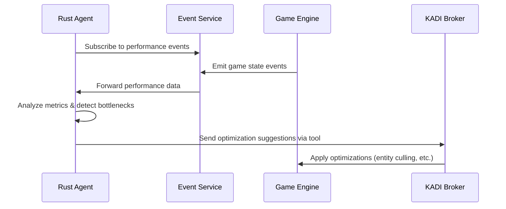

---

## Enhanced Version Control Strategy

### Git + Event Sourcing Hybrid Approach

**Overview**: Different artifacts use different version control strategies based on their nature and requirements

```mermaid
graph TB
    subgraph "Version Control Layers"
        GIT_LAYER[Git Repository Layer<br/>Source Code & Configs]
        EVENT_LAYER[Event Sourcing Layer<br/>Game State Changes]
        STATE_LAYER[Game State Layer<br/>Runtime State]
    end

    subgraph "Agent Artifacts"
        AGENT_CODE[Agent Source Code<br/>Python, TypeScript, Rust, C++]
        AGENT_CONFIG[Agent Configurations<br/>JSON, YAML files]
        AGENT_SCRIPTS[Generated Scripts<br/>JavaScript, HLSL]
    end

    subgraph "Game Artifacts"
        GAME_CODE[Game Engine Code<br/>C++ (ProtogameJS3D)]
        GAME_ASSETS[Game Assets<br/>Models, Textures, Audio]
        GAME_CONFIG[Game Configuration<br/>JSON, XML]
    end

    subgraph "Collaboration Artifacts"
        COMMITS[Git Commits History<br/>Code changes]
        EVENTS[Event Stream<br/>Immutable state changes]
        SNAPSHOTS[State Snapshots<br/>Performance optimizations]
    end

    AGENT_CODE --> GIT_LAYER
    AGENT_CONFIG --> GIT_LAYER
    AGENT_SCRIPTS --> GIT_LAYER

    GAME_CODE --> GIT_LAYER
    GAME_ASSETS --> GIT_LAYER
    GAME_CONFIG --> EVENT_LAYER

    GIT_LAYER --> COMMITS
    EVENT_LAYER --> EVENTS
    STATE_LAYER --> SNAPSHOTS
```

### Version Control Strategy by Artifact Type

**1. Agent Source Code (Git)**
```bash
# Repository structure
agents/
├── game-director/          # Main branch: main
│   ├── src/
│   │   ├── agent.py
│   │   └── tools/
│   ├── tests/
│   └── README.md
├── qa-agent/              # Main branch: main
│   ├── src/
│   │   ├── agent.py
│   │   └── test_suites/
│   └── tests/
├── rust-performance/      # Main branch: main
│   ├── src/
│   │   ├── lib.rs
│   │   ├── metrics.rs
│   │   └── optimization.rs
│   └── Cargo.toml
└── coordination/          # Main branch: main
    ├── src/
    └── package.json
```

**Git Workflow for Agents**:
```bash
# Feature development
git checkout -b feature/performance-monitoring
# ... develop feature ...
git commit -m "Add real-time FPS monitoring"
git push origin feature/performance-monitoring
# Create pull request
# Code review and merge to main
```

**2. Game State Changes (Event Sourcing)**
```javascript
// Event examples stored in PostgreSQL
{
    "timestamp": "2025-01-15T10:30:00Z",
    "agent": "game-director",
    "event_type": "entity_spawned",
    "data": {
        "entity_id": "cube_001",
        "position": [0, 5, 0],
        "color": "red",
        "mesh_type": "cube"
    },
    "git_commit": "abc123",  // Reference to agent code version
    "event_id": "evt_789"
}

{
    "timestamp": "2025-01-15T10:31:15Z",
    "agent": "rust-performance",
    "event_type": "optimization_applied",
    "data": {
        "optimization_type": "entity_culling",
        "affected_entities": [42, 43, 44],
        "performance_improvement": "+15% FPS"
    },
    "git_commit": "def456",
    "event_id": "evt_790"
}
```

**3. Agent Decisions (Hybrid Storage)**
```javascript
// Stored in both Git and event stream for traceability
// Git: agents/decisions/2025-01-15_entity_removal.json
{
    "decision_id": "dec_001",
    "agent": "qa-agent",
    "timestamp": "2025-01-15T10:32:00Z",
    "action": "request_entity_removal",
    "reason": "collision_detected_between_cube_001_and_cube_002",
    "entity_id": "cube_002",
    "analysis": {
        "collision_point": [2.5, 0.0, 0.0],
        "severity": "high",
        "impact": "physics_instability"
    },
    "git_commit": "ghi789"
}

// Event stream reference
{
    "timestamp": "2025-01-15T10:32:00Z",
    "agent": "qa-agent",
    "event_type": "decision_made",
    "data": {
        "decision_id": "dec_001",
        "git_commit": "ghi789"
    },
    "event_id": "evt_791"
}
```

### Branching Strategy for Multi-Agent Development

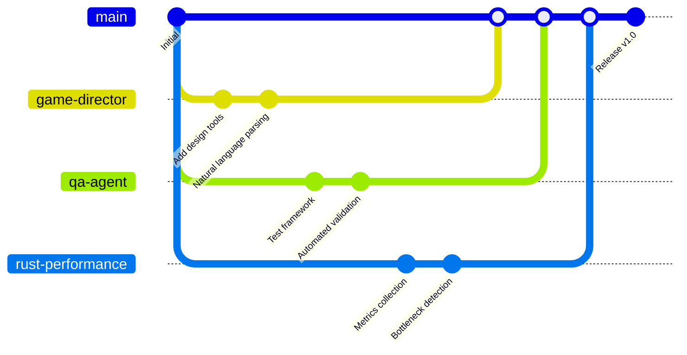

### Version Control Integration

**Git Integration Service (Python)**:
```python
class GitIntegrationService:
    def __init__(self, repo_path: str):
        self.repo = git.Repo(repo_path)
        self.event_store = EventStore()

    async def commit_agent_decision(self, agent_id: str, decision: dict):
        """Commit agent decision to Git and store reference in event store"""
        # Create decision file
        decision_file = f"decisions/{datetime.now().isoformat()}_decision.json"
        with open(f"{self.repo.working_dir}/{decision_file}", 'w') as f:
            json.dump(decision, f, indent=2)

        # Stage and commit
        self.repo.index.add([decision_file])
        commit = self.repo.index.commit(f"{agent_id}: {decision['action']}")

        # Store reference in event store
        await self.event_store.append_event({
            'event_type': 'agent_decision_committed',
            'agent_id': agent_id,
            'git_commit': commit.hexsha,
            'decision_file': decision_file,
            'timestamp': datetime.now().isoformat()
        })

        return commit.hexsha

    async def tag_milestone(self, milestone_name: str, event_ids: List[str]):
        """Tag a milestone with associated events"""
        # Create tag
        tag = self.repo.create_tag(milestone_name, message=f"Milestone: {milestone_name}")

        # Store milestone reference
        await self.event_store.append_event({
            'event_type': 'milestone_tagged',
            'milestone': milestone_name,
            'git_tag': tag.name,
            'associated_events': event_ids,
            'timestamp': datetime.now().isoformat()
        })

        return tag.name
```

### Benefits of Hybrid Approach

**Git Benefits**:
- **Standard Version Control**: Familiar workflow for developers
- **Code Review**: Pull requests and code reviews
- **Branching**: Feature development isolation
- **History**: Complete change history for source code
- **Collaboration**: Multiple developers working on same codebase

**Event Sourcing Benefits**:
- **Immutable State**: Complete audit trail of game changes
- **Time Travel**: Debug by replaying events
- **Replay**: Reproduce bugs or demonstrate features
- **Analytics**: Analyze development patterns and bottlenecks
- **State Reconstruction**: Build any historical state

**Hybrid Benefits**:
- **Best of Both Worlds**: Code versioning + state tracking
- **Traceability**: Link decisions to code changes and state effects
- **Debugging**: Know which code version caused which state changes
- **Analytics**: Correlate code changes with performance impact
- **Recovery**: Roll back both code and state if needed

---

## Communication Protocol

### KADI Protocol Overview

**Protocol**: JSON-RPC 2.0
**Transport**: WebSocket
**Authentication**: Ed25519 signature (agents), none (MCP clients)

### Message Types

#### 1. Agent Registration

**Purpose**: Agent registers capabilities with broker

**Message Flow**:
```
Agent → Broker: kadi.agent.register
Broker → Agent: registered (confirmation)
Broker → All Observers: agent_registered (notification)
```

**Example**:
```json
{
  "jsonrpc": "2.0",
  "method": "kadi.agent.register",
  "params": {
    "publicKey": "ed25519:abcd1234...",
    "displayName": "Gameplay Programmer Agent",
    "agentType": "gameplay_programmer",
    "tools": [
      {
        "name": "implement_game_mechanic",
        "description": "Implement gameplay mechanic as JavaScript system",
        "inputSchema": {
          "type": "object",
          "properties": {
            "mechanicName": {"type": "string"},
            "systemCode": {"type": "string"},
            "dependencies": {"type": "array", "items": {"type": "string"}}
          },
          "required": ["mechanicName", "systemCode"]
        },
        "outputSchema": {
          "type": "object",
          "properties": {
            "success": {"type": "boolean"},
            "systemId": {"type": "string"},
            "errors": {"type": "array", "items": {"type": "string"}}
          }
        }
      }
    ],
    "networks": ["game-dev", "pong-project"],
    "routingTags": ["javascript", "gameplay", "hot-reload"],
    "capabilities": {
      "languages": ["javascript"],
      "frameworks": ["v8", "jsengine"],
      "maxConcurrentTasks": 5
    }
  },
  "id": 1
}
```

**Response**:
```json
{
  "jsonrpc": "2.0",
  "result": {
    "status": "registered",
    "sessionId": "sess_abc123",
    "agentId": "agent_gameplay_001",
    "assignedNetworks": ["game-dev", "pong-project"]
  },
  "id": 1
}
```

---

#### 2. Tool Invocation (Request-Response)

**Purpose**: One agent invokes another agent's tool

**Message Flow**:
```
Client Agent → Broker: kadi.ability.request
Broker → ToolRegistry: findProviders(tool, networks)
Broker → Provider Agent: execute_tool
Provider Agent → Broker: kadi.ability.result
Broker → Client Agent: result (forwarded)
```

**Example Request**:
```json
{
  "jsonrpc": "2.0",
  "method": "kadi.ability.request",
  "params": {
    "name": "implement_game_mechanic",
    "toolInput": {
      "mechanicName": "paddle_movement",
      "systemCode": "class PaddleMovement { update() { /* ... */ } }",
      "dependencies": ["InputSystem"]
    },
    "preferredNetwork": "pong-project",
    "routingTags": ["javascript", "hot-reload"],
    "timeout": 30000
  },
  "id": 5
}
```

**Example Response**:
```json
{
  "jsonrpc": "2.0",
  "result": {
    "success": true,
    "systemId": "PaddleMovement_v1",
    "errors": []
  },
  "id": 5
}
```

---

#### 3. Event Publication (Pub-Sub)

**Purpose**: Broadcast events to subscribers

**Message Flow**:
```
Publisher Agent → Broker: kadi.event.publish
Broker → All Subscribers: event (forwarded)
```

**Example Event**:
```json
{
  "jsonrpc": "2.0",
  "method": "kadi.event.publish",
  "params": {
    "eventType": "game_mechanic_implemented",
    "eventData": {
      "mechanicName": "paddle_movement",
      "systemId": "PaddleMovement_v1",
      "timestamp": "2025-10-28T12:30:00Z",
      "implementedBy": "agent_gameplay_001"
    },
    "networks": ["pong-project"],
    "tags": ["milestone", "gameplay"]
  }
}
```

---

#### 4. Task Assignment (Workflow)

**Purpose**: Workflow Orchestrator assigns tasks to agents

**Message Flow**:
```
Workflow Orchestrator → Task Queue: enqueue(task)
Task Queue → RabbitMQ: publish(agent.{agentId}, task)
Agent → Broker: kadi.task.accept
Agent → Broker: kadi.task.complete (or kadi.task.fail)
Broker → Workflow Orchestrator: update task status
```

**Example Task Assignment**:
```json
{
  "jsonrpc": "2.0",
  "method": "kadi.task.assign",
  "params": {
    "taskId": "task_001",
    "taskType": "implement_mechanic",
    "priority": 8,
    "assignedAgent": "agent_gameplay_001",
    "input": {
      "mechanicName": "ball_physics",
      "designSpec": "Ball should bounce off paddles and walls with realistic physics"
    },
    "dependencies": ["task_002"],
    "deadline": "2025-10-28T18:00:00Z"
  }
}
```

**Example Task Completion**:
```json
{
  "jsonrpc": "2.0",
  "method": "kadi.task.complete",
  "params": {
    "taskId": "task_001",
    "result": {
      "success": true,
      "output": {
        "systemId": "BallPhysics_v1",
        "scriptPath": "Run/Data/Scripts/BallPhysics.js"
      }
    }
  }
}
```

---

### Network Isolation

**Purpose**: Multi-tenancy and access control

**Networks**:
- `global`: Public tools available to all agents
- `game-dev`: General game development tools
- `pong-project`: Project-specific network for Pong game
- `platformer-project`: Project-specific network for Platformer game

**Access Control**:
- Agents register with specific networks
- Tool invocations restricted to accessible networks
- Events broadcast only to network subscribers

---

## Enhanced Visualization Suite

### Agent Collaboration Timeline

```mermaid
gantt
    title Multi-Agent Game Development Timeline
    dateFormat HH:mm:ss
    axisFormat %H:%M:%S

    section Game Director Agent
    Analyze Current State      :gd1, 10:00:00, 5s
    Design Entity Spawning     :gd2, after gd1, 3s
    Monitor Progress          :gd3, after gd2, 10s
    Review Results            :gd4, after gd3, 2s

    section QA Agent
    Watch for Issues         :qa1, 10:01:00, 15s
    Detect Collision          :qa2, after qa1, 2s
    Request Fix              :qa3, after qa2, 1s
    Validate Fix             :qa4, after gd3, 5s

    section Documentation Agent
    Track Changes             :doc1, 10:00:30, 20s
    Update Documentation     :doc2, after doc1, 5s
    Generate Report           :doc3, after gd4, 3s

    section Rust Performance Agent
    Monitor Performance       :rust1, 10:00:00, 30s
    Analyze Metrics           :rust2, after rust1, 3s
    Suggest Optimizations     :rust3, after rust2, 2s
    Apply Optimizations       :rust4, after gd2, 4s

    section Agent Coordinator
    Sync Agents               :coord1, 10:00:00, 30s
    Resolve Conflicts         :coord2, after coord1, 5s
    Distribute Tasks          :coord3, after coord2, 2s
    Update Status             :coord4, after gd4, 1s

    section CEO (Human)
    Initial Request           :ceo1, 09:59:50, 10s
    Monitor Progress          :ceo2, after gd1, 25s
    Review Results            :ceo3, after doc3, 5s
    Provide Feedback          :ceo4, after ceo3, 2s
```

### Detailed Agent Interaction Flow

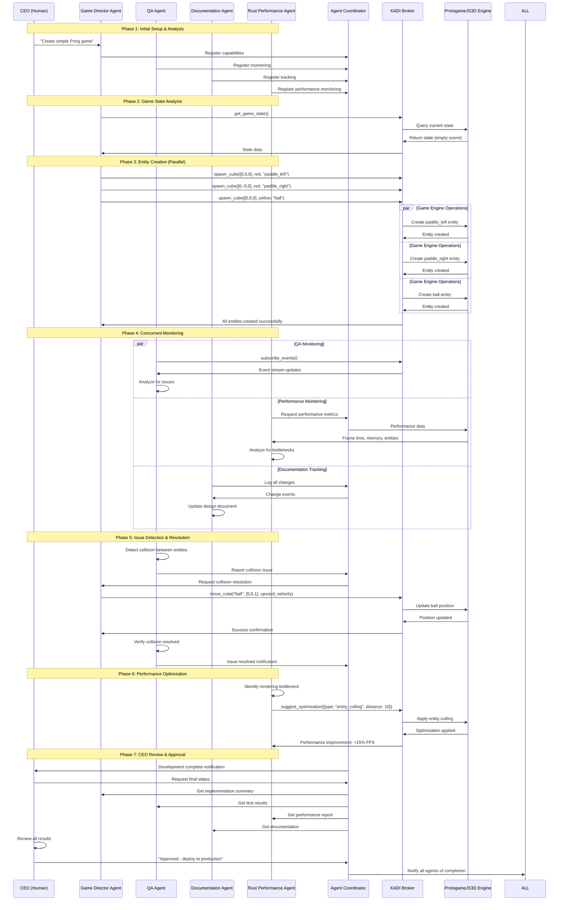

### Game Director Agent State Machine

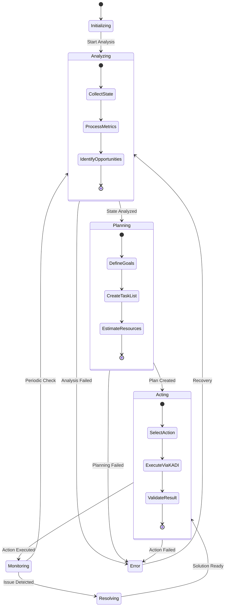

### Multi-Agent Coordination State Machine

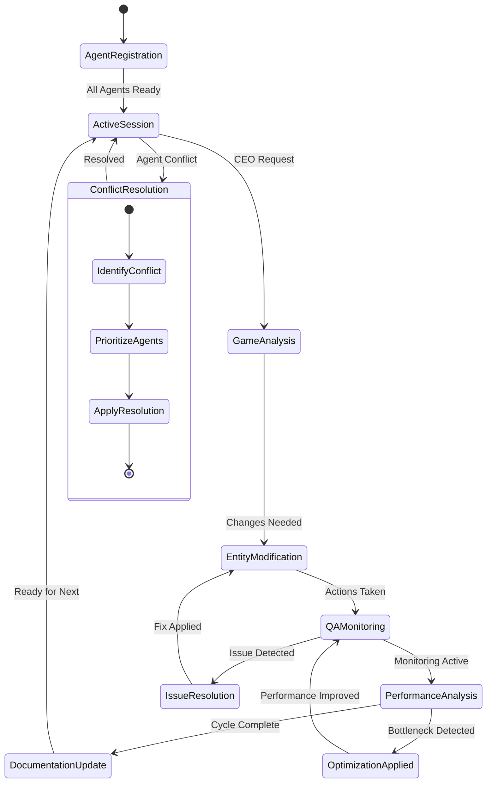

### External Service Deployment Architecture

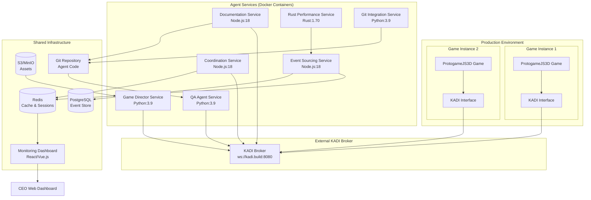

### Performance Monitoring Data Flow

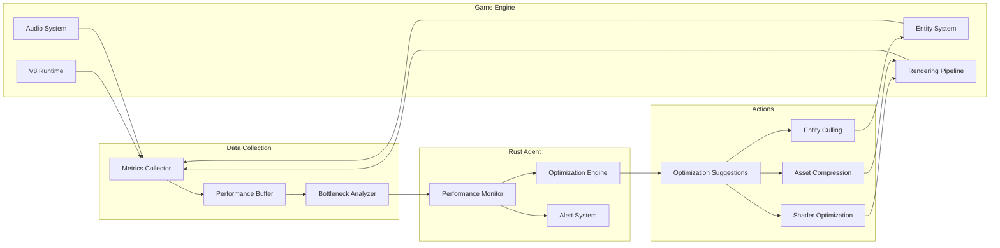

### Git Branching Strategy for Multi-Agent Development

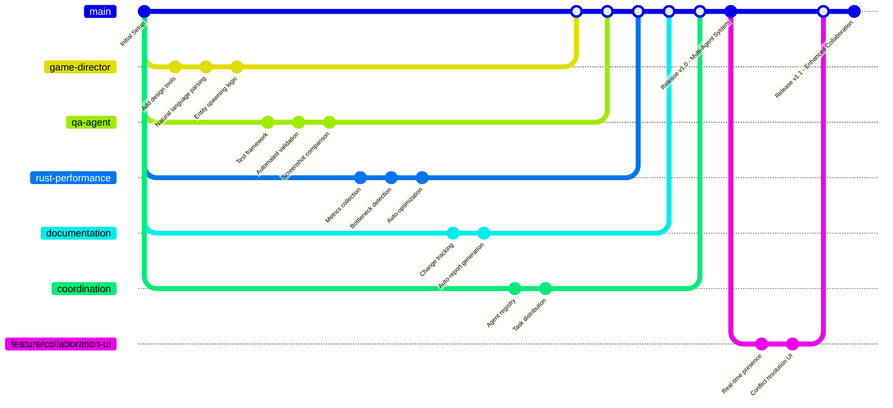

---

## Database Architecture

### Event Sourcing Model

**Core Concept**: Store all state changes as immutable events, rebuild projections by replaying events

**Benefits**:
- Complete audit trail
- Time-travel debugging
- Replay capability for bug reproduction
- Undo/redo coordination

### PostgreSQL Schema

#### Events Table (Event Store)

```sql
CREATE TABLE events (
    event_id BIGSERIAL PRIMARY KEY,
    aggregate_id UUID NOT NULL,
    aggregate_type VARCHAR(50) NOT NULL,  -- 'entity', 'project', 'task', 'agent'
    event_type VARCHAR(100) NOT NULL,     -- 'EntityCreated', 'TaskCompleted', etc.
    event_data JSONB NOT NULL,
    metadata JSONB,                       -- {agentId, userId, correlationId, causationId}
    agent_id VARCHAR(50),
    timestamp TIMESTAMPTZ NOT NULL DEFAULT NOW(),
    version INTEGER NOT NULL,             -- Optimistic concurrency control

    INDEX idx_aggregate (aggregate_id, version),
    INDEX idx_event_type (event_type),
    INDEX idx_timestamp (timestamp),
    INDEX idx_agent_id (agent_id)
);

-- Partition by timestamp for performance
CREATE TABLE events_2025_10 PARTITION OF events
    FOR VALUES FROM ('2025-10-01') TO ('2025-11-01');
```

**Example Events**:

```sql
-- EntityCreated event
INSERT INTO events (aggregate_id, aggregate_type, event_type, event_data, metadata, agent_id, version)
VALUES (
    'ent_001',
    'entity',
    'EntityCreated',
    '{"entityType": "cube", "position": [5, 0, 0], "color": "red", "meshType": "cube"}',
    '{"agentId": "agent_gameplay_001", "correlationId": "task_001"}',
    'agent_gameplay_001',
    1
);

-- TaskCompleted event
INSERT INTO events (aggregate_id, aggregate_type, event_type, event_data, metadata, agent_id, version)
VALUES (
    'task_001',
    'task',
    'TaskCompleted',
    '{"taskId": "task_001", "result": {"success": true, "systemId": "PaddleMovement_v1"}}',
    '{"agentId": "agent_gameplay_001", "duration": 1200}',
    'agent_gameplay_001',
    3
);
```

---

#### Projections (Read Models)

**game_projects Table**:
```sql
CREATE TABLE game_projects (
    project_id UUID PRIMARY KEY,
    name VARCHAR(200) NOT NULL,
    owner_id UUID,
    genre VARCHAR(50),
    status VARCHAR(20),  -- 'planning', 'development', 'testing', 'completed'
    state JSONB,         -- Current project state snapshot
    created_at TIMESTAMPTZ NOT NULL,
    updated_at TIMESTAMPTZ NOT NULL,

    INDEX idx_owner (owner_id),
    INDEX idx_status (status)
);
```

**entities Table**:
```sql
CREATE TABLE entities (
    entity_id BIGINT PRIMARY KEY,
    project_id UUID REFERENCES game_projects(project_id) ON DELETE CASCADE,
    entity_type VARCHAR(50),
    state JSONB,         -- {position, rotation, scale, meshType, color, ...}
    created_by VARCHAR(50),
    created_at TIMESTAMPTZ NOT NULL,
    updated_at TIMESTAMPTZ NOT NULL,
    deleted_at TIMESTAMPTZ,  -- Soft delete

    INDEX idx_project (project_id),
    INDEX idx_type (entity_type),
    INDEX idx_deleted (deleted_at)
);
```

**tasks Table**:
```sql
CREATE TABLE tasks (
    task_id UUID PRIMARY KEY,
    project_id UUID REFERENCES game_projects(project_id) ON DELETE CASCADE,
    task_type VARCHAR(100),
    description TEXT,
    status VARCHAR(20),      -- 'pending', 'assigned', 'in_progress', 'validation', 'completed', 'failed'
    priority INTEGER,        -- 1-10 (10 = highest)
    assigned_agent VARCHAR(50),
    input_data JSONB,
    result_data JSONB,
    dependencies UUID[],     -- Array of task IDs
    error_message TEXT,
    retry_count INTEGER DEFAULT 0,
    max_retries INTEGER DEFAULT 3,
    created_at TIMESTAMPTZ NOT NULL,
    updated_at TIMESTAMPTZ NOT NULL,
    assigned_at TIMESTAMPTZ,
    started_at TIMESTAMPTZ,
    completed_at TIMESTAMPTZ,
    deadline TIMESTAMPTZ,

    INDEX idx_project (project_id),
    INDEX idx_status (status),
    INDEX idx_assigned_agent (assigned_agent),
    INDEX idx_priority (priority DESC),
    INDEX idx_dependencies USING GIN (dependencies)
);
```

**agents Table**:
```sql
CREATE TABLE agents (
    agent_id VARCHAR(50) PRIMARY KEY,
    agent_type VARCHAR(50),
    display_name VARCHAR(200),
    capabilities JSONB,      -- {languages, frameworks, maxConcurrentTasks, ...}
    networks VARCHAR(50)[],
    routing_tags VARCHAR(50)[],
    status VARCHAR(20),      -- 'online', 'offline', 'busy', 'idle'
    current_tasks UUID[],
    last_seen TIMESTAMPTZ,
    metadata JSONB,

    INDEX idx_agent_type (agent_type),
    INDEX idx_status (status),
    INDEX idx_networks USING GIN (networks)
);
```

**snapshots Table** (Performance Optimization):
```sql
CREATE TABLE snapshots (
    snapshot_id VARCHAR(50) PRIMARY KEY,
    aggregate_id UUID NOT NULL,
    aggregate_type VARCHAR(50) NOT NULL,
    snapshot_data JSONB NOT NULL,
    event_version INTEGER NOT NULL,  -- Last event version included
    timestamp TIMESTAMPTZ NOT NULL DEFAULT NOW(),

    INDEX idx_aggregate (aggregate_id),
    INDEX idx_timestamp (timestamp)
);
```

---

### Redis Caching Strategy

**Key Patterns**:

```
session:{sessionId}                → Session state (TTL: 5 hours)
agent:{agentId}:capabilities       → Cached capabilities
agent:{agentId}:status             → Current status (online/offline/busy/idle)
project:{projectId}:snapshot       → Latest state snapshot
project:{projectId}:entities       → Set of entity IDs
queue:pending                      → Sorted set of pending task IDs (by priority)
queue:assigned:{agentId}           → List of tasks assigned to agent
presence:{projectId}:{agentId}     → Agent presence in project (TTL: 30s)
lock:{entityId}                    → Entity lock (TTL: 60s)
```

**Usage Examples**:

```javascript
// Session caching
await redis.setex(`session:${sessionId}`, 18000, JSON.stringify(sessionState));

// Task queue (sorted set by priority)
await redis.zadd('queue:pending', priority, taskId);
const topTasks = await redis.zrevrange('queue:pending', 0, 9);  // Top 10 tasks

// Entity locking
const lockAcquired = await redis.set(`lock:${entityId}`, agentId, 'NX', 'EX', 60);
if (lockAcquired) {
    // Agent has exclusive access for 60 seconds
}

// Presence tracking (heartbeat every 15s)
await redis.setex(`presence:${projectId}:${agentId}`, 30, JSON.stringify({
    status: 'editing',
    currentEntity: entityId,
    timestamp: Date.now()
}));
```

---

### S3/MinIO Blob Storage

**Bucket Structure**:

```
game-assets/
├── projects/{projectId}/
│   ├── models/         → 3D models (.obj, .fbx)
│   ├── textures/       → Texture images (.png, .jpg)
│   ├── audio/          → Audio files (.wav, .mp3)
│   ├── scripts/        → JavaScript files (.js)
│   └── shaders/        → HLSL shaders (.hlsl)
├── replays/{projectId}/
│   └── {replayId}.bin  → Event stream replays
└── screenshots/
    └── {screenshotId}.png
```

**Integration**:
- Graphics Agent uploads models/textures
- Gameplay Agent uploads scripts (with versioning)
- QA Agent captures screenshots and replay recordings

---

## Real-Time Collaboration

### Operational Transformation (OT) / CRDT Integration

**Technology**: Y.js (CRDT library for conflict-free merges)

**Shared State**:
- Scene graph (entity hierarchy)
- Entity properties (position, rotation, scale)
- Game configuration (rules, parameters)

**Y.js Document Structure**:

```javascript
const ydoc = new Y.Doc();
const yScene = ydoc.getMap('scene');
const yEntities = ydoc.getMap('entities');
const yGameConfig = ydoc.getMap('gameConfig');

// Example: Collaborative entity editing
yEntities.set('entity_001', new Y.Map([
    ['position', [5, 0, 0]],
    ['rotation', [0, 0, 0]],
    ['scale', [1, 1, 1]],
    ['color', 'red']
]));

// Observe changes from other agents
yEntities.observe(event => {
    event.changes.keys.forEach((change, key) => {
        if (change.action === 'update') {
            console.log(`Entity ${key} updated by remote agent`);
        }
    });
});
```

**Integration with KADI Broker**:

```javascript
// Agent publishes Y.js updates via KADI events
const update = Y.encodeStateAsUpdate(ydoc);
await kadiClient.publishEvent({
    eventType: 'yjs_update',
    eventData: { update: Array.from(update) },
    networks: [projectId]
});

// Agents receive and apply updates
kadiClient.on('yjs_update', event => {
    const update = new Uint8Array(event.eventData.update);
    Y.applyUpdate(ydoc, update);
});
```

---

### Presence Awareness

**Purpose**: Track what each agent is currently working on

**Presence Data Structure**:
```typescript
interface Presence {
    agentId: string;
    agentType: string;
    status: 'online' | 'offline' | 'busy' | 'idle';
    currentTask: string | null;
    focusedEntity: number | null;
    cursorPosition: [number, number, number] | null;  // 3D cursor
    lastUpdate: number;  // Timestamp
}
```

**Broadcast Mechanism**:
- Agents send heartbeat every 15 seconds
- Broker stores in Redis (`presence:{projectId}:{agentId}`, TTL: 30s)
- Broker broadcasts presence updates to all project subscribers

**Example**:
```json
{
  "jsonrpc": "2.0",
  "method": "kadi.presence.update",
  "params": {
    "projectId": "pong-project",
    "agentId": "agent_graphics_001",
    "status": "busy",
    "currentTask": "task_003",
    "focusedEntity": 42,
    "cursorPosition": [10.5, 2.3, 0.0]
  }
}
```

---

### Entity-Level Locking

**Purpose**: Prevent concurrent edits that could cause conflicts

**Lock Types**:
- **Exclusive Lock**: Only one agent can edit (writes)
- **Shared Lock**: Multiple agents can read but not write

**Lock Acquisition**:

```json
{
  "jsonrpc": "2.0",
  "method": "kadi.lock.acquire",
  "params": {
    "resourceType": "entity",
    "resourceId": "entity_042",
    "lockType": "exclusive",
    "requestedBy": "agent_graphics_001",
    "timeout": 60
  },
  "id": 10
}
```

**Response**:
```json
{
  "jsonrpc": "2.0",
  "result": {
    "lockAcquired": true,
    "lockId": "lock_abc123",
    "expiresAt": "2025-10-28T12:35:00Z"
  },
  "id": 10
}
```

**Lock Release**:
```json
{
  "jsonrpc": "2.0",
  "method": "kadi.lock.release",
  "params": {
    "lockId": "lock_abc123"
  }
}
```

**Auto-Release**: Locks expire after timeout or if agent disconnects

---

### Change Feed Subscription

**Purpose**: Real-time notification of entity/state changes

**Subscription**:
```json
{
  "jsonrpc": "2.0",
  "method": "kadi.subscribe",
  "params": {
    "subscriptionType": "entity_changes",
    "filters": {
      "projectId": "pong-project",
      "entityIds": [1, 2, 42],
      "changeTypes": ["position", "rotation", "scale"]
    }
  }
}
```

**Change Notification**:
```json
{
  "jsonrpc": "2.0",
  "method": "kadi.change_notification",
  "params": {
    "entityId": 42,
    "changeType": "position",
    "oldValue": [10.0, 0.0, 0.0],
    "newValue": [10.5, 0.0, 0.0],
    "changedBy": "agent_physics_001",
    "timestamp": "2025-10-28T12:34:56Z"
  }
}
```

---

### Conflict Resolution Strategies

**1. Last-Write-Wins (LWW)**:
- Use timestamp to determine winner
- Simple but may lose data

**2. Operational Transformation**:
- Transform concurrent operations to preserve intent
- Used by Y.js automatically

**3. Manual Merge**:
- Detect conflict, notify CEO for manual resolution
- Present both versions for comparison

**4. Property-Level Merging**:
- Different properties can be edited concurrently
- Example: Agent A changes position, Agent B changes color → Both applied

**Example Conflict Event**:
```json
{
  "jsonrpc": "2.0",
  "method": "kadi.conflict.detected",
  "params": {
    "conflictId": "conflict_001",
    "resourceType": "entity",
    "resourceId": "entity_042",
    "conflictType": "concurrent_edit",
    "operations": [
      {
        "agentId": "agent_graphics_001",
        "property": "color",
        "value": "blue",
        "timestamp": "2025-10-28T12:34:56.123Z"
      },
      {
        "agentId": "agent_gameplay_001",
        "property": "color",
        "value": "green",
        "timestamp": "2025-10-28T12:34:56.456Z"
      }
    ],
    "resolutionStrategy": "manual"
  }
}
```

---

## Workflow Orchestration

### Task State Machine

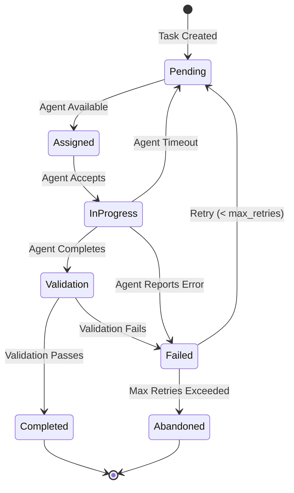

### Task Dependency Management

**Dependency Types**:
- **Sequential**: Task B starts after Task A completes
- **Parallel**: Tasks can execute concurrently
- **Conditional**: Task B starts only if Task A succeeds

**Example Dependency Graph**:

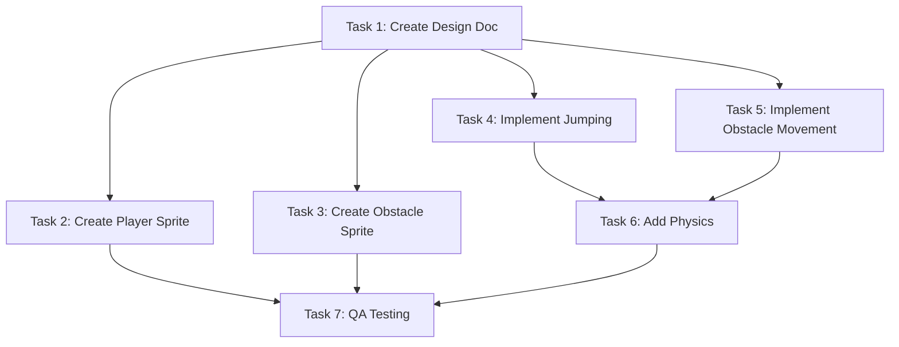

**Database Representation**:
```sql
-- Task dependencies stored as array
INSERT INTO tasks (task_id, dependencies, ...)
VALUES
    ('task_007', ARRAY['task_002', 'task_003', 'task_006'], ...);

-- Query ready tasks (all dependencies completed)
SELECT t.task_id
FROM tasks t
WHERE t.status = 'pending'
  AND NOT EXISTS (
      SELECT 1 FROM tasks d
      WHERE d.task_id = ANY(t.dependencies)
        AND d.status != 'completed'
  );
```

---

### Workflow Orchestrator Service

**Purpose**: Coordinate multi-step workflows, assign tasks, handle failures

**Key Responsibilities**:
1. Parse workflow definitions (YAML/JSON)
2. Create task graph with dependencies
3. Assign tasks to capable agents
4. Monitor task progress
5. Handle errors and retries
6. Notify CEO at approval gates

**Workflow Definition Example (YAML)**:

```yaml
workflow:
  name: "Create Pong Game"
  projectId: "pong-project"
  approvalGates:
    - afterPhase: "design"
      requiredBy: "CEO"
    - afterPhase: "implementation"
      requiredBy: "CEO"

  phases:
    - phase: "design"
      tasks:
        - id: "task_001"
          type: "create_game_design_doc"
          assignTo: "Game Designer Agent"
          input:
            concept: "Classic Pong game with two paddles and a ball"
            genre: "sports"

    - phase: "graphics"
      dependsOn: ["design"]
      parallel: true
      tasks:
        - id: "task_002"
          type: "create_shader"
          assignTo: "Graphics Agent"
          input:
            shaderName: "SimpleLit"
            shaderType: "pixel"

        - id: "task_003"
          type: "configure_lighting"
          assignTo: "Graphics Agent"
          input:
            lightType: "directional"

    - phase: "implementation"
      dependsOn: ["graphics"]
      parallel: true
      tasks:
        - id: "task_004"
          type: "implement_game_mechanic"
          assignTo: "Gameplay Programmer Agent"
          input:
            mechanicName: "paddle_movement"

        - id: "task_005"
          type: "implement_game_mechanic"
          assignTo: "Gameplay Programmer Agent"
          input:
            mechanicName: "ball_physics"

        - id: "task_006"
          type: "add_rigidbody"
          assignTo: "Physics Agent"
          dependsOn: ["task_005"]
          input:
            entityId: "ball_entity"
            mass: 1.0

    - phase: "testing"
      dependsOn: ["implementation"]
      tasks:
        - id: "task_007"
          type: "validate_game_mechanic"
          assignTo: "QA Agent"
          input:
            mechanicNames: ["paddle_movement", "ball_physics"]
```

---

### Agent Selection Algorithm

**Purpose**: Choose best agent for each task

**Selection Criteria** (in priority order):
1. **Agent Type Match**: Agent's type matches task requirements
2. **Capability Match**: Agent has required capabilities (language, framework)
3. **Network Access**: Agent is in task's project network
4. **Current Load**: Agent with fewest current tasks
5. **Past Performance**: Agent with highest success rate for this task type
6. **Preferred Agent**: Task specifies preferred agent (optional)

**Algorithm**:

```typescript
function selectAgent(task: Task): Agent | null {
    // 1. Filter by agent type
    let candidates = agents.filter(a => a.agentType === task.requiredAgentType);

    // 2. Filter by capabilities
    candidates = candidates.filter(a =>
        task.requiredCapabilities.every(cap => a.capabilities.includes(cap))
    );

    // 3. Filter by network access
    candidates = candidates.filter(a => a.networks.includes(task.projectId));

    // 4. Filter by status (online, idle, or not at max capacity)
    candidates = candidates.filter(a =>
        a.status === 'online' && a.currentTasks.length < a.maxConcurrentTasks
    );

    if (candidates.length === 0) return null;

    // 5. Score candidates
    const scored = candidates.map(agent => ({
        agent,
        score: calculateScore(agent, task)
    }));

    // 6. Select highest score
    scored.sort((a, b) => b.score - a.score);
    return scored[0].agent;
}

function calculateScore(agent: Agent, task: Task): number {
    let score = 100;

    // Prefer less busy agents
    score -= agent.currentTasks.length * 10;

    // Prefer agents with high success rate
    const successRate = getSuccessRate(agent.agentId, task.taskType);
    score += successRate * 50;

    // Prefer preferred agent (if specified)
    if (task.preferredAgent === agent.agentId) {
        score += 200;
    }

    return score;
}
```

---

### Error Recovery & Retry Logic

**Retry Strategy**:
- **Exponential Backoff**: Wait 2^n seconds between retries (n = retry count)
- **Max Retries**: 3 attempts before marking as failed
- **Agent Reassignment**: Try different agent on each retry

**Failure Handling**:

```typescript
async function handleTaskFailure(task: Task, error: Error) {
    task.retryCount++;
    task.errorMessage = error.message;

    if (task.retryCount < task.maxRetries) {
        // Retry with backoff
        const backoffSeconds = Math.pow(2, task.retryCount);

        await sleep(backoffSeconds * 1000);

        // Reassign to different agent
        task.assignedAgent = null;
        task.status = 'pending';

        await taskQueue.enqueue(task);

        logger.warn(`Task ${task.taskId} failed, retrying (${task.retryCount}/${task.maxRetries})`);
    } else {
        // Max retries exceeded
        task.status = 'abandoned';
        await notifyCEO({
            type: 'task_failed',
            taskId: task.taskId,
            error: error.message
        });

        logger.error(`Task ${task.taskId} abandoned after ${task.maxRetries} retries`);
    }
}
```

---

### CEO Approval Gates

**Purpose**: Allow CEO to review and approve at critical milestones

**Approval Gate Workflow**:

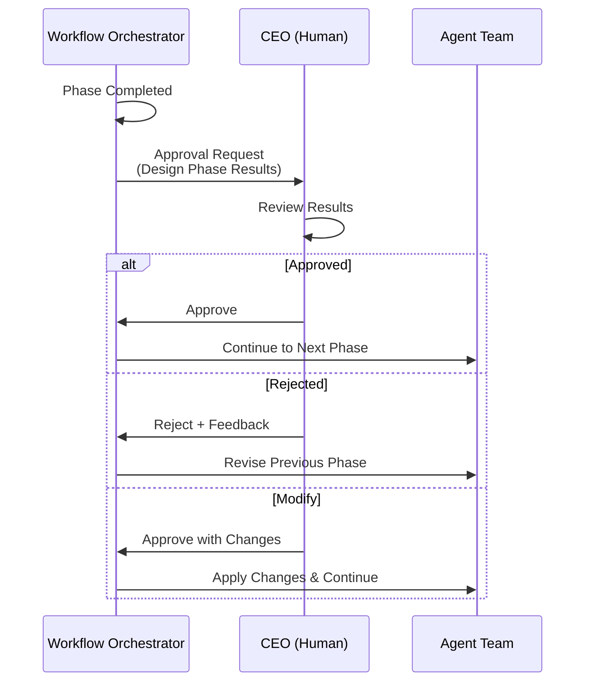

**Approval Request Message**:

```json
{
  "jsonrpc": "2.0",
  "method": "kadi.approval.request",
  "params": {
    "approvalId": "approval_001",
    "workflowId": "workflow_pong",
    "phase": "design",
    "results": {
      "designDoc": "s3://game-assets/pong-project/design_doc.md",
      "mechanics": ["paddle_movement", "ball_physics", "scoring"],
      "entities": ["paddle_left", "paddle_right", "ball", "score_display"]
    },
    "nextPhase": "graphics",
    "estimatedTime": "2 hours"
  }
}
```

**CEO Response**:

```json
{
  "jsonrpc": "2.0",
  "method": "kadi.approval.respond",
  "params": {
    "approvalId": "approval_001",
    "decision": "approved",
    "feedback": "Looks good, proceed with implementation"
  }
}
```

---

## Implementation Phases

### Phase 1: Foundation (Weeks 1-2)

**Goal**: Establish external service infrastructure using existing KADI APIs

**Tasks**:
1. **KADI Interface Analysis**
   - Study existing WebSocket connection (`ws://kadi.build:8080`)
   - Analyze current tool registration system
   - Document existing JSON-RPC 2.0 protocol
   - Test existing tools (`spawn_cube`, `move_cube`, `get_game_state`, `remove_cube`)

2. **External Service Architecture Setup**
   - Create Docker container structure for agent services
   - Set up PostgreSQL for event store (separate from KADI)
   - Configure Redis for caching and session management
   - Establish Git repository for agent source code

3. **Agent Coordinator Service (Node.js)**
   - Create basic agent registry and management
   - Implement connection to existing KADI WebSocket
   - Add agent capability discovery
   - Create basic task distribution without database persistence

4. **Event Sourcing Service (Node.js)**
   - Implement event append and read APIs
   - Create event serialization/deserialization
   - Set up PostgreSQL connection and schema
   - Add basic event replay functionality

5. **Git Integration Service (Python)**
   - Set up Git repository management
   - Implement agent decision tracking
   - Create milestone tagging system
   - Add commit-event correlation

**Deliverables**:
- Docker container setup for agent services
- PostgreSQL event store schema and service
- Redis caching operational
- Basic Agent Coordinator connecting to existing KADI
- Event Sourcing Service with PostgreSQL
- Git Integration Service with repository

**Validation**:
- Agent Coordinator successfully connects to existing KADI broker
- Event store captures game state changes
- Git service tracks agent decisions
- All services run without modifying KADI broker

---

### Phase 2: Core Agents (Weeks 3-5)

**Goal**: Implement essential agents using external service architecture

**Tasks**:
1. **Game Director Agent (Python)**
   - Create agent using external service framework
   - Implement natural language parsing for game concepts
   - Register tools with existing KADI broker
   - Add game state analysis capabilities

2. **QA Agent (Python)**
   - Implement automated testing framework
   - Add screenshot comparison functionality
   - Create performance validation tools
   - Integrate with existing KADI tools for game interaction

3. **Documentation Agent (TypeScript)**
   - Build change tracking system
   - Create automated report generation
   - Implement design document management
   - Add real-time documentation updates

4. **Enhanced Agent Coordination**
   - Add task dependency management
   - Implement conflict resolution system
   - Create agent presence tracking
   - Add CEO notification system

5. **Integration Testing**
   - Test agent-to-agent communication via existing KADI
   - Validate workflow coordination
   - Test error handling and recovery
   - Verify Git integration with event store

**Deliverables**:
- Game Director Agent with design tools
- QA Agent with automated testing
- Documentation Agent with change tracking
- Enhanced Agent Coordinator with conflict resolution
- Comprehensive integration test suite

**Validation**:
- Game Director creates design and spawns entities via KADI
- QA Agent detects issues and requests fixes
- Documentation Agent tracks all changes
- Agents collaborate without conflicts

---

### Phase 3: Performance & Advanced Features (Weeks 6-8)

**Goal**: Add Rust performance agent and advanced collaboration features

**Tasks**:
1. **Rust Performance Agent**
   - Implement zero-overhead performance monitoring
   - Create bottleneck detection algorithms
   - Add automated optimization suggestions
   - Integrate with Event Sourcing Service

2. **Enhanced Real-Time Collaboration**
   - Implement presence awareness system
   - Add entity-level locking mechanism
   - Create change feed subscriptions
   - Build conflict resolution algorithms

3. **Performance Monitoring Dashboard**
   - Create React/Vue.js dashboard for CEO
   - Display real-time agent status and activities
   - Show performance metrics and alerts
   - Add manual intervention capabilities

4. **Advanced Workflow Features**
   - Implement task retry logic with exponential backoff
   - Add approval gate system for CEO
   - Create workflow templates for common game types
   - Add performance optimization workflows

5. **Multi-Instance Support**
   - Support multiple game instances
   - Add cross-instance coordination
   - Implement shared asset management
   - Create instance isolation controls

**Deliverables**:
- Rust Performance Agent with monitoring tools
- Real-time collaboration features
- CEO monitoring dashboard
- Advanced workflow management
- Multi-instance game support

**Validation**:
- Rust Agent monitors performance without overhead
- Multiple agents collaborate on same game
- CEO can monitor and intervene in real-time
- Performance optimizations applied automatically

---

### Phase 4: Production Readiness (Weeks 9-10)

**Goal**: Prepare system for production deployment and operation

**Tasks**:
1. **Production Deployment**
   - Create Docker Compose configuration
   - Set up production PostgreSQL with backup
   - Configure Redis clustering for high availability
   - Deploy to cloud infrastructure (AWS/Azure/GCP)

2. **Monitoring & Alerting**
   - Implement comprehensive logging
   - Add health checks for all services
   - Create alerting system for failures
   - Set up performance monitoring dashboards

3. **Security Hardening**
   - Add API rate limiting
   - Implement authentication tokens
   - Secure database connections
   - Add network security controls

4. **Documentation & Training**
   - Complete API documentation
   - Create user guides for CEO
   - Add developer onboarding materials
   - Record demonstration videos

5. **Performance Validation**
   - Load testing with multiple agents
   - Stress test with complex game scenarios
   - Validate system under failure conditions
   - Optimize bottlenecks identified

**Deliverables**:
- Production-ready deployment configuration
- Comprehensive monitoring and alerting
- Security-hardened system
- Complete documentation and training materials
- Performance validation report

**Validation**:
- System handles multiple concurrent game development projects
- All agents work together efficiently
- CEO can monitor and control the entire system
- System remains stable under load

---

### Phase 2: Agent Framework (Weeks 5-8)

**Goal**: Create agent base classes and implement core agents

**Tasks**:
1. **Agent Base Class Templates**

   **Python Agent Base**:
   ```python
   # agents/python/base_agent.py
   class BaseAgent:
       def __init__(self, agent_type: str, capabilities: dict):
           self.agent_id = f"agent_{agent_type}_{uuid.uuid4().hex[:6]}"
           self.agent_type = agent_type
           self.capabilities = capabilities
           self.tools = []
           self.kadi_client = None

       def register_tool(self, tool_def: dict):
           """Register a tool with the broker"""
           self.tools.append(tool_def)

       async def connect_to_broker(self, broker_url: str):
           """Connect to KADI broker via WebSocket"""
           self.kadi_client = KADIClient(broker_url)
           await self.kadi_client.connect()
           await self.kadi_client.register_agent({
               "agentType": self.agent_type,
               "capabilities": self.capabilities,
               "tools": self.tools,
               "networks": self.get_networks()
           })

       async def handle_tool_invocation(self, tool_name: str, input_data: dict):
           """Override in subclass to implement tool logic"""
           raise NotImplementedError

       def get_networks(self) -> list:
           """Override to specify networks"""
           return ["global", "game-dev"]
   ```

   **TypeScript Agent Base**:
   ```typescript
   // agents/typescript/BaseAgent.ts
   export abstract class BaseAgent {
       protected agentId: string;
       protected agentType: string;
       protected capabilities: Record<string, any>;
       protected tools: Tool[] = [];
       protected kadiClient: KADIClient;

       constructor(agentType: string, capabilities: Record<string, any>) {
           this.agentId = `agent_${agentType}_${randomId()}`;
           this.agentType = agentType;
           this.capabilities = capabilities;
       }

       registerTool(toolDef: Tool): void {
           this.tools.push(toolDef);
       }

       async connectToBroker(brokerUrl: string): Promise<void> {
           this.kadiClient = new KADIClient(brokerUrl);
           await this.kadiClient.connect();
           await this.kadiClient.registerAgent({
               agentType: this.agentType,
               capabilities: this.capabilities,
               tools: this.tools,
               networks: this.getNetworks()
           });
       }

       abstract handleToolInvocation(toolName: string, inputData: any): Promise<any>;

       protected getNetworks(): string[] {
           return ["global", "game-dev"];
       }
   }
   ```

   **C++ Agent Base** (header-only):
   ```cpp
   // agents/cpp/BaseAgent.hpp
   class BaseAgent {
   public:
       BaseAgent(std::string agentType, nlohmann::json capabilities)
           : m_agentType(std::move(agentType))
           , m_capabilities(std::move(capabilities)) {
           m_agentId = "agent_" + m_agentType + "_" + generateRandomId();
       }

       void RegisterTool(nlohmann::json const& toolDef) {
           m_tools.push_back(toolDef);
       }

       void ConnectToBroker(std::string const& brokerUrl) {
           m_kadiClient = std::make_unique<KADIClient>(brokerUrl);
           m_kadiClient->Connect();
           m_kadiClient->RegisterAgent({
               {"agentType", m_agentType},
               {"capabilities", m_capabilities},
               {"tools", m_tools},
               {"networks", GetNetworks()}
           });
       }

       virtual nlohmann::json HandleToolInvocation(
           std::string const& toolName,
           nlohmann::json const& inputData) = 0;

   protected:
       virtual std::vector<std::string> GetNetworks() const {
           return {"global", "game-dev"};
       }

   private:
       std::string m_agentId;
       std::string m_agentType;
       nlohmann::json m_capabilities;
       std::vector<nlohmann::json> m_tools;
       std::unique_ptr<KADIClient> m_kadiClient;
   };
   ```

2. **Implement Core Agents**

   **Game Designer Agent (Python)**:
   - Create GameDesignerAgent class extending BaseAgent
   - Implement `create_game_design_doc` tool
   - Implement `define_game_mechanic` tool
   - Add natural language parsing with LLM integration

   **Graphics/Rendering Agent (C++)**:
   - Create GraphicsAgent class extending BaseAgent
   - Implement `create_shader` tool (generates HLSL)
   - Implement `configure_lighting` tool
   - Integrate with ProtogameJS3D rendering pipeline

   **Gameplay Programmer Agent (JavaScript)**:
   - Create GameplayProgrammerAgent class extending BaseAgent
   - Implement `implement_game_mechanic` tool
   - Integrate with ProtogameJS3D JSEngine system
   - Add hot-reload support for generated scripts

3. **Agent Communication Tests**
   - Test tool invocation between agents
   - Verify event pub/sub functionality
   - Test task assignment from orchestrator
   - Validate error handling and retries

**Deliverables**:
- Base agent classes for Python, TypeScript, C++
- 3 operational agents (Game Designer, Graphics, Gameplay Programmer)
- Agent-to-agent communication tests
- Documentation for creating new agents

**Validation**:
- Game Designer creates design doc
- Graphics Agent creates shader based on design
- Gameplay Agent implements mechanic using shader

---

### Phase 3: Real-Time Collaboration (Weeks 9-12)

**Goal**: Enable concurrent editing with conflict resolution

**Tasks**:
1. **Y.js CRDT Integration**
   - Install Y.js library
   - Create shared Y.Doc for each project
   - Implement synchronization via KADI events
   - Add Y.js awareness for presence tracking

2. **Presence Awareness System**
   - Implement heartbeat mechanism (15s intervals)
   - Store presence in Redis with 30s TTL
   - Broadcast presence updates to subscribers
   - Create presence UI for CEO dashboard

3. **Entity-Level Locking**
   - Implement lock acquisition/release API
   - Add Redis-backed lock storage
   - Implement auto-release on disconnect/timeout
   - Add lock conflict detection

4. **Change Feed Subscription**
   - Implement subscription management
   - Add event filtering by entity/property
   - Implement notification delivery
   - Add unsubscribe functionality

5. **Collaborative Scene Editor UI** (for CEO)
   - Create web-based scene viewer (Three.js)
   - Display all agents' presence (cursors, selections)
   - Show entity locks and ownership
   - Enable CEO to intervene and edit directly

**Deliverables**:
- Y.js integration with KADI broker
- Presence tracking system
- Locking mechanism with tests
- Change feed subscription system
- Web-based collaborative scene editor

**Validation**:
- Two agents edit different entities concurrently (no conflicts)
- Two agents edit same entity (lock prevents conflict)
- CEO intervenes to override agent's changes
- All changes visible in real-time to all participants

---

### Phase 4: Advanced Features (Weeks 13-16)

**Goal**: QA automation, undo/redo, replay, monitoring

**Tasks**:
1. **QA/Testing Agent (Python)**
   - Implement automated test execution
   - Add screenshot comparison (OpenCV)
   - Implement performance profiling
   - Generate test reports with pass/fail status

2. **Undo/Redo Coordination**
   - Implement command pattern for reversible operations
   - Store commands in event store
   - Add `undo_command` and `redo_command` tools
   - Handle cross-agent undo coordination

3. **Replay System**
   - Implement event log export
   - Create replay player that rebuilds state
   - Add time-travel debugging UI
   - Enable replay speed control (1x, 2x, 4x)

4. **CEO Monitoring Dashboard**
   - Create real-time dashboard (React/Vue.js)
   - Display active agents and their status
   - Show task queue and completion progress
   - Add approval request notifications
   - Enable manual task intervention

**Deliverables**:
- QA/Testing Agent with automated testing
- Undo/redo system with tests
- Replay player and export functionality
- CEO monitoring dashboard

**Validation**:
- QA Agent runs full test suite and reports results
- CEO undoes agent's change and redoes it
- Replay entire Pong game development from start
- Monitor dashboard shows real-time progress

---

## Example Workflow: "Create a Pong Game"

### CEO Request

**Input**: "Please make a simple Pong game"

---

### Workflow Breakdown

#### **Phase 1: Design (Sequential)**

**Task 1.1: Create Game Design Document**
- **Assigned To**: Game Designer Agent
- **Tool**: `create_game_design_doc`
- **Input**:
  ```json
  {
    "concept": "Classic Pong game with two paddles and a ball",
    "genre": "sports",
    "targetPlatform": "Windows PC"
  }
  ```
- **Output**:
  ```json
  {
    "designDocId": "design_pong_001",
    "mechanics": ["paddle_movement", "ball_physics", "scoring", "collision"],
    "entities": [
      {"type": "paddle", "count": 2, "properties": ["position", "velocity", "size"]},
      {"type": "ball", "count": 1, "properties": ["position", "velocity", "radius"]},
      {"type": "score_display", "count": 2}
    ],
    "rules": [
      "Ball bounces off top and bottom walls",
      "Ball bounces off paddles",
      "Score increases when ball passes paddle",
      "Game ends at 11 points"
    ]
  }
  ```

**Approval Gate**:
- Workflow Orchestrator notifies CEO
- CEO reviews design doc
- CEO approves → Continue to Phase 2

---

#### **Phase 2: Graphics (Parallel)**

**Task 2.1: Create Paddle Model**
- **Assigned To**: Graphics Agent
- **Tool**: `create_model`
- **Input**:
  ```json
  {
    "modelName": "paddle",
    "primitiveType": "box",
    "dimensions": [0.2, 1.5, 0.1],
    "color": [1.0, 1.0, 1.0, 1.0]
  }
  ```

**Task 2.2: Create Ball Model**
- **Assigned To**: Graphics Agent
- **Tool**: `create_model`
- **Input**:
  ```json
  {
    "modelName": "ball",
    "primitiveType": "sphere",
    "radius": 0.1,
    "color": [1.0, 1.0, 0.0, 1.0]
  }
  ```

**Task 2.3: Create Lighting**
- **Assigned To**: Graphics Agent
- **Tool**: `configure_lighting`
- **Input**:
  ```json
  {
    "lightType": "directional",
    "intensity": 1.0,
    "color": [1.0, 1.0, 1.0],
    "direction": [0.0, -1.0, 0.0]
  }
  ```

**Task 2.4: Create Simple Shader**
- **Assigned To**: Graphics Agent
- **Tool**: `create_shader`
- **Input**:
  ```json
  {
    "shaderName": "PongLit",
    "shaderType": "pixel",
    "effects": ["diffuse_lighting", "ambient"]
  }
  ```

---

#### **Phase 3: Implementation (Parallel with Dependencies)**

**Task 3.1: Implement Paddle Movement**
- **Assigned To**: Gameplay Programmer Agent
- **Dependencies**: [Task 2.1]
- **Tool**: `implement_game_mechanic`
- **Input**:
  ```json
  {
    "mechanicName": "paddle_movement",
    "systemCode": "class PaddleMovement { update(dt) { /* W/S and Up/Down keys */ } }",
    "dependencies": ["InputSystem"]
  }
  ```

**Task 3.2: Implement Ball Physics**
- **Assigned To**: Gameplay Programmer Agent
- **Dependencies**: [Task 2.2]
- **Tool**: `implement_game_mechanic`
- **Input**:
  ```json
  {
    "mechanicName": "ball_physics",
    "systemCode": "class BallPhysics { update(dt) { /* Velocity, collision */ } }",
    "dependencies": []
  }
  ```

**Task 3.3: Add Ball Rigidbody**
- **Assigned To**: Physics Agent
- **Dependencies**: [Task 3.2]
- **Tool**: `add_rigidbody`
- **Input**:
  ```json
  {
    "entityId": "ball_entity",
    "mass": 1.0,
    "friction": 0.0,
    "restitution": 1.0
  }
  ```

**Task 3.4: Implement Collision Detection**
- **Assigned To**: Physics Agent
- **Dependencies**: [Task 3.1, Task 3.2]
- **Tool**: `configure_collision`
- **Input**:
  ```json
  {
    "entityA": "ball_entity",
    "entityB": "paddle_left",
    "collisionType": "AABB"
  }
  ```

**Task 3.5: Implement Scoring System**
- **Assigned To**: Gameplay Programmer Agent
- **Dependencies**: [Task 3.4]
- **Tool**: `implement_game_mechanic`
- **Input**:
  ```json
  {
    "mechanicName": "scoring",
    "systemCode": "class ScoringSystem { checkGoal() { /* Increase score */ } }",
    "dependencies": ["BallPhysics"]
  }
  ```

**Task 3.6: Create Score UI**
- **Assigned To**: UI Agent
- **Dependencies**: [Task 3.5]
- **Tool**: `design_hud`
- **Input**:
  ```json
  {
    "elements": [
      {"type": "text", "id": "score_left", "content": "0", "fontSize": 48},
      {"type": "text", "id": "score_right", "content": "0", "fontSize": 48}
    ],
    "positions": {
      "score_left": [100, 50],
      "score_right": [700, 50]
    }
  }
  ```

**Approval Gate**:
- Workflow Orchestrator notifies CEO
- CEO reviews implementation (can play game)
- CEO approves → Continue to Phase 4

---

#### **Phase 4: Testing (Sequential)**

**Task 4.1: Validate Paddle Movement**
- **Assigned To**: QA Agent
- **Dependencies**: [Task 3.1]
- **Tool**: `validate_game_mechanic`
- **Input**:
  ```json
  {
    "mechanicName": "paddle_movement",
    "testScenarios": [
      {"input": "W key", "expected": "Left paddle moves up"},
      {"input": "S key", "expected": "Left paddle moves down"},
      {"input": "Up key", "expected": "Right paddle moves up"},
      {"input": "Down key", "expected": "Right paddle moves down"}
    ]
  }
  ```

**Task 4.2: Validate Ball Physics**
- **Assigned To**: QA Agent
- **Dependencies**: [Task 3.2, Task 3.3, Task 3.4]
- **Tool**: `validate_game_mechanic`
- **Input**:
  ```json
  {
    "mechanicName": "ball_physics",
    "testScenarios": [
      {"condition": "Ball hits top wall", "expected": "Ball bounces down"},
      {"condition": "Ball hits paddle", "expected": "Ball bounces back"},
      {"condition": "Ball passes paddle", "expected": "Score increases"}
    ]
  }
  ```

**Task 4.3: Performance Profiling**
- **Assigned To**: QA Agent
- **Dependencies**: [All Phase 3 tasks]
- **Tool**: `profile_performance`
- **Input**:
  ```json
  {
    "durationSeconds": 60,
    "captureMetrics": ["fps", "memory_usage", "cpu_load"]
  }
  ```
- **Expected Output**:
  ```json
  {
    "averageFPS": 60,
    "minFPS": 58,
    "maxFPS": 62,
    "averageMemoryMB": 45,
    "averageCPU": 15
  }
  ```

**Final Approval Gate**:
- QA Agent generates test report (all passed)
- CEO reviews final game
- CEO marks workflow as completed

---

### Timeline Estimate

| Phase | Duration | Critical Path |
|-------|----------|---------------|
| Design | 30 min | Task 1.1 → Approval |
| Graphics | 45 min (parallel) | Tasks 2.1-2.4 |
| Implementation | 1.5 hours (parallel with deps) | Task 3.1 → 3.2 → 3.3 → 3.4 → 3.5 → 3.6 → Approval |
| Testing | 1.5 hours (sequential) | Tasks 4.1 → 4.2 → 4.3 → Final Approval |
| **Total** | **~4 hours** | With 2 approval gates |

---

## Technical Specifications

### Rust Agent Base Class and Implementation

**Rust Agent Trait (Base Interface)**:

```rust
// agents/rust/src/agent/mod.rs
use async_trait::async_trait;
use serde::{Deserialize, Serialize};
use anyhow::Result;

#[async_trait]
pub trait Agent: Send + Sync {
    fn agent_type(&self) -> &str;
    fn capabilities(&self) -> &AgentCapabilities;
    fn tools(&self) -> Vec<ToolDefinition>;

    async fn connect_to_broker(&mut self, broker_url: &str) -> Result<()>;
    async fn handle_tool_invocation(&mut self, tool_name: &str, input: serde_json::Value) -> Result<serde_json::Value>;
    async fn shutdown(&mut self) -> Result<()>;
}

#[derive(Debug, Clone, Serialize, Deserialize)]
pub struct AgentCapabilities {
    pub languages: Vec<String>,
    pub frameworks: Vec<String>,
    pub max_concurrent_tasks: usize,
    pub custom_capabilities: std::collections::HashMap<String, serde_json::Value>,
}

#[derive(Debug, Clone, Serialize, Deserialize)]
pub struct ToolDefinition {
    pub name: String,
    pub description: String,
    pub input_schema: serde_json::Value,
    pub output_schema: Option<serde_json::Value>,
}
```

**Rust Agent Base Implementation**:

```rust
// agents/rust/src/agent/base.rs
use super::{Agent, AgentCapabilities, ToolDefinition};
use crate::kadi::KADIBridge;
use async_trait::async_trait;
use anyhow::Result;
use uuid::Uuid;

pub struct BaseAgent {
    pub agent_id: String,
    pub agent_type: String,
    pub capabilities: AgentCapabilities,
    pub tools: Vec<ToolDefinition>,
    pub kadi_bridge: Option<KADIBridge>,
    pub networks: Vec<String>,
}

impl BaseAgent {
    pub fn new(agent_type: String, capabilities: AgentCapabilities) -> Self {
        let agent_id = format!("agent_{}_{}", agent_type, Uuid::new_v4().simple());

        Self {
            agent_id,
            agent_type,
            capabilities,
            tools: Vec::new(),
            kadi_bridge: None,
            networks: vec!["global".to_string(), "game-dev".to_string()],
        }
    }

    pub fn register_tool(&mut self, tool: ToolDefinition) {
        self.tools.push(tool);
    }

    pub fn set_networks(&mut self, networks: Vec<String>) {
        self.networks = networks;
    }
}

#[async_trait]
impl Agent for BaseAgent {
    fn agent_type(&self) -> &str {
        &self.agent_type
    }

    fn capabilities(&self) -> &AgentCapabilities {
        &self.capabilities
    }

    fn tools(&self) -> Vec<ToolDefinition> {
        self.tools.clone()
    }

    async fn connect_to_broker(&mut self, broker_url: &str) -> Result<()> {
        let mut bridge = KADIBridge::new(broker_url).await?;

        bridge.register_agent(
            &self.agent_id,
            &self.agent_type,
            &self.capabilities,
            &self.tools,
            &self.networks
        ).await?;

        self.kadi_bridge = Some(bridge);
        Ok(())
    }

    async fn handle_tool_invocation(&mut self, _tool_name: &str, _input: serde_json::Value) -> Result<serde_json::Value> {
        anyhow::bail!("handle_tool_invocation must be implemented by subclass")
    }

    async fn shutdown(&mut self) -> Result<()> {
        if let Some(bridge) = &mut self.kadi_bridge {
            bridge.disconnect().await?;
        }
        Ok(())
    }
}
```

**Rust Performance Agent Full Implementation**:

```rust
// agents/rust-performance/src/main.rs
use agents_rust::agent::{Agent, AgentCapabilities, ToolDefinition};
use anyhow::Result;
use serde::{Deserialize, Serialize};
use tokio::sync::mpsc;
use std::collections::VecDeque;

#[derive(Debug, Clone, Serialize, Deserialize)]
pub struct PerformanceMetrics {
    // Frame metrics
    pub frame_time_ms: f64,
    pub fps: f32,
    pub frame_time_variance: f64,

    // Memory metrics
    pub memory_usage_mb: u64,
    pub v8_heap_size: u64,
    pub gc_pause_ms: f64,

    // Entity metrics
    pub entity_count: u32,
    pub active_entities: u32,
    pub entity_update_time_ms: f64,

    // Rendering metrics
    pub draw_calls: u32,
    pub triangles_rendered: u32,
    pub shader_switches: u32,

    // Audio metrics
    pub active_sources: u16,
    pub audio_cpu_usage: f32,

    // System metrics
    pub cpu_usage_percent: f64,
    pub gpu_usage_percent: f64,
    pub network_latency_ms: f64,

    pub timestamp: std::time::SystemTime,
}

#[derive(Debug, Clone, Serialize, Deserialize)]
pub struct OptimizationSuggestion {
    pub optimization_type: String,
    pub priority: u8,
    pub description: String,
    pub estimated_improvement: String,
    pub implementation_steps: Vec<String>,
}

pub struct RustPerformanceAgent {
    base: agents_rust::agent::BaseAgent,
    event_receiver: mpsc::Receiver<serde_json::Value>,
    performance_buffer: VecDeque<PerformanceMetrics>,
    buffer_size: usize,
    analysis_threshold: f32,
}

impl RustPerformanceAgent {
    pub fn new() -> Self {
        let capabilities = AgentCapabilities {
            languages: vec!["rust".to_string()],
            frameworks: vec!["tokio".to_string(), "serde".to_string()],
            max_concurrent_tasks: 10,
            custom_capabilities: std::collections::HashMap::new(),
        };

        let mut base = agents_rust::agent::BaseAgent::new(
            "rust_performance".to_string(),
            capabilities
        );

        // Register tools
        base.register_tool(ToolDefinition {
            name: "monitor_performance".to_string(),
            description: "Continuously monitor game performance metrics".to_string(),
            input_schema: serde_json::json!({
                "type": "object",
                "properties": {
                    "monitoringInterval": {"type": "number", "default": 1000},
                    "metrics": {
                        "type": "array",
                        "items": {"type": "string", "enum": ["fps", "memory", "cpu", "draw_calls", "audio"]}
                    }
                }
            }),
            output_schema: None,
        });

        base.register_tool(ToolDefinition {
            name: "detect_bottlenecks".to_string(),
            description: "Identify performance bottlenecks in game systems".to_string(),
            input_schema: serde_json::json!({
                "type": "object",
                "properties": {
                    "analysisDuration": {"type": "number", "default": 5000},
                    "focusArea": {"type": "string", "enum": ["rendering", "physics", "audio", "scripts"]}
                }
            }),
            output_schema: None,
        });

        base.register_tool(ToolDefinition {
            name: "suggest_optimizations".to_string(),
            description: "Generate automated optimization suggestions".to_string(),
            input_schema: serde_json::json!({
                "type": "object",
                "properties": {
                    "targetFPS": {"type": "number"},
                    "priorityAreas": {"type": "array", "items": {"type": "string"}}
                }
            }),
            output_schema: None,
        });

        let (tx, rx) = mpsc::channel(1000);

        Self {
            base,
            event_receiver: rx,
            performance_buffer: VecDeque::with_capacity(100),
            buffer_size: 100,
            analysis_threshold: 30.0, // FPS threshold for triggering analysis
        }
    }

    pub async fn monitor_performance(&mut self) -> Result<()> {
        while let Some(event) = self.event_receiver.recv().await {
            let metrics = self.collect_metrics(&event)?;
            self.performance_buffer.push_back(metrics.clone());

            if self.performance_buffer.len() > self.buffer_size {
                self.performance_buffer.pop_front();
            }

            if self.should_analyze(&metrics) {
                let suggestions = self.generate_optimization_suggestions(&metrics);
                self.send_suggestions_via_kadi(suggestions).await?;
            }
        }
        Ok(())
    }

    fn collect_metrics(&self, event: &serde_json::Value) -> Result<PerformanceMetrics> {
        // Parse event data and construct metrics
        Ok(serde_json::from_value(event.clone())?)
    }

    fn should_analyze(&self, metrics: &PerformanceMetrics) -> bool {
        metrics.fps < self.analysis_threshold
    }

    fn generate_optimization_suggestions(&self, metrics: &PerformanceMetrics) -> Vec<OptimizationSuggestion> {
        let mut suggestions = Vec::new();

        // Entity culling suggestion
        if metrics.entity_count > 100 && metrics.draw_calls > 500 {
            suggestions.push(OptimizationSuggestion {
                optimization_type: "entity_culling".to_string(),
                priority: 8,
                description: "High entity count causing excessive draw calls".to_string(),
                estimated_improvement: "+20% FPS".to_string(),
                implementation_steps: vec![
                    "Implement frustum culling for off-screen entities".to_string(),
                    "Add distance-based LOD (Level of Detail) system".to_string(),
                    "Enable occlusion culling for hidden entities".to_string(),
                ],
            });
        }

        // Memory optimization suggestion
        if metrics.v8_heap_size > 100 * 1024 * 1024 { // > 100 MB
            suggestions.push(OptimizationSuggestion {
                optimization_type: "memory_optimization".to_string(),
                priority: 6,
                description: "V8 heap size excessive, possible memory leaks".to_string(),
                estimated_improvement: "-50% memory usage".to_string(),
                implementation_steps: vec![
                    "Review JavaScript object lifecycle management".to_string(),
                    "Implement object pooling for frequently created entities".to_string(),
                    "Check for event listener memory leaks".to_string(),
                ],
            });
        }

        // Shader optimization suggestion
        if metrics.shader_switches > 100 {
            suggestions.push(OptimizationSuggestion {
                optimization_type: "shader_batching".to_string(),
                priority: 7,
                description: "Excessive shader switches causing GPU stalls".to_string(),
                estimated_improvement: "+15% FPS".to_string(),
                implementation_steps: vec![
                    "Sort draw calls by shader to minimize switches".to_string(),
                    "Combine similar materials into uber-shaders".to_string(),
                    "Batch entities with identical shaders".to_string(),
                ],
            });
        }

        suggestions
    }

    async fn send_suggestions_via_kadi(&mut self, suggestions: Vec<OptimizationSuggestion>) -> Result<()> {
        if let Some(bridge) = &mut self.base.kadi_bridge {
            bridge.publish_event(
                "optimization_suggestions",
                serde_json::json!({
                    "agent_id": self.base.agent_id,
                    "timestamp": chrono::Utc::now().to_rfc3339(),
                    "suggestions": suggestions
                }),
                &self.base.networks
            ).await?;
        }
        Ok(())
    }
}

#[async_trait::async_trait]
impl Agent for RustPerformanceAgent {
    fn agent_type(&self) -> &str {
        self.base.agent_type()
    }

    fn capabilities(&self) -> &AgentCapabilities {
        self.base.capabilities()
    }

    fn tools(&self) -> Vec<ToolDefinition> {
        self.base.tools()
    }

    async fn connect_to_broker(&mut self, broker_url: &str) -> Result<()> {
        self.base.connect_to_broker(broker_url).await
    }

    async fn handle_tool_invocation(&mut self, tool_name: &str, input: serde_json::Value) -> Result<serde_json::Value> {
        match tool_name {
            "monitor_performance" => {
                let interval = input["monitoringInterval"].as_u64().unwrap_or(1000);
                Ok(serde_json::json!({
                    "success": true,
                    "message": format!("Started monitoring with interval {}ms", interval)
                }))
            },
            "detect_bottlenecks" => {
                let recent_metrics: Vec<&PerformanceMetrics> = self.performance_buffer.iter().collect();
                let avg_fps = recent_metrics.iter().map(|m| m.fps as f64).sum::<f64>() / recent_metrics.len() as f64;

                Ok(serde_json::json!({
                    "success": true,
                    "average_fps": avg_fps,
                    "bottlenecks_detected": avg_fps < self.analysis_threshold as f64
                }))
            },
            "suggest_optimizations" => {
                let target_fps = input["targetFPS"].as_f64().unwrap_or(60.0);
                let latest_metrics = self.performance_buffer.back();

                if let Some(metrics) = latest_metrics {
                    let suggestions = self.generate_optimization_suggestions(metrics);
                    Ok(serde_json::json!({
                        "success": true,
                        "current_fps": metrics.fps,
                        "target_fps": target_fps,
                        "suggestions": suggestions
                    }))
                } else {
                    Ok(serde_json::json!({
                        "success": false,
                        "error": "No performance data available yet"
                    }))
                }
            },
            _ => {
                anyhow::bail!("Unknown tool: {}", tool_name)
            }
        }
    }

    async fn shutdown(&mut self) -> Result<()> {
        self.base.shutdown().await
    }
}

#[tokio::main]
async fn main() -> Result<()> {
    let mut agent = RustPerformanceAgent::new();

    agent.connect_to_broker("ws://kadi.build:8080").await?;

    println!("Rust Performance Agent started successfully");

    // Start monitoring loop
    agent.monitor_performance().await?;

    Ok(())
}
```

### External Service Integration Patterns

**Agent Coordinator Service (Node.js/TypeScript)**:

```typescript
// services/agent-coordinator/src/coordinator.ts
import { KADIClient } from './kadi-client';
import { EventSourcingService } from './event-sourcing-service';
import { RedisClient } from './redis-client';

interface AgentRegistration {
    agentId: string;
    agentType: string;
    capabilities: Record<string, any>;
    tools: ToolDefinition[];
    networks: string[];
    status: 'online' | 'offline' | 'busy' | 'idle';
    currentTasks: string[];
}

export class AgentCoordinator {
    private kadiClient: KADIClient;
    private eventStore: EventSourcingService;
    private redisClient: RedisClient;
    private agents: Map<string, AgentRegistration> = new Map();

    constructor(kadiUrl: string, postgresUrl: string, redisUrl: string) {
        this.kadiClient = new KADIClient(kadiUrl);
        this.eventStore = new EventSourcingService(postgresUrl);
        this.redisClient = new RedisClient(redisUrl);
    }

    async start(): Promise<void> {
        // Connect to existing KADI broker (NO modifications to KADI)
        await this.kadiClient.connect();

        // Subscribe to agent registration events
        this.kadiClient.on('agent_registered', this.handleAgentRegistration.bind(this));

        // Subscribe to task completion events
        this.kadiClient.on('task_completed', this.handleTaskCompletion.bind(this));

        console.log('Agent Coordinator connected to existing KADI broker');
    }

    private async handleAgentRegistration(registration: AgentRegistration): Promise<void> {
        this.agents.set(registration.agentId, registration);

        // Store in Redis for quick access
        await this.redisClient.setex(
            `agent:${registration.agentId}:capabilities`,
            3600,
            JSON.stringify(registration.capabilities)
        );

        // Log registration event to event store
        await this.eventStore.appendEvent({
            aggregate_id: registration.agentId,
            aggregate_type: 'agent',
            event_type: 'AgentRegistered',
            event_data: registration,
            metadata: {
                timestamp: new Date().toISOString()
            },
            agent_id: registration.agentId,
            version: 1
        });

        console.log(`Agent registered: ${registration.agentId} (${registration.agentType})`);
    }

    async assignTask(task: Task): Promise<string | null> {
        // Find suitable agent using existing KADI APIs
        const suitableAgent = await this.findSuitableAgent(task);

        if (!suitableAgent) {
            console.warn(`No suitable agent found for task ${task.taskId}`);
            return null;
        }

        // Assign task via existing KADI tool invocation
        await this.kadiClient.invokeAbility({
            name: 'assign_task',
            toolInput: {
                taskId: task.taskId,
                agentId: suitableAgent.agentId,
                taskData: task
            },
            preferredNetwork: task.projectId
        });

        // Update Redis cache
        await this.redisClient.lpush(
            `queue:assigned:${suitableAgent.agentId}`,
            task.taskId
        );

        return suitableAgent.agentId;
    }

    private async findSuitableAgent(task: Task): Promise<AgentRegistration | null> {
        const candidates = Array.from(this.agents.values()).filter(agent => {
            return agent.agentType === task.requiredAgentType &&
                   agent.networks.includes(task.projectId) &&
                   agent.currentTasks.length < (agent.capabilities.maxConcurrentTasks || 5);
        });

        if (candidates.length === 0) return null;

        // Simple load balancing: choose agent with fewest tasks
        candidates.sort((a, b) => a.currentTasks.length - b.currentTasks.length);
        return candidates[0];
    }

    private async handleTaskCompletion(event: any): Promise<void> {
        const { taskId, agentId, result } = event;

        // Remove from agent's current tasks
        const agent = this.agents.get(agentId);
        if (agent) {
            agent.currentTasks = agent.currentTasks.filter(id => id !== taskId);
        }

        // Remove from Redis queue
        await this.redisClient.lrem(`queue:assigned:${agentId}`, 1, taskId);

        // Log completion event
        await this.eventStore.appendEvent({
            aggregate_id: taskId,
            aggregate_type: 'task',
            event_type: 'TaskCompleted',
            event_data: { result },
            metadata: { agentId },
            agent_id: agentId,
            version: 1
        });
    }
}
```

**Event Sourcing Service (Node.js/TypeScript)**:

```typescript
// services/event-sourcing/src/event-store.ts
import { Pool } from 'pg';

interface Event {
    aggregate_id: string;
    aggregate_type: string;
    event_type: string;
    event_data: any;
    metadata: any;
    agent_id: string;
    version: number;
}

export class EventSourcingService {
    private pool: Pool;

    constructor(postgresUrl: string) {
        this.pool = new Pool({ connectionString: postgresUrl });
    }

    async appendEvent(event: Event): Promise<number> {
        const result = await this.pool.query(
            `INSERT INTO events (
                aggregate_id, aggregate_type, event_type,
                event_data, metadata, agent_id, version
            ) VALUES ($1, $2, $3, $4, $5, $6, $7)
            RETURNING event_id`,
            [
                event.aggregate_id,
                event.aggregate_type,
                event.event_type,
                event.event_data,
                event.metadata,
                event.agent_id,
                event.version
            ]
        );

        return result.rows[0].event_id;
    }

    async getEventsSince(aggregateId: string, sinceVersion: number): Promise<Event[]> {
        const result = await this.pool.query(
            `SELECT * FROM events
             WHERE aggregate_id = $1 AND version > $2
             ORDER BY version ASC`,
            [aggregateId, sinceVersion]
        );

        return result.rows;
    }

    async replayEvents(aggregateId: string): Promise<any> {
        const events = await this.getEventsSince(aggregateId, 0);

        // Rebuild aggregate state from events
        let state: any = {};

        for (const event of events) {
            state = this.applyEvent(state, event);
        }

        return state;
    }

    private applyEvent(state: any, event: Event): any {
        switch (event.event_type) {
            case 'EntityCreated':
                return {
                    ...state,
                    entities: {
                        ...state.entities,
                        [event.event_data.entityId]: event.event_data
                    }
                };

            case 'EntityUpdated':
                return {
                    ...state,
                    entities: {
                        ...state.entities,
                        [event.event_data.entityId]: {
                            ...state.entities[event.event_data.entityId],
                            ...event.event_data.updates
                        }
                    }
                };

            case 'EntityDeleted':
                const { [event.event_data.entityId]: _, ...remainingEntities } = state.entities;
                return {
                    ...state,
                    entities: remainingEntities
                };

            default:
                return state;
        }
    }
}
```

### Conclusion

This multi-agent game development system architecture provides a **production-ready, scalable foundation** for collaborative AI-driven game development **without requiring any modifications to the existing KADI broker infrastructure**. The design emphasizes:

**✅ External Service Architecture**: All new functionality built as independent services that leverage existing KADI APIs via WebSocket connections, ensuring complete backward compatibility and minimal risk.

**✅ Multi-Language Agent Support**: Agents implemented in optimal languages for their domains (Python for AI/ML, TypeScript for coordination, Rust for performance, C++ for graphics, JavaScript for gameplay), each using standardized base classes and KADI communication protocols.

**✅ Event Sourcing + Git Hybrid**: Complete audit trail through PostgreSQL event store combined with Git version control for agent code, enabling time-travel debugging, state reconstruction, and full traceability.

**✅ Real-Time Collaboration**: CEO and multiple agents work concurrently with presence awareness, entity-level locking, conflict resolution, and live change feeds—all orchestrated through external services.

**✅ Zero-Overhead Performance Monitoring**: Rust Performance Agent provides real-time bottleneck detection and automated optimization suggestions without impacting game performance.

**✅ Scalable Workflow Orchestration**: Task dependency management, agent selection algorithms, retry logic, and approval gates enable complex multi-phase game development workflows with automated coordination.

**Key Architectural Advantages**:

1. **No KADI Broker Changes**: Uses existing WebSocket interface (`ws://kadi.build:8080`), tool registration, and JSON-RPC 2.0 protocol
2. **Independent Scaling**: External services can scale horizontally without affecting KADI broker
3. **Clear Separation**: Agent business logic separated from infrastructure concerns
4. **Polyglot Development**: Each agent uses the best language for its domain
5. **Production Readiness**: Docker containerization, PostgreSQL persistence, Redis caching, comprehensive monitoring

**Implementation Roadmap**:

- **Weeks 1-2**: External service infrastructure (PostgreSQL, Redis, Git, Agent Coordinator)
- **Weeks 3-5**: Core agents (Game Director, QA, Documentation) with KADI integration
- **Weeks 6-8**: Rust Performance Agent and advanced collaboration features
- **Weeks 9-10**: Production deployment, monitoring, security hardening, documentation

**Expected Outcomes**:

- **Rapid Prototyping**: Transform "Create a Pong game" request into playable prototype in ~4 hours
- **Quality Assurance**: Automated testing and performance monitoring ensure production quality
- **Full Traceability**: Every decision, action, and state change recorded for debugging and analysis
- **Human-AI Collaboration**: CEO maintains control with real-time monitoring and intervention capabilities
- **Future Extensibility**: Add new agent types and capabilities without architectural changes

This architecture represents a **practical, implementable solution** that leverages existing infrastructure while providing enterprise-grade capabilities for multi-agent game development.

### Agent Development Kit (ADK)

**Package Structure**:
```
agent-development-kit/
├── python/
│   ├── base_agent.py
│   ├── kadi_client.py
│   ├── examples/
│   │   └── game_designer_agent.py
│   └── requirements.txt
├── typescript/
│   ├── BaseAgent.ts
│   ├── KADIClient.ts
│   ├── examples/
│   │   └── GameplayProgrammerAgent.ts
│   └── package.json
├── cpp/
│   ├── BaseAgent.hpp
│   ├── KADIClient.hpp
│   ├── examples/
│   │   └── GraphicsAgent.cpp
│   └── CMakeLists.txt
└── docs/
    ├── agent_development_guide.md
    ├── tool_schema_reference.md
    └── workflow_integration.md
```

---

### ProtogameJS3D Integration Points

**1. KADI Subsystem Extension**

```cpp
// Code/Game/Subsystem/KADISubsystem.hpp
class KADISubsystem : public ISubsystem {
public:
    // Existing methods
    void Connect(std::string const& brokerUrl);
    void RegisterTool(std::string const& name, ToolHandler handler);

    // NEW: Project management
    void CreateProject(std::string const& projectId, nlohmann::json config);
    void SetActiveProject(std::string const& projectId);

    // NEW: Entity state synchronization
    void SyncEntityState(EntityID entityId);
    void SubscribeToEntityChanges(EntityID entityId, ChangeCallback callback);

    // NEW: Event sourcing integration
    void AppendEvent(std::string const& eventType, nlohmann::json eventData);
    std::vector<Event> GetEventsSince(int64_t version);
};
```

**2. JavaScript Bridge Extensions**

```javascript
// Run/Data/Scripts/kadi/KADIGameAPI.js
class KADIGameAPI {
    // Existing methods
    async invokeTool(toolName, input) { /* ... */ }

    // NEW: Subscribe to external agent events
    subscribeToAgentEvents(agentType, callback) {
        this.eventCallbacks[agentType] = callback;
    }

    // NEW: Expose game state for QA Agent
    getGameStateSnapshot() {
        return {
            entities: JSGame.propGameObjects.map(obj => ({
                id: obj.entityId,
                position: obj.position,
                velocity: obj.velocity
            })),
            gameMode: JSGame.gameMode,
            score: JSGame.score
        };
    }

    // NEW: Apply state from agent (for testing/replay)
    applyGameState(state) {
        // Reconstruct game state from snapshot
    }
}
```

---

### Message Size and Performance Limits

**Message Size Limits**:
- Single message: 1 MB max (enforce at broker level)
- Tool input/output: 500 KB max
- Event data: 100 KB max
- Large assets: Use S3 URLs instead of embedding data

**Rate Limiting**:
- Tool invocations: 100 requests/minute per agent
- Event publications: 1000 events/minute per agent
- Presence updates: 4 per minute per agent

**Performance Targets**:
- Tool invocation latency: < 100ms (broker overhead)
- Event delivery latency: < 50ms
- Task assignment latency: < 200ms
- Database write latency: < 50ms (single event)

---

## Security & Performance

### Security Measures

**1. Agent Authentication**
- Ed25519 public key authentication for agents
- SHA-256 hash of public key as persistent session ID
- Nonce expiry (5-minute TTL) to prevent replay attacks

**2. Network Isolation**
- Projects isolated by network membership
- Agents can only invoke tools in accessible networks
- Events broadcast only to network subscribers

**3. Tool Authorization**
- Tool schemas define required capabilities
- Broker validates agent has required capabilities before routing
- CEO can revoke agent capabilities at runtime

**4. Database Access Control**
- Agents cannot directly access database (only via broker)
- Read-only projections for agents
- Event store append-only (no modifications)

**5. Rate Limiting**
- Per-agent rate limits prevent abuse
- Backpressure handling when queue is full
- DDoS protection at WebSocket layer

---

### Performance Optimizations

**1. RabbitMQ Channel Pooling**
- 10-channel pool for 50,000 msg/sec throughput
- Round-robin distribution across channels
- Durable queues for persistence

**2. PostgreSQL Partitioning**
- Time-based partitioning of events table (monthly)
- Index on aggregate_id + version for fast lookup
- JSONB GIN indexes for event_data queries

**3. Redis Caching**
- Session state cached (5-hour TTL)
- Agent capabilities cached
- Project snapshots cached (5-minute TTL)

**4. State Snapshot Strategy**
- Full snapshot every 100 events or 5 minutes
- Incremental rebuild from last snapshot
- Reduces event replay time from hours to seconds

**5. Batch Operations**
- Batch entity updates (50 entities per message)
- Batch event writes (PostgreSQL batch insert)
- Batch tool invocations for bulk operations

---

## Future Enhancements

### Phase 5: Advanced AI Integration (Weeks 17-20)

**1. LLM-Powered Agents**
- Integrate GPT-4, Claude, or local LLMs for natural language understanding
- Game Designer Agent generates design docs from vague prompts
- Code generation for Gameplay Programmer Agent

**2. Reinforcement Learning for AI Agents**
- Train RL models to play and balance games
- AI Programmer Agent tunes difficulty automatically
- Use gameplay recordings as training data

**3. Automated Code Review**
- Code Reviewer Agent analyzes generated scripts
- Suggests optimizations and best practices
- Enforces coding standards

---

### Phase 6: Multi-Project Management (Weeks 21-24)

**1. Project Templates**
- Pre-built workflows for common game genres
- Template library (platformer, shooter, puzzle)
- CEO can customize templates before execution

**2. Asset Reuse Across Projects**
- Shared asset library in S3
- Agents can search and reuse existing models/textures
- Version control for assets

**3. Cross-Project Learning**
- Agents learn from past projects
- Success rate tracking per task type
- Knowledge base of solved problems

---

### Phase 7: Deployment & Publishing (Weeks 25-28)

**1. Build Pipeline Agent**
- Automates game builds (Debug, Release)
- Packages game for distribution (ZIP, installer)
- Uploads to itch.io, Steam

**2. Marketing Agent**
- Generates game descriptions and screenshots
- Creates promotional videos
- Posts to social media

**3. Analytics Agent**
- Tracks player metrics (playtime, retention)
- Identifies balance issues from telemetry
- Suggests patches and updates

---

## Conclusion

This multi-agent game development system architecture provides a scalable, extensible foundation for collaborative AI-driven game development. By leveraging the existing KADI broker infrastructure, ProtogameJS3D engine capabilities, and modern persistence technologies, the system enables:

- **Rapid Prototyping**: CEO inputs high-level concept, agents implement in hours
- **Real-Time Collaboration**: Human and AI agents work together seamlessly
- **Persistent State**: Full audit trail and cross-restart continuity
- **Language Diversity**: Each agent uses optimal language for its domain
- **Scalability**: Add new agents and capabilities without core changes

The phased implementation approach ensures incremental delivery of value while maintaining system stability and quality.

---

**Document Status**: Ready for Review
**Next Steps**: CEO approval → Phase 1 implementation
**Contact**: For questions or feedback, please reach out to the development team.
