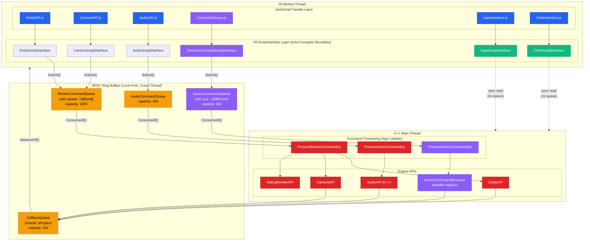
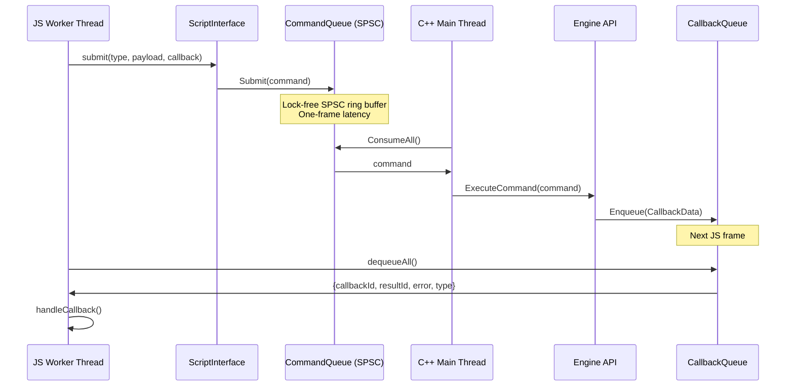
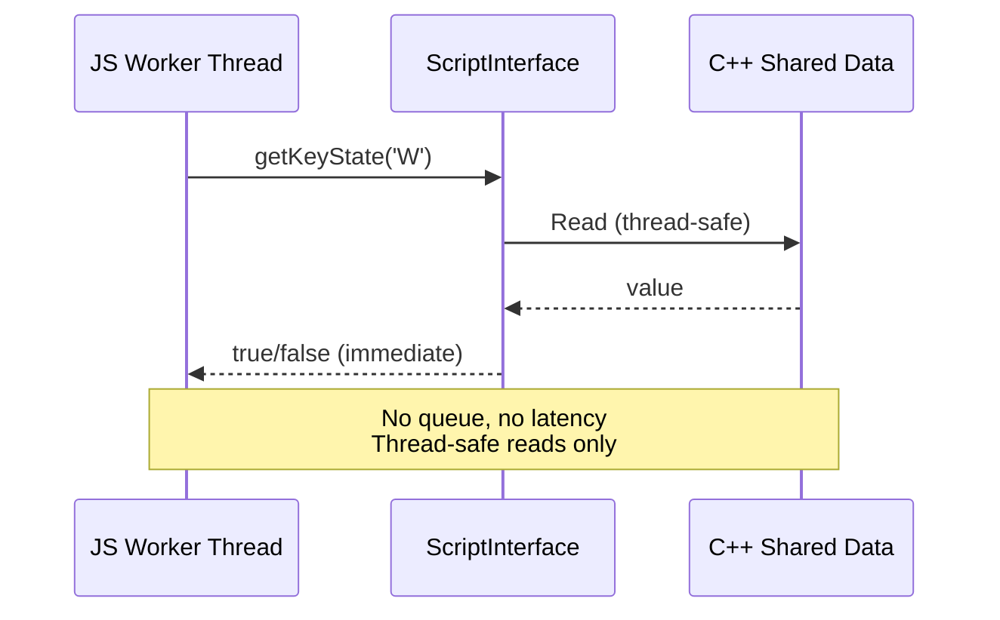
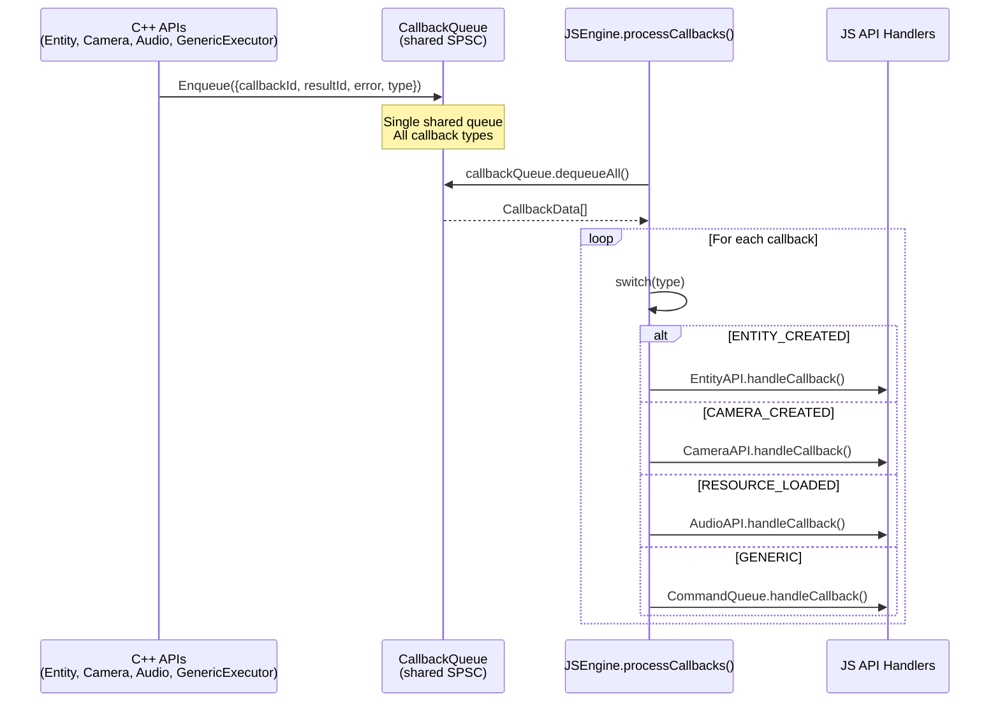
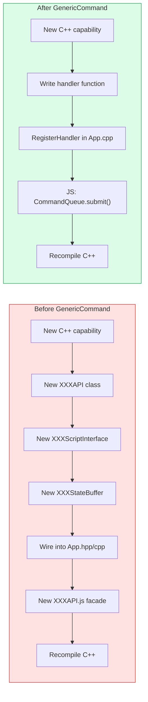
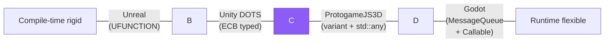

# C++ ↔ JavaScript Bridge Architecture

Three distinct connection patterns between C++ and JavaScript in the ProtogameJS3D engine.

## Overview Diagram

## Three Connection Patterns

### Pattern 1: Async Command Queue (Mutation Path)

**Characteristics:**
- Lock-free, non-blocking SPSC ring buffer
- One-frame latency (submit frame N, execute frame N+1)
- Callback delivery via shared CallbackQueue

| Queue | Payload Type | Capacity | Use Case |
|-------|-------------|----------|----------|
| RenderCommandQueue | `std::variant` (72B) | 1000 | Entity, Camera, DebugRender |
| AudioCommandQueue | typed | 200 | Sound playback |
| **GenericCommandQueue** | **`std::any` (~208B)** | **500** | **Runtime-extensible commands** |

---

### Pattern 2: Sync Direct Read (Query Path)

**Characteristics:**
- Immediate return, zero latency
- No queue involved
- Thread-safe read-only access
- Used for high-frequency queries (every frame)

| Interface | Data Source | Example Methods |
|-----------|-----------|-----------------|
| InputScriptInterface | Input state buffer | `isKeyDown()`, `getMousePos()` |
| ClockScriptInterface | Clock data | `getDeltaSeconds()`, `getFPS()` |

---

### Pattern 3: Callback Delivery (Return Path)

**Characteristics:**
- Single shared `CallbackQueue` for ALL return paths
- `CallbackType` enum discriminator for routing
- Processed at start of each JS frame (`JSEngine.update()`)
- Lock-free SPSC, capacity 100

| CallbackType | Routed To | Source |
|-------------|-----------|--------|
| `ENTITY_CREATED` | `EntityAPI.handleCallback()` | EntityAPI |
| `CAMERA_CREATED` | `CameraAPI.handleCallback()` | CameraAPI |
| `RESOURCE_LOADED` | `AudioAPI.handleCallback()` | AudioAPI |
| **`GENERIC`** | **`CommandQueue.handleCallback()`** | **GenericCommandExecutor** |

---

## What GenericCommand Changes

**Reduction**: 6 files/classes → 1 handler function + 1 registration call

---

## Industry Comparison

ProtogameJS3D sits as a **pragmatic hybrid**: compile-time typed queues for hot paths (render, audio), runtime dispatch for extensibility (GenericCommand).
