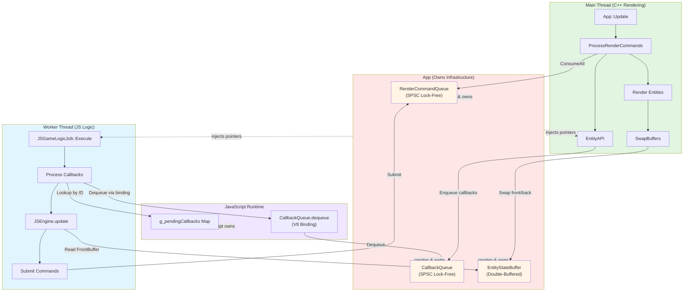
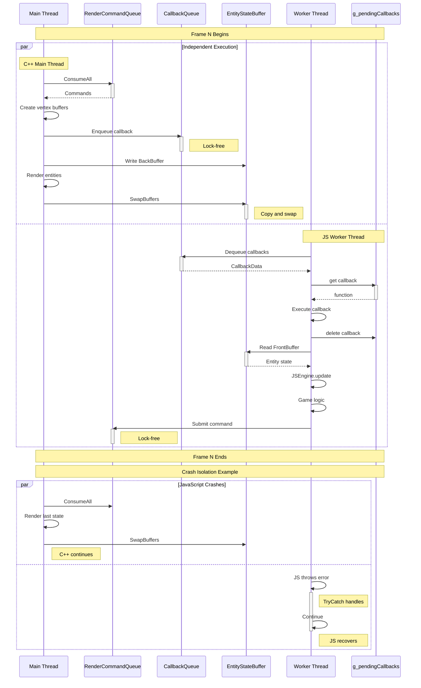
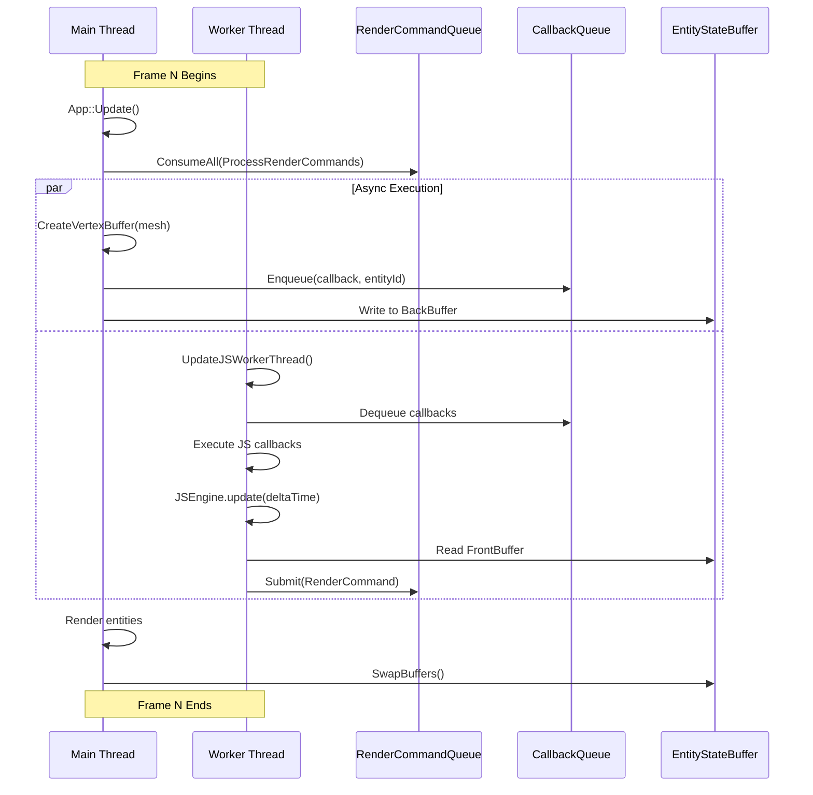
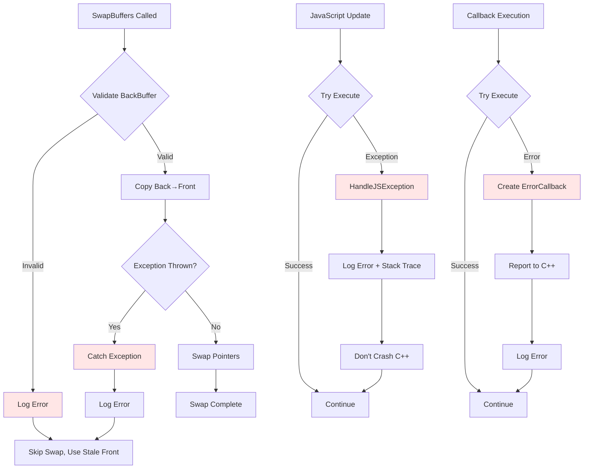
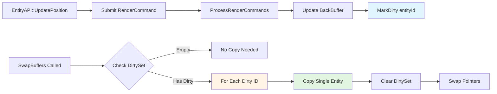

# Design Document: C++/JavaScript Decoupling Architecture (Phase 1-4)

## Overview

This design implements the complete Phase 1-4 roadmap for C++/JavaScript decoupling in ProtogameJS3D's dual-language game engine. The goal is to achieve true thread independence where C++ rendering (main thread) and JavaScript game logic (worker thread) run at independent speeds with fully asynchronous bidirectional communication.

**Current State (Phase 1 - Complete ✅)**:
- Async infrastructure: EntityStateBuffer, CameraStateBuffer, RenderCommandQueue
- JavaScript → C++ async via lock-free SPSC queue
- M4-T8 refactoring: Entity/Camera systems in Engine repository

**Target State (Phase 2-4 - This Design)**:
- **Phase 2**: JavaScript on worker thread, async C++→JS callbacks via CallbackQueue
- **Phase 3**: Error recovery and exception handling for robustness
- **Phase 4**: Dirty tracking optimization to reduce SwapBuffers() cost from O(n) to O(d)
- **Additional**: Remove vertexBufferHandle from EntityState, formal documentation

**Architecture Philosophy**:
- **Lock-Free Hot Paths**: No locks during entity updates or rendering
- **Brief Locked Synchronization**: Only during buffer swap (< 100µs)
- **Fault Isolation**: JavaScript errors don't crash C++, C++ errors don't corrupt JavaScript
- **Incremental Implementation**: Each phase builds on previous, independently testable

## Steering Document Alignment

### Technical Standards

**Thread Safety Standards**:
- SPSC queue pattern for single-producer/single-consumer communication
- Cache-line separation to prevent false sharing (64-byte alignment)
- Atomic operations with appropriate memory ordering (acquire/release semantics)
- No blocking operations in hot paths

**Performance Standards**:
- C++ rendering: Maintain 60+ FPS regardless of JavaScript performance
- Queue operations: < 1µs per operation
- SwapBuffers: < 100µs with dirty tracking (Phase 4)
- Memory overhead: < 2× for double-buffering

**Code Quality Standards**:
- C++20 features with full conformance
- RAII patterns for resource management
- Exception safety guarantees (basic or strong)
- Professional documentation with design rationales

### Project Structure

**Engine Repository** (`C:\p4\Personal\SD\Engine\`):
- Core systems: `Code/Engine/Core/` - StateBuffer, CallbackQueue (new), thread utilities
- Entity management: `Code/Engine/Entity/` - EntityAPI, EntityStateBuffer
- Rendering: `Code/Engine/Renderer/` - CameraAPI, RenderCommandQueue
- Script integration: `Code/Engine/Script/` - V8Subsystem, IJSGameLogicContext

**Game Repository** (`C:\p4\Personal\SD\ProtogameJS3D\`):
- Application: `Code/Game/Framework/` - App.cpp, JSGameLogicJob (modified for CallbackQueue), RenderResourceManager (new)
- Game logic: `Code/Game/Gameplay/` - Game.cpp (wire up TriggerNextFrame())
- JavaScript: `Run/Data/Scripts/` - EntityAPI.js, CameraAPI.js, JSEngine.js (callback processing)

## Code Reuse Analysis

### Existing Components to Leverage

**RenderCommandQueue Pattern** (`Engine/Renderer/RenderCommandQueue.hpp`):
- Lock-free SPSC ring buffer implementation
- Cache-line separated atomic indices (m_head, m_tail)
- Template-based processor pattern (`ConsumeAll<ProcessorFunc>`)
- **Reuse**: Duplicate this pattern for CallbackQueue (JS→C++ and C++→JS use same architecture)
- **Extension**: Add error reporting fields to callback commands

**StateBuffer Template** (`Engine/Core/StateBuffer.hpp`):
- Generic double-buffering with front/back separation
- SwapBuffers() with full O(n) copy
- Thread-safe access pattern: GetFrontBuffer() read-only, GetBackBuffer() write-only
- **Reuse**: Add dirty tracking fields without breaking existing API
- **Extension**: MarkDirty(EntityID), GetDirtyEntities(), dirty-only swap

**EntityAPI/CameraAPI Pattern** (`Engine/Entity/EntityAPI.hpp`):
- RenderCommand submission via SubmitCommand()
- Callback management via m_pendingCallbacks map
- JavaScript binding via EntityScriptInterface
- **Reuse**: Change ExecutePendingCallbacks() to use CallbackQueue instead of direct execution
- **Extension**: Add error reporting when callbacks fail

**V8Subsystem** (`Engine/Script/V8Subsystem.cpp`):
- V8 isolate management
- JavaScript execution via ExecuteCommand()
- Module loading infrastructure
- **Reuse**: Add V8::Locker for worker thread isolation
- **Extension**: Worker thread isolate creation and management

### Integration Points

**Game::Update() → Worker Thread** (`Code/Game/Gameplay/Game.cpp`):
- Currently: Calls `UpdateJS()` on main thread (line 68-74)
- Target: Spawn worker thread, call `UpdateJSWorkerThread()` on worker
- Integration: Replace direct V8 execution with thread signaling

**App::ProcessRenderCommands() → RenderResourceManager** (`Code/Game/Framework/App.cpp`):
- Currently: Writes vertexBufferHandle to EntityState
- Target: Store vertexBufferHandle in RenderResourceManager
- Integration: Map EntityID → vertexBufferHandle in C++ only

**EntityAPI::ExecutePendingCallbacks() → CallbackQueue** (`Engine/Entity/EntityAPI.cpp`):
- Currently: Directly executes callbacks, blocking C++ thread
- Target: Enqueue callbacks to CallbackQueue for async processing
- Integration: JavaScript dequeues and executes during update loop

**JavaScript Update Loop** (`Run/Data/Scripts/JSEngine.js`):
- Currently: Processes entity updates, renders
- Target: Add callback processing at start of update loop
- Integration: `while (let cb = CallbackQueue.dequeue()) { executeCallback(cb); }`

## Architecture

### Ownership Model

**Critical Design Principle**: Clear ownership and dependency injection pattern

| Component | Owner | Lifetime | Injection Target |
|-----------|-------|----------|------------------|
| **RenderCommandQueue** | App | App::Startup() → App::Shutdown() | JSGameLogicJob (producer), App (consumer) |
| **CallbackQueue** | App | App::Startup() → App::Shutdown() | EntityAPI (producer), JSGameLogicJob (consumer via JS bindings) |
| **EntityStateBuffer** | App | App::Startup() → App::Shutdown() | App (writer), JSGameLogicJob (reader) |
| **JSGameLogicJob** | App | App::Startup() → App::Shutdown() | Owns worker thread |
| **EntityAPI** | App | App::Startup() → App::Shutdown() | Receives queue pointers |

**Ownership Pattern**:
```cpp
class App {
private:
    // Infrastructure (owned by App)
    RenderCommandQueue* m_renderCommandQueue = nullptr;  // JS→C++ commands
    CallbackQueue* m_callbackQueue = nullptr;            // C++→JS callbacks
    EntityStateBuffer* m_entityStateBuffer = nullptr;    // Double-buffered state

    // Components (owned by App, receive pointers)
    JSGameLogicJob* m_jsGameLogicJob = nullptr;          // Worker thread job
    EntityAPI* m_entityAPI = nullptr;                    // Entity management

    // App creates all infrastructure, injects into components
    void Startup() {
        m_renderCommandQueue = new RenderCommandQueue(QUEUE_CAPACITY);
        m_callbackQueue = new CallbackQueue(CALLBACK_CAPACITY);
        m_entityStateBuffer = new EntityStateBuffer();

        m_jsGameLogicJob = new JSGameLogicJob(m_game, m_renderCommandQueue,
                                               m_entityStateBuffer, m_callbackQueue);
        m_entityAPI = new EntityAPI(m_renderCommandQueue, m_callbackQueue);
    }
};
```

**JavaScript Access Pattern**:
- **JavaScript owns**: `g_pendingCallbacks` Map (pure JavaScript data structure)
- **JavaScript accesses** (via V8 bindings): `CallbackQueue.dequeue()` → calls C++ CallbackQueue::Dequeue()
- **Analogy**: JavaScript is a CLIENT of C++ queue infrastructure, not an owner

```javascript
// JavaScript side (Run/Data/Scripts/JSEngine.js)
const g_pendingCallbacks = new Map();  // ← JavaScript owns this Map

JSEngine.update = function(deltaTime) {
    // Access C++ queue via V8 binding
    while (true) {
        let callback = CallbackQueue.dequeue();  // ← V8 binding to C++ CallbackQueue
        if (!callback) break;

        // Lookup callback in JavaScript-owned Map
        let callbackFunc = g_pendingCallbacks.get(callback.callbackId);
        if (callbackFunc) {
            callbackFunc(callback.resultId);
            g_pendingCallbacks.delete(callback.callbackId);
        }
    }
};
```

**Three Layers**:
1. **C++ Infrastructure Layer**: App owns queues (RenderCommandQueue, CallbackQueue)
2. **V8 Binding Layer**: V8Subsystem exposes C++ methods to JavaScript
3. **JavaScript Usage Layer**: JavaScript code calls bindings, owns callback Map

### High-Level Thread Model

This section shows how the three core independence principles are achieved through architecture:

1. **No Waiting**: Lock-free SPSC queues enable non-blocking communication
2. **Different Speeds**: Independent thread loops allow C++ 60 FPS, JS variable 30-60 FPS
3. **Crash Isolation**: Double-buffering enables C++ to use last good state if JS crashes

#### Architecture Diagram



**Key Architectural Principles**:
- **App owns all infrastructure**: RenderCommandQueue, CallbackQueue, EntityStateBuffer
- **Dependency injection**: App passes queue pointers to JSGameLogicJob and EntityAPI
- **JavaScript is a client**: Accesses C++ queues via V8 bindings, owns callback Map
- **Symmetry**: Both queues use identical lock-free SPSC pattern

#### Sequence Diagram (Complete Frame Execution)



**Key Sequence Features**:
- **Parallel Execution**: Main thread and worker thread run independently
- **Lock-Free Communication**: All queue operations use atomics (no waiting)
- **Brief Synchronization**: Only SwapBuffers() uses mutex (< 100µs)
- **Crash Isolation**: C++ continues rendering if JavaScript throws error
- **Callback Round-Trip**: C++ enqueues callback ID → JS looks up function in Map → executes

### Modular Design Principles

**Single File Responsibility**:
- `CallbackQueue.hpp/cpp`: Lock-free SPSC queue for callbacks only
- `JavaScriptWorkerThread.hpp/cpp`: Worker thread lifecycle management only
- `RenderResourceManager.hpp/cpp`: Render resource (vertex buffers, textures) management only
- `StateBuffer.hpp`: Dirty tracking logic isolated in template class

**Component Isolation**:
- CallbackQueue independent of V8 (testable without JavaScript)
- StateBuffer dirty tracking backward-compatible (optional optimization)
- RenderResourceManager separate from EntityState (clean abstraction)

**Service Layer Separation**:
- **Data Layer**: StateBuffer, RenderResourceManager (pure state management)
- **Communication Layer**: RenderCommandQueue, CallbackQueue (async messaging)
- **Execution Layer**: Game, App, EntityAPI (business logic)

### Phase 2: Worker Thread Architecture



### Phase 3: Error Recovery Architecture



### Phase 4: Dirty Tracking Optimization



## Components and Interfaces

### Component 1: CallbackQueue (New)

**Purpose**: Lock-free SPSC queue for async C++→JavaScript callback communication

**File Location**: `C:\p4\Personal\SD\Engine\Code\Engine\Core\CallbackQueue.hpp`

**Public Interface**:
```cpp
class CallbackQueue {
public:
    // Types
    struct CallbackData {
        CallbackID callbackId;        // Unique callback identifier
        uint64_t   resultId;          // Entity/camera ID returned
        std::string errorMessage;     // Error message if failed (empty = success)
        CallbackType type;            // ENTITY_CREATED, CAMERA_CREATED, etc.
    };

    // Construction
    explicit CallbackQueue(size_t capacity = DEFAULT_CAPACITY);
    ~CallbackQueue();

    // Producer API (C++ Main Thread)
    bool Enqueue(CallbackData const& callback);
    size_t GetApproximateSize() const;

    // Consumer API (JavaScript Worker Thread)
    template <typename ProcessorFunc>
    void DequeueAll(ProcessorFunc&& processor);

    // Monitoring
    bool IsEmpty() const;
    bool IsFull() const;
    uint64_t GetTotalEnqueued() const;
    uint64_t GetTotalDequeued() const;
};
```

**Dependencies**:
- `<atomic>` for lock-free indices
- `<cstddef>` for size_t
- Pattern copied from RenderCommandQueue.hpp

**Reuses**:
- Exact same SPSC ring buffer algorithm from RenderCommandQueue
- Cache-line separation pattern (64-byte alignment)
- Atomic memory ordering (acquire/release semantics)

**Design Rationale**:
- Separate class (not template) because callback data structure is fixed
- Small data structure (40 bytes: 8+8+32+4 with padding)
- DEFAULT_CAPACITY = 100 (callbacks are infrequent, 1-10 per frame)

---

### Component 2: Activate Existing JSGameLogicJob (Modified)

**Purpose**: Wire up existing worker thread infrastructure (no new component needed)

**File Location**: `C:\p4\Personal\SD\ProtogameJS3D\Code\Game\Framework\JSGameLogicJob.hpp` (already exists)

**Key Discovery**: JSGameLogicJob already implements complete worker thread infrastructure from Phase 1:
- Continuous worker thread execution loop (`Execute()` method)
- V8 isolate management (m_isolate member)
- Frame synchronization (m_frameRequested, m_frameComplete atomics)
- Graceful shutdown (m_shutdownRequested, RequestShutdown())
- Access to RenderCommandQueue and EntityStateBuffer

**Existing Interface** (no changes needed):
```cpp
class JSGameLogicJob : public Job {
public:
    JSGameLogicJob(IJSGameLogicContext* context, RenderCommandQueue* commandQueue,
                   EntityStateBuffer* entityBuffer);

    void Execute() override;         // Worker thread loop (already implemented)
    void TriggerNextFrame();         // Signal next frame
    bool IsFrameComplete() const;    // Check frame completion
    void RequestShutdown();          // Graceful shutdown

private:
    IJSGameLogicContext* m_context;          // JavaScript execution context
    RenderCommandQueue* m_commandQueue;      // JS→C++ command queue
    EntityStateBuffer* m_entityBuffer;       // Entity state double-buffer
    std::atomic<bool> m_frameRequested;
    std::atomic<bool> m_frameComplete;
    std::atomic<bool> m_shutdownRequested;
    v8::Isolate* m_isolate;                  // Worker thread V8 isolate
};
```

**Phase 2 Changes Required**:
1. **Add CallbackQueue pointer** to constructor:
   ```cpp
   JSGameLogicJob(IJSGameLogicContext* context, RenderCommandQueue* commandQueue,
                  EntityStateBuffer* entityBuffer, CallbackQueue* callbackQueue);
   ```

2. **Wire up in App.cpp**:
   ```cpp
   // In App::Startup()
   m_callbackQueue = new CallbackQueue(DEFAULT_CALLBACK_CAPACITY);
   m_jsGameLogicJob = new JSGameLogicJob(m_game, m_renderCommandQueue,
                                          m_entityStateBuffer, m_callbackQueue);
   ```

3. **Activate in Game::Update()**:
   ```cpp
   // Currently: UpdateJS() executes on main thread
   // Target: TriggerNextFrame() activates worker thread
   void Game::Update() {
       if (m_jsGameLogicJob) {
           m_jsGameLogicJob->TriggerNextFrame();  // Signal worker to execute frame
       }
   }
   ```

**Design Rationale**:
- **Reuse over rewrite**: Phase 1 already built complete worker thread infrastructure
- **Minimal changes**: Just add CallbackQueue parameter and wire up existing code
- **Proven pattern**: JSGameLogicJob already tested with RenderCommandQueue
- **Consistent architecture**: Same dependency injection pattern for CallbackQueue

**Design Notes from JSGameLogicJob.hpp**:
> "Solution A (Chosen): Maintains V8 isolate state across frames, lower overhead, simpler error recovery"

This choice validates our approach - continuous worker thread with persistent isolate is optimal.

---

### Component 3: RenderResourceManager (New)

**Purpose**: Manages render-specific resources (vertex buffers, textures) separate from EntityState

**File Location**: `C:\p4\Personal\SD\ProtogameJS3D\Code\Game\Framework\RenderResourceManager.hpp`

**Public Interface**:
```cpp
class RenderResourceManager {
public:
    // Resource Assignment
    void AssignVertexBuffer(EntityID entityId, int vertexBufferHandle);
    void AssignTexture(EntityID entityId, int textureHandle);

    // Resource Retrieval
    int GetVertexBuffer(EntityID entityId) const;
    int GetTexture(EntityID entityId) const;
    bool HasVertexBuffer(EntityID entityId) const;
    bool HasTexture(EntityID entityId) const;

    // Resource Cleanup
    void RemoveEntity(EntityID entityId);
    void Clear();

    // Monitoring
    size_t GetEntityCount() const;

private:
    std::unordered_map<EntityID, int> m_vertexBuffers;  // EntityID → VBO handle
    std::unordered_map<EntityID, int> m_textures;       // EntityID → Texture handle

    mutable std::mutex m_mutex;  // Thread safety (if needed)
};
```

**Dependencies**:
- `<unordered_map>` for EntityID → handle mapping
- `Engine/Entity/EntityID.hpp` for EntityID type

**Reuses**:
- EntityID type from existing Entity system
- std::unordered_map pattern from EntityStateMap

**Design Rationale**:
- C++ only (JavaScript never accesses)
- Separates render resources from game state (Single Responsibility)
- Allows EntityState to be pure game data
- Fast O(1) lookup during rendering

---

### Component 4: StateBuffer with Dirty Tracking (Modified)

**Purpose**: Extend existing StateBuffer with optional dirty tracking optimization

**File Location**: `C:\p4\Personal\SD\Engine\Code\Engine\Core\StateBuffer.hpp`

**New Public Interface** (additions only):
```cpp
template <typename TStateContainer>
class StateBuffer {
public:
    // ... existing methods ...

    // Dirty Tracking (Phase 4)
    void MarkDirty(typename TStateContainer::key_type const& key);
    void ClearDirtyTracking();
    bool IsDirtyTrackingEnabled() const;
    void EnableDirtyTracking(bool enable);

    // Statistics
    size_t GetDirtyCount() const;
    float GetAverageDirtyRatio() const;  // dirty / total entities

private:
    // Dirty tracking state
    std::unordered_set<typename TStateContainer::key_type> m_dirtyKeys;
    bool m_dirtyTrackingEnabled = false;

    // Statistics
    RunningAverage<float, 60> m_dirtyRatios;  // Last 60 frames
};
```

**Dependencies**:
- `<unordered_set>` for dirty key tracking
- Existing TStateContainer::key_type (EntityID or std::string)

**Reuses**:
- Existing SwapBuffers() algorithm
- Existing double-buffer storage (m_bufferA, m_bufferB)

**Design Rationale**:
- Backward compatible (dirty tracking optional, disabled by default)
- No performance impact when disabled
- Significant win when enabled: O(d) vs O(n) where d << n
- Statistics help validate optimization effectiveness

---

### Component 5: EntityAPI Callback Integration (Modified)

**Purpose**: Change ExecutePendingCallbacks() to enqueue callback IDs (not execute callbacks directly)

**File Location**: `C:\p4\Personal\SD\Engine\Code\Engine\Entity\EntityAPI.cpp`

**Key Design Decision**: JavaScript owns callbacks, C++ only passes callback IDs

**Callback Ownership Clarification**:
- **JavaScript Owns**: `g_pendingCallbacks` Map<callbackId, function> in JavaScript
- **C++ Stores**: Only callback IDs (uint64_t), NOT v8::Function objects
- **Benefits**: Thread safety (no v8::Function across frames), cleaner separation

**Modified Method**:
```cpp
// Current (Phase 1) - Synchronous blocking
void EntityAPI::ExecutePendingCallbacks() {
    for (auto& [callbackId, pending] : m_pendingCallbacks) {
        if (pending.ready) {
            ExecuteCallback(callbackId, pending.resultId);  // ← Blocks C++ thread
            pending.executed = true;
        }
    }
    // Cleanup executed callbacks
    std::erase_if(m_pendingCallbacks, [](auto const& pair) {
        return pair.second.executed;
    });
}

// Target (Phase 2) - Async queue with callback IDs only
void EntityAPI::ExecutePendingCallbacks(CallbackQueue* callbackQueue) {
    for (auto& [callbackId, pending] : m_pendingCallbacks) {
        if (pending.ready) {
            // C++ sends only callback ID, not callback function
            CallbackQueue::CallbackData data{
                .callbackId = callbackId,         // ← ID only
                .resultId = pending.resultId,
                .errorMessage = pending.errorMsg,
                .type = CallbackType::ENTITY_CREATED
            };

            bool enqueued = callbackQueue->Enqueue(data);  // ← Never blocks
            if (!enqueued) {
                LogWarning("CallbackQueue full - dropped callback %llu", callbackId);
            }

            pending.executed = true;
        }
    }
    // Cleanup executed callbacks
    std::erase_if(m_pendingCallbacks, [](auto const& pair) {
        return pair.second.executed;
    });
}
```

**JavaScript Callback Registration Pattern**:
```javascript
// EntityAPI.js
let g_callbackIdCounter = 0;
const g_pendingCallbacks = new Map();  // JavaScript owns this

EntityAPI.createMesh = function(meshType, position, radius, color, callback) {
    // Generate unique callback ID
    const callbackId = ++g_callbackIdCounter;

    // JavaScript stores callback function
    g_pendingCallbacks.set(callbackId, callback);  // ← JS owns callback

    // C++ receives only the ID
    cppEntityAPI.createMesh(meshType, position, radius, color, callbackId);
};

// Later, when C++ enqueues callback...
JSEngine.update = function(deltaTime) {
    while (true) {
        let callback = CallbackQueue.dequeue();  // C++ sends callback ID + resultId
        if (!callback) break;

        // JavaScript looks up callback function by ID
        let callbackFunc = g_pendingCallbacks.get(callback.callbackId);
        if (callbackFunc) {
            callbackFunc(callback.resultId);           // Execute JS function
            g_pendingCallbacks.delete(callback.callbackId);  // Cleanup
        }
    }
};
```

**Dependencies**:
- CallbackQueue pointer (passed from App)
- Existing m_pendingCallbacks map (stores IDs and status, not v8::Function)

**Reuses**:
- Existing callback ID management
- Existing PendingCallback structure

**Design Rationale**:
- **Thread Safety**: C++ never stores v8::Function (avoids cross-thread V8 issues)
- **Clean Separation**: JavaScript manages function lifecycle, C++ just routes IDs
- **Non-blocking**: Enqueue operation never blocks C++ thread
- **Graceful Degradation**: If queue full, log warning and continue

---

### Component 6: JavaScript Callback Processing (Modified)

**Purpose**: Add callback dequeue and execution to JavaScript update loop

**File Location**: `C:\p4\Personal\SD\ProtogameJS3D\Run\Data\Scripts\JSEngine.js`

**New Code**:
```javascript
// At start of JSEngine.update()
JSEngine.update = function(deltaTime) {
    // Phase 2: Process callbacks from C++
    if (typeof globalThis.CallbackQueue !== 'undefined') {
        while (true) {
            let callback = CallbackQueue.dequeue();
            if (!callback) break;  // Queue empty

            try {
                executeCallback(callback.callbackId, callback.resultId, callback.errorMessage);
            } catch (e) {
                console.error('Callback execution failed:', e);
                // Don't propagate - continue processing other callbacks
            }
        }
    }

    // Existing update logic
    // ...
};

function executeCallback(callbackId, resultId, errorMessage) {
    // Find callback in pending map
    let callbackFunc = g_pendingCallbacks.get(callbackId);
    if (!callbackFunc) {
        console.warn('Callback not found:', callbackId);
        return;
    }

    // Execute callback
    if (errorMessage && errorMessage.length > 0) {
        console.error('C++ reported error:', errorMessage);
        // Call callback with error
        if (callbackFunc.errorHandler) {
            callbackFunc.errorHandler(errorMessage);
        }
    } else {
        // Call callback with result
        callbackFunc(resultId);
    }

    // Cleanup
    g_pendingCallbacks.delete(callbackId);
}
```

**Dependencies**:
- Native CallbackQueue binding (exposed by V8Subsystem)
- Existing g_pendingCallbacks map

**Reuses**:
- Existing callback registration pattern
- Existing error handling conventions

**Design Rationale**:
- Process callbacks before game logic (callbacks may affect state)
- Try-catch prevents callback errors from stopping update loop
- Graceful handling of missing callbacks (log warning, continue)

## Data Models

### Model 1: CallbackData

**Purpose**: Data structure for C++→JavaScript callback messages

```cpp
struct CallbackData {
    CallbackID   callbackId;      // uint64_t: Unique callback identifier
    uint64_t     resultId;        // EntityID or CameraID returned from C++
    std::string  errorMessage;    // Empty = success, non-empty = error description
    CallbackType type;            // enum: ENTITY_CREATED, CAMERA_CREATED, RESOURCE_LOADED
};

enum class CallbackType : uint8_t {
    ENTITY_CREATED,
    CAMERA_CREATED,
    RESOURCE_LOADED,
    GENERIC
};
```

**Size**: ~40 bytes (8+8+24+4 with padding)

**Thread Safety**: Immutable after construction, copied into queue

**Design Rationale**:
- CallbackID matches JavaScript callback registration
- resultId is 53-bit safe for JavaScript Number type
- errorMessage allows detailed error reporting
- CallbackType enables type-specific handling

---

### Model 2: EntityState (Modified)

**Purpose**: Pure game state structure (render resources removed)

```cpp
// Before (Phase 1)
struct EntityState {
    Vec3        position;           // ✅ Game state
    EulerAngles orientation;        // ✅ Game state
    Rgba8       color;              // ✅ Game state
    float       radius;             // ✅ Game state
    std::string meshType;           // ⚠️ Configuration
    bool        isActive;           // ✅ Game state
    int         vertexBufferHandle; // ❌ C++ render resource
    std::string cameraType;         // ⚠️ Configuration
};

// After (Phase 2+)
struct EntityState {
    Vec3        position;           // ✅ Game state
    EulerAngles orientation;        // ✅ Game state
    Rgba8       color;              // ✅ Game state
    float       radius;             // ✅ Game state
    std::string meshType;           // ✅ Configuration
    bool        isActive;           // ✅ Game state
    std::string cameraType;         // ✅ Configuration
    // vertexBufferHandle moved to RenderResourceManager
};
```

**Size Reduction**: 72 bytes → 68 bytes (4 byte savings per entity)

**Design Rationale**:
- EntityState visible to JavaScript (pure game data only)
- Render resources hidden in RenderResourceManager (C++ only)
- Cleaner separation of concerns (Single Responsibility)

---

### Model 3: DirtySet (Phase 4)

**Purpose**: Track which entities were modified this frame

```cpp
template <typename TStateContainer>
class StateBuffer {
private:
    std::unordered_set<typename TStateContainer::key_type> m_dirtyKeys;
    bool m_dirtyTrackingEnabled = false;
};
```

**For EntityStateBuffer**: `std::unordered_set<EntityID>`
**For CameraStateBuffer**: `std::unordered_set<std::string>`

**Memory Overhead**: 8 bytes per dirty entity + hash table overhead

**Design Rationale**:
- Fast O(1) insert for MarkDirty()
- Fast O(d) iteration during SwapBuffers()
- Clear after swap (reuse for next frame)

## Error Handling

### Error Scenario 1: SwapBuffers() Copy Fails

**Description**: std::unordered_map copy assignment throws (out of memory, etc.)

**Handling**:
```cpp
void StateBuffer::SwapBuffers() {
    try {
        std::lock_guard lock(m_swapMutex);

        // Validate before swap
        if (!ValidateStateBuffer(m_backBuffer)) {
            LogError("Back buffer validation failed - skipping swap");
            return;  // Keep using old front buffer
        }

        // Copy with exception safety
        *m_frontBuffer = *m_backBuffer;
        std::swap(m_frontBuffer, m_backBuffer);
        ++m_totalSwaps;
    }
    catch (std::exception const& e) {
        LogError("SwapBuffers failed: %s", e.what());
        // Don't propagate - renderer uses stale front buffer
        // Game continues with last known good state
    }
}

bool StateBuffer::ValidateStateBuffer(TStateContainer const* buffer) const {
    if (!buffer) return false;
    if (buffer->size() > MAX_ENTITIES) {
        LogError("Buffer size exceeds limit: %zu > %zu", buffer->size(), MAX_ENTITIES);
        return false;
    }
    return true;
}
```

**User Impact**: One frame renders with stale state, then recovers

**Recovery**: Next frame's swap may succeed, system self-heals

---

### Error Scenario 2: JavaScript Exception During Update

**Description**: JavaScript code throws error (null reference, type error, etc.)

**Handling**:
```cpp
void Game::UpdateJSWorkerThread(float deltaTime, EntityStateBuffer* entityBuffer,
                                 RenderCommandQueue* commandQueue) {
    v8::Isolate* isolate = v8::Isolate::GetCurrent();
    v8::HandleScope handleScope(isolate);
    v8::TryCatch tryCatch(isolate);

    // Execute JavaScript update
    String command = StringFormat("globalThis.JSEngine.update(%f);", deltaTime);
    bool success = g_scriptSubsystem->ExecuteCommand(command);

    if (!success || tryCatch.HasCaught()) {
        HandleJSException(tryCatch);
        // Continue execution - C++ rendering unaffected
    }
}

void Game::HandleJSException(v8::TryCatch& tryCatch) {
    v8::Isolate* isolate = v8::Isolate::GetCurrent();
    v8::String::Utf8Value exception(isolate, tryCatch.Exception());
    v8::Local<v8::Message> message = tryCatch.Message();

    // Extract error details
    String errorMsg(*exception);
    String filename = "unknown";
    int linenum = 0;

    if (!message.IsEmpty()) {
        v8::String::Utf8Value filenameUtf8(isolate, message->GetScriptResourceName());
        filename = *filenameUtf8;
        linenum = message->GetLineNumber(isolate->GetCurrentContext()).FromMaybe(0);
    }

    // Log detailed error
    LogError("JavaScript Exception: %s", errorMsg.c_str());
    LogError("  at %s:%d", filename.c_str(), linenum);

    // Optional: Send error to telemetry system
    // g_telemetry->ReportJavaScriptError(errorMsg, filename, linenum);

    // Don't crash - game continues with last valid state
}
```

**User Impact**: JavaScript logic pauses for one frame, C++ rendering continues

**Recovery**: Next frame JavaScript may succeed, or error persists (logged repeatedly)

---

### Error Scenario 3: CallbackQueue Full

**Description**: C++ enqueues callbacks faster than JavaScript processes them

**Handling**:
```cpp
void EntityAPI::ExecutePendingCallbacks(CallbackQueue* callbackQueue) {
    for (auto& [callbackId, pending] : m_pendingCallbacks) {
        if (pending.ready) {
            CallbackQueue::CallbackData data{/* ... */};

            bool enqueued = callbackQueue->Enqueue(data);
            if (!enqueued) {
                // Queue full - drop callback and log warning
                LogWarning("CallbackQueue full (capacity: %zu) - dropped callback %llu",
                           callbackQueue->GetCapacity(), callbackId);

                // Optional: Send error callback to JavaScript
                CallbackQueue::CallbackData errorData{
                    .callbackId = callbackId,
                    .resultId = 0,
                    .errorMessage = "CallbackQueue full - callback dropped",
                    .type = pending.type
                };
                // Try to enqueue error (may also fail if queue full)
                callbackQueue->Enqueue(errorData);
            }

            pending.executed = true;
        }
    }
}
```

**User Impact**: Callback not executed, JavaScript may wait indefinitely for result

**Mitigation**: Increase CallbackQueue capacity (default 100 → 500)

**Detection**: Monitor GetApproximateSize(), alert if > 80% capacity

---

### Error Scenario 4: Worker Thread Deadlock

**Description**: Mutex timeout or circular wait between main and worker threads

**Handling**:
```cpp
void JavaScriptWorkerThread::Stop() {
    // Signal stop
    m_stopRequested.store(true, std::memory_order_release);

    // Join with timeout
    constexpr auto TIMEOUT = std::chrono::seconds(5);

    if (m_workerThread.joinable()) {
        auto start = std::chrono::steady_clock::now();

        while (m_isRunning.load(std::memory_order_acquire)) {
            std::this_thread::sleep_for(std::chrono::milliseconds(100));

            auto elapsed = std::chrono::steady_clock::now() - start;
            if (elapsed > TIMEOUT) {
                LogError("Worker thread deadlock detected - timeout after 5s");
                LogError("Forcing thread termination (unsafe)");

                // Last resort: detach thread (memory leak, but prevent hang)
                m_workerThread.detach();
                return;
            }
        }

        m_workerThread.join();
    }
}
```

**User Impact**: Application may hang on shutdown, or force terminate worker

**Prevention**: No nested locks, brief locked sections only, timeout detection

---

### Error Scenario 5: Dirty Tracking Desync

**Description**: Entity marked dirty but not in backBuffer, or vice versa

**Handling**:
```cpp
void StateBuffer::SwapBuffers() {
    std::lock_guard lock(m_swapMutex);

    if (m_dirtyTrackingEnabled) {
        // Validate dirty set before copying
        for (auto const& dirtyKey : m_dirtyKeys) {
            if (m_backBuffer->find(dirtyKey) == m_backBuffer->end()) {
                LogWarning("Dirty key not in backBuffer: %llu - removing from dirty set", dirtyKey);
                m_dirtyKeys.erase(dirtyKey);
            }
        }

        // Copy only dirty entities
        for (auto const& dirtyKey : m_dirtyKeys) {
            auto it = m_backBuffer->find(dirtyKey);
            if (it != m_backBuffer->end()) {
                (*m_frontBuffer)[dirtyKey] = it->second;
            } else {
                // Entity deleted - remove from front buffer
                m_frontBuffer->erase(dirtyKey);
            }
        }

        m_dirtyKeys.clear();
    } else {
        // Full copy fallback (always correct)
        *m_frontBuffer = *m_backBuffer;
    }

    std::swap(m_frontBuffer, m_backBuffer);
    ++m_totalSwaps;
}
```

**User Impact**: Entity may render with stale state for one frame

**Recovery**: Self-cleaning logic removes invalid dirty keys

**Validation**: Add debug mode that compares dirty-copy vs full-copy results

## Testing Strategy

### Unit Testing

**CallbackQueue Tests** (`Engine/Tests/Core/CallbackQueueTests.cpp`):
```cpp
TEST(CallbackQueue, EnqueueDequeue) {
    CallbackQueue queue(10);

    CallbackQueue::CallbackData data{1, 42, "", CallbackType::ENTITY_CREATED};
    EXPECT_TRUE(queue.Enqueue(data));
    EXPECT_EQ(queue.GetApproximateSize(), 1);

    bool processed = false;
    queue.DequeueAll([&](CallbackQueue::CallbackData const& cb) {
        EXPECT_EQ(cb.callbackId, 1);
        EXPECT_EQ(cb.resultId, 42);
        processed = true;
    });

    EXPECT_TRUE(processed);
    EXPECT_TRUE(queue.IsEmpty());
}

TEST(CallbackQueue, BackpressureWhenFull) {
    CallbackQueue queue(2);

    CallbackQueue::CallbackData data{1, 0, "", CallbackType::GENERIC};

    EXPECT_TRUE(queue.Enqueue(data));  // 1st succeeds
    EXPECT_TRUE(queue.Enqueue(data));  // 2nd succeeds (full)
    EXPECT_FALSE(queue.Enqueue(data)); // 3rd fails (backpressure)
}
```

**StateBuffer Dirty Tracking Tests** (`Engine/Tests/Core/StateBufferTests.cpp`):
```cpp
TEST(StateBuffer, DirtyTrackingReducesCopies) {
    using TestMap = std::unordered_map<uint64_t, int>;
    StateBuffer<TestMap> buffer;
    buffer.EnableDirtyTracking(true);

    // Create 1000 entities in back buffer
    auto* backBuffer = buffer.GetBackBuffer();
    for (uint64_t i = 0; i < 1000; ++i) {
        (*backBuffer)[i] = static_cast<int>(i);
    }

    // Swap (full copy first time)
    buffer.SwapBuffers();

    // Mark only 10 entities dirty
    backBuffer = buffer.GetBackBuffer();
    for (uint64_t i = 0; i < 10; ++i) {
        (*backBuffer)[i] = 999;
        buffer.MarkDirty(i);
    }

    // Swap (should only copy 10 entities)
    auto startTime = std::chrono::high_resolution_clock::now();
    buffer.SwapBuffers();
    auto endTime = std::chrono::high_resolution_clock::now();

    // Verify front buffer has updated values
    auto const* frontBuffer = buffer.GetFrontBuffer();
    for (uint64_t i = 0; i < 10; ++i) {
        EXPECT_EQ(frontBuffer->at(i), 999);
    }

    // Performance should be much better than full copy
    auto duration = std::chrono::duration_cast<std::chrono::microseconds>(endTime - startTime);
    EXPECT_LT(duration.count(), 100);  // < 100µs for 10 entities
}
```

**RenderResourceManager Tests** (`Game/Tests/Framework/RenderResourceManagerTests.cpp`):
```cpp
TEST(RenderResourceManager, AssignAndRetrieve) {
    RenderResourceManager manager;

    EntityID id = 42;
    int vboHandle = 123;

    manager.AssignVertexBuffer(id, vboHandle);
    EXPECT_TRUE(manager.HasVertexBuffer(id));
    EXPECT_EQ(manager.GetVertexBuffer(id), vboHandle);
}

TEST(RenderResourceManager, RemoveEntityCleansUp) {
    RenderResourceManager manager;

    manager.AssignVertexBuffer(42, 123);
    manager.AssignTexture(42, 456);

    manager.RemoveEntity(42);

    EXPECT_FALSE(manager.HasVertexBuffer(42));
    EXPECT_FALSE(manager.HasTexture(42));
}
```

### Integration Testing

**Worker Thread JavaScript Execution** (`Integration/WorkerThreadTests.cpp`):
```cpp
TEST(Integration, JavaScriptRunsOnWorkerThread) {
    // Setup
    Game game;
    EntityStateBuffer entityBuffer;
    RenderCommandQueue renderQueue;
    CallbackQueue callbackQueue;
    JavaScriptWorkerThread worker(&g_scriptSubsystem, &entityBuffer,
                                    nullptr, &renderQueue, &callbackQueue);

    // Start worker thread
    worker.Start();

    // Main thread continues independently
    for (int frame = 0; frame < 60; ++frame) {
        // Simulate C++ rendering at 60 FPS
        std::this_thread::sleep_for(std::chrono::milliseconds(16));
        entityBuffer.SwapBuffers();
    }

    // Verify worker thread executed updates
    EXPECT_GT(worker.GetTotalUpdates(), 0);

    // Stop worker thread
    worker.Stop();
    EXPECT_FALSE(worker.IsRunning());
}
```

**Callback Round-Trip** (`Integration/CallbackRoundTripTests.cpp`):
```cpp
TEST(Integration, CallbackRoundTrip) {
    // JavaScript creates entity
    String jsCode = R"(
        EntityAPI.createMesh('cube', {x: 0, y: 0, z: 0}, 1.0,
                             {r: 255, g: 0, b: 0, a: 255},
                             function(entityId) {
                                 globalThis.testEntityId = entityId;
                             });
    )";

    g_scriptSubsystem->ExecuteCommand(jsCode);

    // C++ processes command
    g_app->ProcessRenderCommands();

    // C++ enqueues callback
    g_entityAPI->ExecutePendingCallbacks(&g_callbackQueue);

    // JavaScript processes callback
    g_game->UpdateJSWorkerThread(0.016f, &g_entityBuffer, &g_renderQueue);

    // Verify JavaScript received entityId
    v8::Local<v8::Value> result = GetGlobalProperty("testEntityId");
    EXPECT_TRUE(result->IsNumber());
    EXPECT_GT(result->NumberValue(), 0);
}
```

### End-to-End Testing

**Full Frame Execution** (`E2E/FullFrameTests.cpp`):
```cpp
TEST(E2E, CompleteFrameExecution) {
    // Frame N

    // 1. Worker thread: JavaScript updates entities
    g_workerThread->WorkerThreadLoop();  // One iteration

    // 2. Main thread: Process render commands
    g_app->ProcessRenderCommands();

    // 3. Main thread: Enqueue callbacks
    g_entityAPI->ExecutePendingCallbacks(&g_callbackQueue);

    // 4. Main thread: Render
    g_app->Render();

    // 5. Main thread: Swap buffers
    g_entityBuffer->SwapBuffers();

    // Verify no crashes, no deadlocks, frame completes < 16ms
}
```

**Error Recovery** (`E2E/ErrorRecoveryTests.cpp`):
```cpp
TEST(E2E, JavaScriptErrorDoesNotCrashCPP) {
    // Execute JavaScript code that throws
    String jsCode = "throw new Error('Intentional test error');";

    // Should not crash, should log error
    EXPECT_NO_FATAL_FAILURE({
        g_scriptSubsystem->ExecuteCommand(jsCode);
    });

    // C++ rendering continues
    EXPECT_NO_THROW({
        g_app->Render();
    });
}

TEST(E2E, SwapBuffersFailureDoesNotCrash) {
    // Inject failure into SwapBuffers (mock)
    g_entityBuffer->InjectFailure(true);

    // Should not crash, should log error
    EXPECT_NO_FATAL_FAILURE({
        g_entityBuffer->SwapBuffers();
    });

    // Next frame may succeed
    g_entityBuffer->InjectFailure(false);
    EXPECT_NO_THROW({
        g_entityBuffer->SwapBuffers();
    });
}
```

### Performance Benchmarks

**Dirty Tracking Benchmark** (`Benchmarks/DirtyTrackingBenchmark.cpp`):
```cpp
BENCHMARK(SwapBuffers_FullCopy_1000Entities) {
    StateBuffer<EntityStateMap> buffer;
    buffer.EnableDirtyTracking(false);

    // Setup 1000 entities
    SetupEntities(buffer.GetBackBuffer(), 1000);

    // Measure swap time
    auto start = std::chrono::high_resolution_clock::now();
    buffer.SwapBuffers();
    auto end = std::chrono::high_resolution_clock::now();

    return std::chrono::duration_cast<std::chrono::microseconds>(end - start).count();
}

BENCHMARK(SwapBuffers_DirtyOnly_10Entities) {
    StateBuffer<EntityStateMap> buffer;
    buffer.EnableDirtyTracking(true);

    // Setup 1000 entities, mark 10 dirty
    SetupEntities(buffer.GetBackBuffer(), 1000);
    buffer.SwapBuffers();  // First swap (full copy)

    MarkEntitiesDirty(buffer, 10);

    // Measure swap time (should be much faster)
    auto start = std::chrono::high_resolution_clock::now();
    buffer.SwapBuffers();
    auto end = std::chrono::high_resolution_clock::now();

    return std::chrono::duration_cast<std::chrono::microseconds>(end - start).count();
}

// Expected Results:
// FullCopy_1000Entities: ~500-1000µs
// DirtyOnly_10Entities: ~20-50µs (10-20x faster)
```

### Thread Safety Validation

**ThreadSanitizer Tests**:
```bash
# Build with ThreadSanitizer
cmake -DCMAKE_BUILD_TYPE=RelWithDebInfo -DENABLE_TSAN=ON ..
make

# Run tests under TSan
./ProtogameJS3D_Tests --gtest_filter=Integration.*

# Expected: No data race warnings
# Common issues to watch for:
# - Double-checked locking without acquire/release
# - Missing atomic operations on shared flags
# - False sharing between m_head and m_tail
```

**Lock-Free Progress Guarantee Tests**:
```cpp
TEST(ThreadSafety, QueueNeverBlocks) {
    RenderCommandQueue queue;

    std::atomic<bool> producerBlocked{false};
    std::atomic<bool> consumerBlocked{false};

    // Producer thread
    std::thread producer([&]() {
        for (int i = 0; i < 10000; ++i) {
            auto start = std::chrono::steady_clock::now();

            RenderCommand cmd{/*...*/};
            queue.Submit(cmd);

            auto elapsed = std::chrono::steady_clock::now() - start;
            if (elapsed > std::chrono::milliseconds(10)) {
                producerBlocked.store(true);
            }
        }
    });

    // Consumer thread
    std::thread consumer([&]() {
        for (int i = 0; i < 100; ++i) {
            auto start = std::chrono::steady_clock::now();

            queue.ConsumeAll([](auto const&) {});

            auto elapsed = std::chrono::steady_clock::now() - start;
            if (elapsed > std::chrono::milliseconds(10)) {
                consumerBlocked.store(true);
            }

            std::this_thread::sleep_for(std::chrono::milliseconds(10));
        }
    });

    producer.join();
    consumer.join();

    EXPECT_FALSE(producerBlocked.load());
    EXPECT_FALSE(consumerBlocked.load());
}
```

## Performance Targets

### Phase 2 Targets

| Metric | Target | Measurement |
|--------|--------|-------------|
| C++ Frame Rate | 60+ FPS | Stable, no drops when JS slows |
| JS Update Rate | 30-60 FPS | Independent of C++ |
| Callback Latency | < 1 frame | C++ enqueue → JS execute |
| Queue Submit Time | < 1µs | RenderCommandQueue::Submit() |
| Worker Thread Startup | < 100ms | Thread spawn + V8 isolate |

### Phase 3 Targets

| Metric | Target | Measurement |
|--------|--------|-------------|
| JS Error Recovery | 100% | No C++ crashes from JS errors |
| SwapBuffers Error Recovery | 100% | Graceful degradation |
| Callback Error Reporting | 100% | Errors reported to C++ |
| Deadlock Detection | < 5s timeout | Detect and log hangs |

### Phase 4 Targets

| Metric | Target | Measurement |
|--------|--------|-------------|
| SwapBuffers Time (10 dirty) | < 50µs | 10 entities dirty out of 1000 |
| SwapBuffers Time (100 dirty) | < 100µs | 100 entities dirty out of 1000 |
| Dirty Ratio (typical) | < 10% | Average dirty entities per frame |
| Memory Overhead | < 1KB | DirtySet storage |

## Implementation Phases

### Phase 2.1: CallbackQueue Implementation (4-6h)

**Files to Create**:
- `Engine/Code/Engine/Core/CallbackQueue.hpp`
- `Engine/Code/Engine/Core/CallbackQueue.cpp`
- `Engine/Tests/Core/CallbackQueueTests.cpp`

**Acceptance Criteria**:
- Enqueue/Dequeue work correctly
- Thread-safe (passes TSan)
- Backpressure when full
- Unit tests pass

### Phase 2.2: EntityAPI/CameraAPI Integration (2-3h)

**Files to Modify**:
- `Engine/Code/Engine/Entity/EntityAPI.cpp`
- `Engine/Code/Engine/Renderer/CameraAPI.cpp`

**Changes**:
- Add `CallbackQueue*` parameter to ExecutePendingCallbacks()
- Change direct callback execution to Enqueue()
- Add backpressure logging

**Acceptance Criteria**:
- Callbacks enqueued instead of executed
- No blocking on C++ thread
- Integration tests pass

### Phase 2.3: Wire Up Existing JSGameLogicJob (2-3h)

**Files to Modify**:
- `Game/Code/Game/Framework/JSGameLogicJob.hpp`
- `Game/Code/Game/Framework/JSGameLogicJob.cpp`
- `Game/Code/Game/Framework/App.cpp`
- `Game/Code/Game/Gameplay/Game.cpp`

**Changes**:
- Add `CallbackQueue*` parameter to JSGameLogicJob constructor
- Pass CallbackQueue pointer when creating JSGameLogicJob in App::Startup()
- Replace Game::UpdateJS() with TriggerNextFrame() call to activate worker thread
- Store CallbackQueue pointer in JSGameLogicJob for JavaScript access

**Acceptance Criteria**:
- JSGameLogicJob receives CallbackQueue pointer via dependency injection
- Worker thread executes JavaScript independently of main thread
- TriggerNextFrame() activates JavaScript update loop
- No deadlocks, graceful shutdown works correctly
- Integration tests pass

### Phase 2.4: JavaScript Callback Processing (3-4h)

**Files to Modify**:
- `Run/Data/Scripts/JSEngine.js`
- `Run/Data/Scripts/interfaces/EntityAPI.js`
- `Run/Data/Scripts/interfaces/CameraAPI.js`

**Changes**:
- Add CallbackQueue.dequeue() at start of update
- Implement executeCallback() function
- Add error handling for callback failures

**Acceptance Criteria**:
- Callbacks dequeued and executed
- Errors logged, don't crash update loop
- Round-trip tests pass

### Phase 3.1: SwapBuffers Error Handling (2-3h)

**Files to Modify**:
- `Engine/Code/Engine/Core/StateBuffer.hpp`

**Changes**:
- Add ValidateStateBuffer() method
- Wrap copy in try-catch
- Add error logging

**Acceptance Criteria**:
- Exceptions caught and logged
- Stale front buffer used on failure
- No crashes

### Phase 3.2: HandleJSException Implementation (3-4h)

**Files to Modify**:
- `Game/Code/Game/Gameplay/Game.cpp`

**Changes**:
- Implement HandleJSException() method
- Add v8::TryCatch around JavaScript execution
- Extract error details (message, stack trace, line number)

**Acceptance Criteria**:
- JavaScript errors logged with details
- C++ continues execution
- Error recovery tests pass

### Phase 4.1: Dirty Tracking Implementation (4-6h)

**Files to Modify**:
- `Engine/Code/Engine/Core/StateBuffer.hpp`
- `Engine/Tests/Core/StateBufferTests.cpp`

**Changes**:
- Add m_dirtyKeys, m_dirtyTrackingEnabled
- Implement MarkDirty(), EnableDirtyTracking()
- Modify SwapBuffers() to use dirty-only copy

**Acceptance Criteria**:
- Dirty tracking works correctly
- Backward compatible (optional)
- Unit tests pass
- Benchmarks show 10-20x speedup

### Phase 4.2: ProcessRenderCommands Integration (2-3h)

**Files to Modify**:
- `Game/Code/Game/Framework/App.cpp`

**Changes**:
- Call entityBuffer->MarkDirty(entityId) after updates
- Enable dirty tracking: entityBuffer->EnableDirtyTracking(true)

**Acceptance Criteria**:
- Entities marked dirty on update
- Integration tests pass
- No visual artifacts

### Phase 5: Remove vertexBufferHandle (4-5h)

**Files to Create**:
- `Game/Code/Game/Framework/RenderResourceManager.hpp`
- `Game/Code/Game/Framework/RenderResourceManager.cpp`

**Files to Modify**:
- `Engine/Code/Engine/Entity/EntityState.hpp`
- `Game/Code/Game/Framework/App.cpp`

**Changes**:
- Remove vertexBufferHandle from EntityState
- Create RenderResourceManager with EntityID → VBO mapping
- Update ProcessRenderCommands() to use RenderResourceManager

**Acceptance Criteria**:
- EntityState size reduced
- Rendering works correctly
- All tests pass

### Documentation: AsyncArchitecturePhases.md (2-3h)

**Files to Create**:
- `Docs/architecture/AsyncArchitecturePhases.md`

**Content**:
- Phase 1: Infrastructure (completed)
- Phase 2: Worker thread execution
- Phase 3: Error recovery
- Phase 4: Performance optimization
- Diagrams, code examples, trade-offs

**Acceptance Criteria**:
- All phases documented
- Diagrams included
- Code examples accurate
- Design rationales explained

## Total Estimated Time

- **Phase 2**: 11-16 hours (reduced from 15-21h by reusing JSGameLogicJob)
- **Phase 3**: 5-7 hours
- **Phase 4**: 6-9 hours
- **Phase 5**: 4-5 hours
- **Documentation**: 2-3 hours

**Total**: 28-40 hours (across all phases)

**Time Savings**: 4-5 hours saved by reusing existing JSGameLogicJob infrastructure instead of creating new JavaScriptWorkerThread component

## Risk Mitigation Summary

1. **V8 Thread Safety**: Use V8::Locker, one isolate per thread
2. **Deadlock**: Timeout detection, no nested locks
3. **Performance Regression**: Benchmark at each phase, keep fallbacks
4. **Dirty Tracking Bugs**: Debug mode with full-copy validation
5. **Queue Overflow**: Monitor size, alert at 80%, increase capacity

## Success Metrics

- ✅ C++ rendering: 60+ FPS stable (independent of JavaScript)
- ✅ JavaScript worker thread: Runs independently at 30-60 FPS
- ✅ No synchronous blocking: All communication via queues
- ✅ Error isolation: JavaScript errors don't crash C++
- ✅ Dirty tracking: 10-20x speedup for typical workloads (< 10% dirty)
- ✅ All tests pass: Unit, integration, E2E
- ✅ ThreadSanitizer clean: No data races detected
- ✅ Documentation complete: AsyncArchitecturePhases.md
