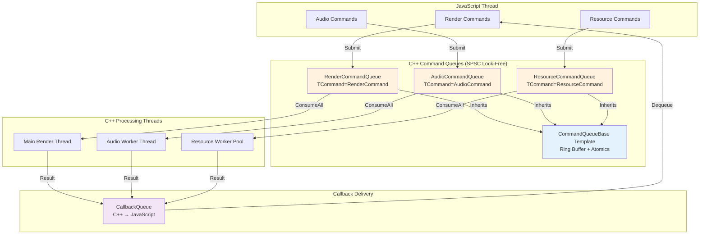

# Design Document: Unified Command Queue Architecture

## Overview

This design document specifies a comprehensive refactoring of the async communication infrastructure into a unified, template-based architecture. The refactoring eliminates ~800 lines of duplicate code by extracting common SPSC (Single-Producer-Single-Consumer) queue implementation into a reusable `CommandQueueBase` template, then specializing for domain-specific queues (Render, Audio, Resource, Debug, Callback).

Additionally, this design completes the SOLID-compliant separation of Renderer and Resource modules by migrating remaining resource loading responsibilities (Shader, BitmapFont) from Renderer to Resource, ensuring each module has a single, well-defined purpose.

### Design Goals
1. **Eliminate Duplication**: Replace 5+ handwritten queue implementations with 1 template + 5 specializations
2. **Consistent Patterns**: All async subsystems use identical command submission and callback patterns
3. **Module Separation**: Complete Renderer/Resource SOLID refactoring
4. **Zero Breaking Changes**: Preserve all existing C++ and JavaScript APIs
5. **Visual Studio Organization**: Logical filter grouping without physical directory restructuring

## Steering Document Alignment

### Technical Standards (tech.md)

*Note: Project does not currently have steering documents. This design follows established patterns from existing codebase:*

- **Lock-Free Async Architecture**: Continues Phase 1-4 async pattern (SPSC queues, cache-line padding, acquire/release memory ordering)
- **Template-Based Design**: Leverages C++ templates for code reuse (CRTP pattern)
- **SOLID Principles**: Enforces Single Responsibility (Renderer vs Resource separation)
- **Professional Documentation**: Maintains academic-grade documentation standards established in existing headers

### Project Structure (structure.md)

*Note: Project does not currently have structure steering document. This design preserves existing structure:*

- **Module Organization**: Engine/{Core,Renderer,Audio,Resource}/ preserved
- **Header-Only Templates**: CommandQueueBase.hpp contains full template implementation (standard C++ practice)
- **Visual Studio Filters**: Logical organization via .vcxproj.filters (IDE-only), physical structure unchanged

## Code Reuse Analysis

### Existing Components to Leverage

#### 1. **RenderCommandQueue** (`Engine/Renderer/RenderCommandQueue.hpp`)
**Reuse Strategy**: Extract common implementation
- Ring buffer allocation/deallocation
- Atomic index management (m_head, m_tail)
- Cache-line padding (`alignas(64)`)
- Submit/ConsumeAll pattern
- Statistics tracking (m_totalSubmitted, m_totalConsumed)

**What Changes**: Becomes specialization of `CommandQueueBase<RenderCommand>`

#### 2. **CallbackQueue** (`Engine/Core/CallbackQueue.hpp`)
**Reuse Strategy**: Extract common implementation
- Identical ring buffer pattern
- Same thread safety model (SPSC)
- Same memory ordering (acquire/release)

**What Changes**: Becomes specialization of `CommandQueueBase<CallbackData>`

#### 3. **Existing Command Structures**
**Preserve As-Is**:
- `RenderCommand` (Engine/Renderer/RenderCommand.hpp)
- `CallbackData` (Engine/Core/CallbackQueue.hpp - extracted to separate file)

**New Structures** (same pattern):
- `AudioCommand` (Engine/Audio/AudioCommand.hpp)
- `ResourceCommand` (Engine/Resource/ResourceCommand.hpp)
- `DebugRenderCommand` (Engine/Renderer/DebugRenderCommand.hpp)

#### 4. **Engine JobSystem** (`Engine/Core/JobSystem.hpp`)
**Reuse Strategy**: Replace ResourceSubsystem's custom worker threads with JobSystem
- **Why JobSystem**: Professional-grade job system with typed workers (JOB_TYPE_IO perfect for resource loading)
- **Architecture**: Three-queue model (queued → executing → completed) with worker thread specialization
- **Integration**: ResourceSubsystem submits Jobs to JobSystem instead of maintaining custom thread pool
- **Benefits**:
  - Eliminates duplicate worker thread implementation (~150 lines)
  - Typed I/O workers prevent blocking generic computation workers
  - Consistent job infrastructure across all engine systems
  - Better lifecycle management (client controls job creation/deletion)
- **Backward Compatibility**: Preserve `std::async` wrapper for existing C++ `LoadResourceAsync()` API

### Integration Points

#### 1. **ScriptSubsystem** (`Engine/Script/`)
**Integration**: Optional command queue injection
```cpp
// If scripting enabled:
resourceSubsystem->SetCommandQueue(resourceCommandQueue, callbackQueue);
audioSubsystem->SetCommandQueue(audioCommandQueue, callbackQueue);

// If scripting disabled:
// Queues remain nullptr, systems work normally
```

#### 2. **Existing Script Interfaces**
**Integration**: Add async methods
```cpp
// ResourceScriptInterface (new)
ScriptMethodResult ExecuteLoadTexture(ScriptArgs const& args);  // Uses ResourceCommandQueue

// AudioScriptInterface (existing - add async)
ScriptMethodResult ExecuteLoadSound(ScriptArgs const& args);    // Uses AudioCommandQueue
```

#### 3. **CallbackQueue** (`Engine/Core/CallbackQueue.hpp`)
**Integration**: Shared result delivery for all async operations
- Audio loading callbacks
- Resource loading callbacks
- Entity/Camera creation callbacks (existing)

## Architecture

### Unified Command Queue Pattern

All queues follow identical architecture, varying only in command type (`TCommand`):

```
┌────────────────────────────────────────────────────┐
│         CommandQueueBase<TCommand>                  │
│  (Template Base Class - CRTP Pattern)               │
├────────────────────────────────────────────────────┤
│  • Ring buffer: TCommand* m_buffer                  │
│  • Atomic indices: m_head, m_tail (cache-aligned)   │
│  • Submit(command): Producer API                    │
│  • ConsumeAll(processor): Consumer API              │
│  • Virtual hooks: OnSubmit, OnConsume, OnQueueFull  │
└────────────────────────────────────────────────────┘
                          ▲
                          │ Inherits
         ┌────────────────┼────────────────┐
         │                │                │
   ┌─────▼─────┐   ┌──────▼──────┐  ┌─────▼─────┐
   │ RenderCmd │   │  AudioCmd   │  │ResourceCmd│
   │  Queue    │   │   Queue     │  │   Queue   │
   └───────────┘   └─────────────┘  └───────────┘
```

### Modular Design Principles

#### Single File Responsibility
- **CommandQueueBase.hpp**: Template implementation only
- **{Domain}Command.hpp**: Command structure definitions only
- **{Domain}CommandQueue.hpp**: Queue specialization only (typically <30 lines)
- **{Domain}ScriptInterface.hpp**: JavaScript bindings only

#### Component Isolation
Each queue is independent:
```cpp
// RenderCommandQueue does not know about AudioCommandQueue
// AudioCommandQueue does not know about ResourceCommandQueue
// All share common base template, but zero cross-dependencies
```

#### Service Layer Separation
```
JavaScript Layer (high-level)
    ↓ (calls)
ScriptInterface Layer (bindings)
    ↓ (submits)
CommandQueue Layer (async transport)
    ↓ (processed by)
Subsystem Layer (business logic)
```

### Architecture Diagram



### Architectural Pattern: Command Queues vs Job System Integration

This refactoring creates **two distinct async patterns** based on workload characteristics:

#### Pattern 1: Lock-Free SPSC Command Queues (RenderCommandQueue, AudioCommandQueue, CallbackQueue)

**Use Case**: Direct thread-to-thread communication with single consumer

**Characteristics**:
- Single producer (JavaScript worker thread)
- Single consumer (dedicated processing thread: Main/Audio/JS)
- Lock-free ring buffer (atomic head/tail indices)
- Processed in consumer's main loop (e.g., `App::Render()`, `AudioWorker::Update()`)
- Ultra-low latency (<0.5ms submission, <1µs consumption)
- Fixed capacity with backpressure (Submit returns false when full)

**Why NOT JobSystem**:
1. **Thread Affinity Requirements**:
   - RenderCommandQueue → Main Thread (DirectX thread affinity)
   - AudioCommandQueue → Audio Thread (FMOD thread affinity)
   - CallbackQueue → JavaScript Thread (V8 thread affinity)
2. **No Worker Pool Needed**: Single consumer executes all commands sequentially
3. **Optimal Performance**: Lock-free SPSC is already optimal for this pattern
4. **Synchronous Consumption**: Commands processed every frame in tight loop

**Execution Flow**:
```
JavaScript → CommandQueue → Dedicated Thread (ConsumeAll in thread's main loop)
  → Direct execution (same thread, no context switching)
```

---

#### Pattern 2: JobSystem Integration (ResourceCommandQueue ONLY)

**Use Case**: Workload distribution across worker pool for long-running I/O operations

**Characteristics**:
- Single producer (JavaScript worker thread)
- Multiple consumers (JobSystem I/O worker thread pool)
- Commands → Jobs conversion (ResourceLoadJob)
- Asynchronous execution (10-200ms file I/O operations)
- Typed workers (`JOB_TYPE_IO` prevents blocking generic workers)
- Three-queue job tracking (queued → executing → completed)

**Why JobSystem**:
1. **Worker Pool Architecture**: Multiple I/O workers can process jobs in parallel
2. **Long-Running Operations**: File I/O benefits from parallel worker distribution
3. **Typed Workers**: `JOB_TYPE_IO` ensures resource loading doesn't block terrain generation, physics, etc.
4. **Job Lifecycle Tracking**: Three-queue model provides visibility into loading progress
5. **Shared Infrastructure**: Same worker pool used across engine (terrain, resource, physics)
6. **Eliminates Duplication**: Removes ResourceSubsystem's custom worker thread implementation (~150 lines)

**Execution Flow**:
```
JavaScript → ResourceCommandQueue → ResourceSubsystem::ProcessPendingCommands()
  → Creates ResourceLoadJob → JobSystem::SubmitJob() (JOB_TYPE_IO)
  → I/O Worker Thread executes Job::Execute() (parallel, 10-200ms)
  → Job completion → CallbackQueue → JavaScript receives result
```

---

#### Decision Matrix: When to Use Each Pattern

| Factor | Lock-Free SPSC Queue | JobSystem Integration |
|--------|---------------------|----------------------|
| **Consumer Count** | Single dedicated thread | Worker pool (multiple threads) |
| **Thread Affinity** | Required (DirectX, FMOD, V8) | No affinity requirement |
| **Operation Latency** | <1ms (render commands, audio) | >10ms (file I/O, network) |
| **Execution Pattern** | Every frame in tight loop | Asynchronous background work |
| **Worker Typing** | Not applicable | Needed (I/O vs generic workers) |
| **Job Tracking** | Not needed (immediate) | Needed (long-running ops) |

**Summary**:
- **RenderCommandQueue, AudioCommandQueue, CallbackQueue**: Lock-free SPSC (single consumer, thread affinity, <1ms latency)
- **ResourceCommandQueue**: JobSystem integration (worker pool, long I/O, typed workers)

---

## Components and Interfaces

### Component 1: CommandQueueBase Template

**File**: `Engine/Core/CommandQueueBase.hpp` (new)

**Purpose**: Reusable lock-free SPSC ring buffer template for all command queues

**Interfaces**:
```cpp
template <typename TCommand>
class CommandQueueBase
{
public:
    // Construction
    explicit CommandQueueBase(size_t capacity);
    virtual ~CommandQueueBase();

    // Producer API (single thread)
    bool Submit(TCommand const& command);
    size_t GetApproximateSize() const;

    // Consumer API (single thread)
    template <typename ProcessorFunc>
    void ConsumeAll(ProcessorFunc&& processor);

    // Monitoring
    bool IsEmpty() const;
    bool IsFull() const;
    size_t GetCapacity() const;
    uint64_t GetTotalSubmitted() const;
    uint64_t GetTotalConsumed() const;

protected:
    // Virtual hooks (subclass customization)
    virtual void OnSubmit(TCommand const& command) {}
    virtual void OnConsume(TCommand const& command) {}
    virtual void OnQueueFull() {}

private:
    // Ring buffer storage
    TCommand* m_buffer;
    size_t m_capacity;

    // Atomic indices (cache-line separated)
    alignas(64) std::atomic<size_t> m_head;
    alignas(64) std::atomic<size_t> m_tail;

    // Statistics
    std::atomic<uint64_t> m_totalSubmitted;
    std::atomic<uint64_t> m_totalConsumed;

    // Helper
    size_t NextIndex(size_t index) const;
};
```

**Dependencies**:
- `<atomic>`, `<cstddef>`, `<cstdint>` (standard library only)
- **Zero** engine-specific dependencies

**Reuses**: None (foundational component)

**Memory Ordering Design**:
```cpp
// Submit (Producer)
bool Submit(TCommand const& command) {
    size_t currentTail = m_tail.load(std::memory_order_relaxed);  // Producer owns tail
    size_t nextTail = NextIndex(currentTail);

    if (nextTail == m_head.load(std::memory_order_acquire)) {     // Sync with consumer
        OnQueueFull();
        return false;
    }

    m_buffer[currentTail] = command;                               // Write command
    m_tail.store(nextTail, std::memory_order_release);             // Publish to consumer
    m_totalSubmitted.fetch_add(1, std::memory_order_relaxed);      // Stats only
    OnSubmit(command);
    return true;
}

// ConsumeAll (Consumer)
template <typename ProcessorFunc>
void ConsumeAll(ProcessorFunc&& processor) {
    size_t currentHead = m_head.load(std::memory_order_relaxed);  // Consumer owns head
    size_t currentTail = m_tail.load(std::memory_order_acquire);   // Sync with producer

    while (currentHead != currentTail) {
        OnConsume(m_buffer[currentHead]);
        processor(m_buffer[currentHead]);                          // Process command
        currentHead = NextIndex(currentHead);
        m_totalConsumed.fetch_add(1, std::memory_order_relaxed);
    }

    m_head.store(currentHead, std::memory_order_release);          // Publish to producer
}
```

---

### Component 2: RenderCommandQueue (Refactored)

**File**: `Engine/Renderer/RenderCommandQueue.hpp` (existing - minimal changes)

**Purpose**: Render command submission (JavaScript → Render Thread)

**Interfaces**:
```cpp
class RenderCommandQueue : public CommandQueueBase<RenderCommand>
{
public:
    static constexpr size_t DEFAULT_CAPACITY = 1000;

    explicit RenderCommandQueue(size_t capacity = DEFAULT_CAPACITY)
        : CommandQueueBase<RenderCommand>(capacity) {}

protected:
    void OnQueueFull() override {
        // Log warning: render commands being dropped
    }
};
```

**Dependencies**:
- `CommandQueueBase<RenderCommand>`
- `RenderCommand` (Engine/Renderer/RenderCommand.hpp)

**Reuses**: Inherits entire SPSC implementation from `CommandQueueBase`

**Migration Strategy**:
1. Keep existing RenderCommand.hpp unchanged
2. Replace RenderCommandQueue implementation with inheritance from base
3. Delete ~200 lines of duplicate ring buffer code
4. Preserve all public APIs (binary compatible)

---

### Component 3: AudioCommandQueue (New)

**File**: `Engine/Audio/AudioCommandQueue.hpp` (new)

**Purpose**: Audio command submission (JavaScript → Audio Thread)

**Interfaces**:
```cpp
class AudioCommandQueue : public CommandQueueBase<AudioCommand>
{
public:
    static constexpr size_t DEFAULT_CAPACITY = 200;  // Fewer audio ops per frame

    explicit AudioCommandQueue(size_t capacity = DEFAULT_CAPACITY)
        : CommandQueueBase<AudioCommand>(capacity) {}

protected:
    void OnSubmit(AudioCommand const& command) override {
        // Optional: Log audio operations for debugging
        if (command.type == AudioCommandType::LOAD_SOUND)
            LOG_INFO("Audio: Loading %s", command.soundPath.c_str());
    }
};
```

**Dependencies**:
- `CommandQueueBase<AudioCommand>`
- `AudioCommand` (Engine/Audio/AudioCommand.hpp - new)

**Reuses**: Entire queue implementation from base template

---

### Component 4: ResourceCommandQueue (New)

**File**: `Engine/Resource/ResourceCommandQueue.hpp` (new)

**Purpose**: Resource loading command submission (JavaScript → Resource Worker Pool)

**Interfaces**:
```cpp
class ResourceCommandQueue : public CommandQueueBase<ResourceCommand>
{
public:
    static constexpr size_t DEFAULT_CAPACITY = 200;

    explicit ResourceCommandQueue(size_t capacity = DEFAULT_CAPACITY)
        : CommandQueueBase<ResourceCommand>(capacity) {}

protected:
    void OnQueueFull() override {
        LOG_WARNING("Resource queue full! Commands being dropped.");
    }
};
```

**Dependencies**:
- `CommandQueueBase<ResourceCommand>`
- `ResourceCommand` (Engine/Resource/ResourceCommand.hpp - new)

**Reuses**: Entire queue implementation from base template

**Integration with ResourceSubsystem and JobSystem**:
```cpp
// ResourceSubsystem.hpp (updated)
class ResourceSubsystem {
public:
    // Existing C++ API (unchanged)
    template <typename T>
    ResourceHandle<T> LoadResource(String const& path);

    template <typename T>
    std::future<ResourceHandle<T>> LoadResourceAsync(String const& path);  // Now uses JobSystem

#if ENGINE_SCRIPTING_ENABLED
    // New: JavaScript integration (optional)
    void SetCommandQueue(ResourceCommandQueue* cmdQueue, CallbackQueue* cbQueue);
    void ProcessPendingCommands();  // Called by App::Update() - submits Jobs to JobSystem
#endif

    // New: JobSystem integration (replaces custom worker threads)
    void SetJobSystem(JobSystem* jobSystem);

private:
    // REMOVED: Custom worker thread implementation
    // std::vector<std::thread> m_workerThreads;              // Deleted (JobSystem replaces)
    // std::queue<std::function<void()>> m_taskQueue;         // Deleted (JobSystem replaces)
    // std::mutex m_queueMutex;                               // Deleted (JobSystem handles)
    // std::condition_variable m_condition;                   // Deleted (JobSystem handles)

    // NEW: Dependency injection
    JobSystem* m_jobSystem = nullptr;  // Required for async operations

    // Optional script integration
    ResourceCommandQueue* m_commandQueue = nullptr;  // Optional (nullptr if no script)
    CallbackQueue* m_callbackQueue = nullptr;
};
```

**Flow: JavaScript → ResourceCommandQueue → JobSystem → CallbackQueue**
1. JavaScript calls `resource.loadTexture(path, callback)` via ScriptSubsystem
2. ResourceScriptInterface submits `ResourceCommand{LOAD_TEXTURE}` to ResourceCommandQueue
3. ResourceSubsystem::ProcessPendingCommands() consumes commands, creates Jobs
4. Jobs submitted to JobSystem with `JOB_TYPE_IO` (I/O worker threads execute)
5. Job completion triggers CallbackQueue submission with `{ callbackId, resourceId }`
6. JavaScript receives callback result in next frame

---

### Component 5: DebugRenderCommandQueue (New, Debug-Only)

**File**: `Engine/Renderer/DebugRenderCommand.hpp` (new)

**Purpose**: Debug visualization command submission (JavaScript → Render Thread)

**Interfaces**:
```cpp
#if defined(_DEBUG) || defined(DEBUG)

class DebugRenderCommandQueue : public CommandQueueBase<DebugRenderCommand>
{
public:
    static constexpr size_t DEFAULT_CAPACITY = 500;

    explicit DebugRenderCommandQueue(size_t capacity = DEFAULT_CAPACITY)
        : CommandQueueBase<DebugRenderCommand>(capacity) {}
};

#else

// Release build: stub implementation
class DebugRenderCommandQueue {
public:
    explicit DebugRenderCommandQueue(size_t = 0) {}
    bool Submit(DebugRenderCommand const&) { return true; }
    template <typename F> void ConsumeAll(F&&) {}
};

#endif
```

**Dependencies**:
- `CommandQueueBase<DebugRenderCommand>` (DEBUG builds only)
- `DebugRenderCommand` (Engine/Renderer/DebugRenderCommand.hpp)

**Reuses**: Entire queue implementation from base (DEBUG), stub (RELEASE)

---

### Component 6: JobSystem Integration for Resource Loading

**Files**:
- `Engine/Core/JobSystem.hpp` (existing - reused)
- `Engine/Resource/ResourceLoadJob.hpp` (new)

**Purpose**: Replace ResourceSubsystem's custom worker threads with professional JobSystem architecture

**IMPORTANT: Why Only ResourceCommandQueue Uses JobSystem**

| Queue Type | Uses JobSystem? | Reason |
|-----------|----------------|---------|
| **RenderCommandQueue** | ❌ **NO** | Single consumer (Main Thread), DirectX thread affinity, lock-free SPSC optimal |
| **CallbackQueue** | ❌ **NO** | Single consumer (JS Worker), data delivery only, lock-free SPSC optimal |
| **AudioCommandQueue** | ❌ **NO** | Single consumer (Audio Thread), FMOD thread, lock-free SPSC optimal |
| **ResourceCommandQueue** | ✅ **YES** | Multiple I/O workers, long-running file I/O (10-200ms), typed worker benefits |

**Architectural Distinction**:
- **Command Queues (Render/Audio)**: Direct thread-to-thread communication, single consumer executes commands in own loop
- **Resource Loading**: Workload distribution across worker pool, benefits from JobSystem's typed workers and job tracking

**Why JobSystem Over Custom Threads?**

| Aspect | Custom Worker Threads (Current) | JobSystem (Proposed) |
|--------|--------------------------------|---------------------|
| **Worker Specialization** | No specialization | `JOB_TYPE_IO` workers dedicated to I/O operations |
| **Code Duplication** | ~150 lines duplicate implementation | Reuses existing infrastructure |
| **Lifecycle Management** | Manual thread creation/destruction | Managed by JobSystem |
| **Job Tracking** | Simple queue (no visibility) | Three-queue model (queued/executing/completed) |
| **Integration** | ResourceSubsystem only | Shared across all engine systems |
| **Performance** | Generic mutex locking | Condition variable sleeping + typed workers |

**ResourceLoadJob Implementation**:
```cpp
// ResourceLoadJob.hpp (new)
#include "Engine/Core/Job.hpp"
#include "Engine/Resource/ResourceSubsystem.hpp"

class ResourceLoadJob : public Job
{
public:
    explicit ResourceLoadJob(ResourceCommand const& cmd, ResourceSubsystem* subsystem, CallbackQueue* callbackQueue)
        : Job(JOB_TYPE_IO)  // I/O worker threads only
        , m_command(cmd)
        , m_subsystem(subsystem)
        , m_callbackQueue(callbackQueue)
    {}

    void Execute() override
    {
        // Execute on I/O worker thread (non-blocking for generic workers)
        switch (m_command.type)
        {
        case ResourceCommandType::LOAD_TEXTURE:
        {
            auto handle = m_subsystem->LoadResource<TextureResource>(m_command.path);

            // Return result to JavaScript via CallbackQueue
            if (m_callbackQueue && handle.IsValid())
            {
                CallbackData callback;
                callback.callbackId = m_command.callbackId;
                callback.data["resourceId"] = handle.GetID();
                callback.data["success"] = true;
                m_callbackQueue->Submit(callback);
            }
            break;
        }
        // ... other resource types
        }
    }

private:
    ResourceCommand m_command;
    ResourceSubsystem* m_subsystem;
    CallbackQueue* m_callbackQueue;
};
```

**ResourceSubsystem Integration**:
```cpp
// ResourceSubsystem.cpp (updated)
void ResourceSubsystem::ProcessPendingCommands()
{
#if ENGINE_SCRIPTING_ENABLED
    if (!m_commandQueue || !m_jobSystem) return;

    m_commandQueue->ConsumeAll([this](ResourceCommand const& cmd)
    {
        // Create job and submit to JobSystem (I/O workers will execute)
        auto job = new ResourceLoadJob(cmd, this, m_callbackQueue);
        m_jobSystem->SubmitJob(job);
    });

    // Retrieve completed jobs and delete them
    // (Jobs manage their own callback submission)
    auto completedJobs = m_jobSystem->RetrieveAllCompletedJobs();
    for (Job* job : completedJobs)
    {
        delete job;  // Client manages job lifecycle
    }
#endif
}
```

**Benefits**:
1. **Eliminates Duplication**: Removes ~150 lines of worker thread code from ResourceSubsystem
2. **Typed Workers**: I/O jobs don't block generic computation workers (terrain generation, etc.)
3. **Consistent Pattern**: All async operations use JobSystem (resource, terrain, physics)
4. **Better Lifecycle**: Three-queue model provides visibility into job states
5. **Professional Grade**: Production-ready job system with proper condition variable sleeping

**Migration Strategy**:
- **Phase 1**: Add JobSystem dependency injection to ResourceSubsystem
- **Phase 2**: Implement ResourceLoadJob class
- **Phase 3**: Update `ProcessPendingCommands()` to use JobSystem
- **Phase 4**: Remove custom worker thread implementation (`m_workerThreads`, `m_taskQueue`, etc.)
- **Phase 5**: Preserve `std::async` wrapper for backward compatibility

---

## Data Models

### Model 1: AudioCommand

**File**: `Engine/Audio/AudioCommand.hpp` (new)

```cpp
enum class AudioCommandType : uint8_t {
    LOAD_SOUND,
    PLAY_SOUND,
    STOP_SOUND,
    SET_VOLUME,
    UPDATE_3D_POSITION
};

struct AudioCommand {
    AudioCommandType type;
    uint64_t callbackId;          // JavaScript callback ID
    std::string soundPath;        // Path for LOAD_SOUND
    uint64_t soundId;             // ID for PLAY_SOUND, STOP_SOUND, SET_VOLUME
    float volume;                 // For SET_VOLUME (0.0-1.0)
    Vec3 position;                // For UPDATE_3D_POSITION

    // Size: ~280 bytes (string storage)
};
```

### Model 2: ResourceCommand

**File**: `Engine/Resource/ResourceCommand.hpp` (new)

```cpp
enum class ResourceCommandType : uint8_t {
    LOAD_TEXTURE,
    LOAD_MODEL,
    LOAD_SHADER,
    LOAD_AUDIO,
    LOAD_FONT,
    UNLOAD_RESOURCE
};

struct ResourceCommand {
    ResourceCommandType type;
    uint64_t callbackId;          // JavaScript callback ID
    std::string path;             // Resource file path
    eResourceType resourceType;   // TEXTURE, MODEL, SHADER, AUDIO, FONT
    bool async;                   // true = background load, false = priority load
    int priority;                 // 0-10 (higher = load sooner)

    // Size: ~280 bytes (string storage)
};
```

### Model 3: DebugRenderCommand

**File**: `Engine/Renderer/DebugRenderCommand.hpp` (new)

```cpp
enum class DebugRenderCommandType : uint8_t {
    ADD_WORLD_LINE,
    ADD_WORLD_SPHERE,
    ADD_WORLD_ARROW,
    ADD_BILLBOARD_TEXT,
    ADD_SCREEN_TEXT,
    CLEAR,
    SET_VISIBLE,
    SET_HIDDEN
};

struct DebugRenderCommand {
    DebugRenderCommandType type;

    // Geometry parameters (union for memory efficiency)
    union {
        struct { Vec3 start, end; float radius; } line;
        struct { Vec3 center; float radius; } sphere;
        struct { Vec3 base, top; float radius; } arrow;
        struct { char text[256]; Vec3 pos; float height; } worldText;
        struct { char text[256]; Vec2 screenPos; float size; } screenText;
    } params;

    Rgba8 color;
    float duration;
    uint8_t renderMode;  // ALWAYS, USE_DEPTH, X_RAY

    // Size: ~280 bytes (text buffer)
};
```

### Model 4: CallbackData (Existing - Enhanced)

**File**: `Engine/Core/CallbackData.hpp` (extracted from CallbackQueue.hpp)

```cpp
enum class CallbackType : uint8_t {
    ENTITY_CREATED,
    CAMERA_CREATED,
    RESOURCE_LOADED,   // Enhanced: Add resource loading
    AUDIO_LOADED,      // New: Audio loading complete
    GENERIC
};

struct CallbackData {
    uint64_t callbackId;      // JavaScript-generated callback ID
    uint64_t resultId;        // EntityID, CameraID, ResourceID, SoundID
    std::string errorMessage; // Empty = success, non-empty = error description
    CallbackType type;        // Type of callback

    // Size: ~40 bytes
};
```

## SOLID Module Separation: Renderer/Resource

### Current State (Violates SRP)

**Renderer Module** currently has:
- ✅ DirectX API wrapping (correct responsibility)
- ✅ Rendering pipeline (correct)
- ❌ Texture file loading (`CreateTextureFromFile`) - SHOULD be in Resource
- ❌ Shader file loading (`CreateOrGetShaderFromFile`) - SHOULD be in Resource
- ❌ BitmapFont file loading (`CreateOrGetBitmapFontFromFile`) - SHOULD be in Resource
- ❌ Resource caching (`std::vector<Texture*> m_loadedTextures`) - SHOULD be in Resource

### Target State (SOLID Compliant)

**Renderer Module** SHALL have ONLY:
- DirectX device/context management
- Shader compilation (DirectX API responsibility)
- Rendering pipeline (draw calls, state management)
- Viewport management

**Resource Module** SHALL have ALL:
- File I/O operations (`fopen`, `std::ifstream`)
- Resource loading (textures, shaders, fonts, models, audio)
- Resource caching (`ResourceCache`)
- Lifetime management (`ResourceHandle`)

### Migration Strategy

#### 1. Shader Loading Migration

**From**: `Renderer::CreateOrGetShaderFromFile()`
**To**: `ResourceSubsystem::CreateOrGetShader<ShaderResource>()`

```cpp
// Phase 1: Create ShaderLoader
class ShaderLoader : public IResourceLoader {
    bool CanLoad(String const& extension) const override {
        return extension == ".hlsl" || extension == ".shader";
    }

    std::shared_ptr<IResource> Load(String const& path) override {
        // Read shader source from file
        std::string shaderSource = ReadTextFile(path);

        // Create ShaderResource
        auto shaderResource = std::make_shared<ShaderResource>();
        shaderResource->m_path = path;
        shaderResource->m_source = shaderSource;

        return shaderResource;
    }
};

// Phase 2: Renderer compiles shader bytecode from ShaderResource
Shader* Renderer::CompileShader(ShaderResource const& resource, eVertexType vertexType) {
    // Renderer responsibility: DirectX shader compilation
    // Input: shader source code (from Resource module)
    // Output: compiled DirectX shader objects
}
```

**Boundary**: Resource loads source text, Renderer compiles to DirectX bytecode

#### 2. BitmapFont Loading Migration

**From**: `Renderer::CreateOrGetBitmapFontFromFile()`
**To**: `ResourceSubsystem::CreateOrGetBitmapFont<FontResource>()`

```cpp
// FontLoader reads .fnt files
class FontLoader : public IResourceLoader {
    std::shared_ptr<IResource> Load(String const& path) override {
        // Read font definition file
        // Parse glyph metrics
        // Create FontResource
    }
};

// BitmapFont creation stays in Renderer (uses DirectX)
BitmapFont* Renderer::CreateBitmapFont(FontResource const& resource) {
    // Renderer responsibility: Create DirectX texture atlas
    // Input: font data (from Resource module)
    // Output: renderable BitmapFont
}
```

#### 3. Texture Loading (Already Migrated ✅)

**Status**: Texture loading already migrated to ResourceSubsystem (Phase 6)
- `Renderer::CreateTextureFromFile()` removed
- `ResourceSubsystem::CreateOrGetTextureFromFile()` implemented
- `TextureLoader` class exists

**Validation**: Ensure Renderer has ZERO texture file I/O

## Error Handling

### Error Scenarios

#### 1. **Queue Full (Backpressure)**
**Scenario**: Submit() called when queue at capacity
**Handling**:
```cpp
bool submitted = queue->Submit(command);
if (!submitted) {
    LOG_WARNING("Queue full! Command type %d dropped", command.type);

    // Optional: Return error callback to JavaScript
    CallbackData errorCallback;
    errorCallback.callbackId = command.callbackId;
    errorCallback.errorMessage = "Queue full - command dropped";
    callbackQueue->Enqueue(errorCallback);
}
```
**User Impact**: Command silently dropped, error callback to JavaScript

#### 2. **Resource Loading Failure**
**Scenario**: File not found, format error, memory allocation failure
**Handling**:
```cpp
void ResourceSubsystem::ProcessResourceCommand(ResourceCommand const& cmd) {
    std::shared_ptr<IResource> resource = LoadResourceInternal(cmd.path);

    CallbackData callback;
    callback.callbackId = cmd.callbackId;
    callback.type = CallbackType::RESOURCE_LOADED;

    if (resource) {
        callback.resultId = resource->GetID();
        callback.errorMessage = "";
    } else {
        callback.resultId = 0;
        callback.errorMessage = "Failed to load: " + cmd.path;
    }

    m_callbackQueue->Enqueue(callback);
}
```
**User Impact**: JavaScript callback receives error message

#### 3. **Audio Loading Failure (FMOD)**
**Scenario**: FMOD_Sound_Load fails (corrupted file, unsupported format)
**Handling**:
```cpp
// Similar to resource loading - return error via callback
callback.errorMessage = "FMOD error: " + FMOD_ErrorString(result);
```
**User Impact**: JavaScript receives FMOD error description

#### 4. **Callback Queue Full**
**Scenario**: C++ generates callbacks faster than JavaScript consumes
**Handling**:
```cpp
bool enqueued = callbackQueue->Enqueue(callback);
if (!enqueued) {
    LOG_ERROR("Callback queue full! JavaScript not consuming fast enough");
    // Critical: This indicates JavaScript thread is blocked or slow
}
```
**User Impact**: JavaScript misses callback (promise never resolves)

## Testing Strategy

### Unit Testing

#### CommandQueueBase Template
```cpp
TEST(CommandQueueBase, SubmitAndConsume) {
    struct TestCommand { int value; };
    CommandQueueBase<TestCommand> queue(10);

    // Test: Submit and consume
    queue.Submit({42});
    int receivedValue = 0;
    queue.ConsumeAll([&](TestCommand const& cmd) {
        receivedValue = cmd.value;
    });
    EXPECT_EQ(receivedValue, 42);
}

TEST(CommandQueueBase, BackpressureWhenFull) {
    CommandQueueBase<TestCommand> queue(2);  // Small capacity

    EXPECT_TRUE(queue.Submit({1}));  // OK
    EXPECT_TRUE(queue.Submit({2}));  // OK
    EXPECT_FALSE(queue.Submit({3})); // Full - backpressure
}

TEST(CommandQueueBase, Statistics) {
    CommandQueueBase<TestCommand> queue(10);
    queue.Submit({1});
    queue.Submit({2});

    EXPECT_EQ(queue.GetTotalSubmitted(), 2);
    EXPECT_EQ(queue.GetApproximateSize(), 2);
}
```

#### Specialized Queues
```cpp
TEST(RenderCommandQueue, InheritanceWorks) {
    RenderCommandQueue queue(100);
    RenderCommand cmd{RenderCommandType::CREATE_MESH, /*...*/};

    EXPECT_TRUE(queue.Submit(cmd));
    EXPECT_EQ(queue.GetCapacity(), 100);
}
```

### Integration Testing

#### End-to-End JavaScript → C++ → JavaScript
```javascript
// JavaScript test
describe('Resource Async Loading', () => {
    it('should load texture and return resource ID', async () => {
        const resourceId = await new Promise((resolve, reject) => {
            resource.loadTexture('test.png', (id, error) => {
                if (error) reject(error);
                else resolve(id);
            });
        });

        expect(resourceId).toBeGreaterThan(0);
    });
});
```

#### C++ Integration Test
```cpp
TEST(AsyncArchitecture, ResourceCommandToCallback) {
    ResourceCommandQueue cmdQueue(100);
    CallbackQueue cbQueue(100);
    ResourceSubsystem resourceSys(config);
    resourceSys.SetCommandQueue(&cmdQueue, &cbQueue);

    // Submit resource command
    ResourceCommand cmd;
    cmd.type = ResourceCommandType::LOAD_TEXTURE;
    cmd.callbackId = 12345;
    cmd.path = "test.png";
    cmdQueue.Submit(cmd);

    // Process (simulates worker thread)
    resourceSys.ProcessPendingCommands();

    // Verify callback
    bool callbackReceived = false;
    cbQueue.DequeueAll([&](CallbackData const& cb) {
        EXPECT_EQ(cb.callbackId, 12345);
        EXPECT_GT(cb.resultId, 0);
        EXPECT_TRUE(cb.errorMessage.empty());
        callbackReceived = true;
    });

    EXPECT_TRUE(callbackReceived);
}
```

### End-to-End Testing

#### User Scenarios

**Scenario 1: JavaScript loads texture asynchronously**
1. JavaScript calls `resource.loadTexture('player.png', callback)`
2. Command submitted to ResourceCommandQueue
3. Worker thread loads texture from disk
4. Callback enqueued to CallbackQueue
5. JavaScript receives resource ID via callback
6. Verify texture renderable

**Scenario 2: Audio plays during gameplay**
1. JavaScript calls `audio.playSound(soundId)`
2. Command submitted to AudioCommandQueue
3. Audio thread triggers FMOD playback
4. Verify sound audible
5. Verify JavaScript continues (non-blocking)

**Scenario 3: Queue backpressure handling**
1. Flood queue with 1000+ commands (exceed capacity)
2. Verify Submit() returns false after queue full
3. Verify error callbacks to JavaScript
4. Verify system remains stable (no crash)

## Performance Benchmarks

### Target Metrics (Must Maintain)
- **Submit latency**: <0.5ms (lock-free, non-blocking)
- **Consume throughput**: >10,000 commands/second
- **Memory overhead**: <200 KB total for all queues
- **Template instantiation**: <50 KB binary size increase

### Regression Prevention
- Benchmark existing RenderCommandQueue before refactoring
- Benchmark refactored RenderCommandQueue after migration
- Variance must be <5% (ensure template doesn't add overhead)

## Visual Studio Filter Configuration

### .vcxproj.filters Structure

```xml
<ItemGroup>
  <!-- Filter Definitions -->
  <Filter Include="Engine\Core\Async">
    <UniqueIdentifier>{12345678-1234-1234-1234-123456789ABC}</UniqueIdentifier>
  </Filter>
  <Filter Include="Engine\Core\Async\Base">
    <UniqueIdentifier>{GENERATED-GUID-1}</UniqueIdentifier>
  </Filter>
  <Filter Include="Engine\Core\Async\Commands">
    <UniqueIdentifier>{GENERATED-GUID-2}</UniqueIdentifier>
  </Filter>
  <Filter Include="Engine\Core\Async\Queues">
    <UniqueIdentifier>{GENERATED-GUID-3}</UniqueIdentifier>
  </Filter>
</ItemGroup>

<ItemGroup>
  <!-- Base Template -->
  <ClInclude Include="..\..\Engine\Code\Engine\Core\CommandQueueBase.hpp">
    <Filter>Engine\Core\Async\Base</Filter>
  </ClInclude>

  <!-- Commands (logical grouping) -->
  <ClInclude Include="..\..\Engine\Code\Engine\Renderer\RenderCommand.hpp">
    <Filter>Engine\Core\Async\Commands</Filter>
  </ClInclude>
  <ClInclude Include="..\..\Engine\Code\Engine\Audio\AudioCommand.hpp">
    <Filter>Engine\Core\Async\Commands</Filter>
  </ClInclude>
  <ClInclude Include="..\..\Engine\Code\Engine\Resource\ResourceCommand.hpp">
    <Filter>Engine\Core\Async\Commands</Filter>
  </ClInclude>
  <ClInclude Include="..\..\Engine\Code\Engine\Renderer\DebugRenderCommand.hpp">
    <Filter>Engine\Core\Async\Commands</Filter>
  </ClInclude>

  <!-- Queues (logical grouping) -->
  <ClInclude Include="..\..\Engine\Code\Engine\Renderer\RenderCommandQueue.hpp">
    <Filter>Engine\Core\Async\Queues</Filter>
  </ClInclude>
  <ClInclude Include="..\..\Engine\Code\Engine\Audio\AudioCommandQueue.hpp">
    <Filter>Engine\Core\Async\Queues</Filter>
  </ClInclude>
  <ClInclude Include="..\..\Engine\Code\Engine\Resource\ResourceCommandQueue.hpp">
    <Filter>Engine\Core\Async\Queues</Filter>
  </ClInclude>
  <ClInclude Include="..\..\Engine\Code\Engine\Core\CallbackQueue.hpp">
    <Filter>Engine\Core\Async\Queues</Filter>
  </ClInclude>
</ItemGroup>
```

**Result in Solution Explorer**:
```
Engine
└── Core
    └── Async
        ├── Base
        │   └── CommandQueueBase.hpp
        ├── Commands
        │   ├── AudioCommand.hpp
        │   ├── DebugRenderCommand.hpp
        │   ├── RenderCommand.hpp
        │   └── ResourceCommand.hpp
        └── Queues
            ├── AudioCommandQueue.hpp
            ├── CallbackQueue.hpp
            ├── RenderCommandQueue.hpp
            └── ResourceCommandQueue.hpp
```

**Physical Directory Structure** (UNCHANGED):
```
Engine/
├── Core/
│   ├── CommandQueueBase.hpp (new)
│   ├── CallbackQueue.hpp (existing)
│   └── CallbackData.hpp (extracted)
├── Renderer/
│   ├── RenderCommand.hpp (existing)
│   ├── RenderCommandQueue.hpp (refactored)
│   └── DebugRenderCommand.hpp (new)
├── Audio/
│   ├── AudioCommand.hpp (new)
│   └── AudioCommandQueue.hpp (new)
└── Resource/
    ├── ResourceCommand.hpp (new)
    └── ResourceCommandQueue.hpp (new)
```

## Migration Timeline

### Phase 1: Template Foundation (Week 1)
- Create `CommandQueueBase.hpp`
- Unit tests for template
- Documentation

### Phase 2: Queue Refactoring (Week 1-2)
- Refactor `RenderCommandQueue` to use base
- Refactor `CallbackQueue` to use base
- Regression testing

### Phase 3: New Queues (Week 2)
- Implement `AudioCommandQueue`
- Implement `ResourceCommandQueue`
- Implement `DebugRenderCommandQueue`

### Phase 4: SOLID Separation (Week 2-3)
- Migrate Shader loading to Resource
- Migrate BitmapFont loading to Resource
- Remove file I/O from Renderer

### Phase 5: Visual Studio Filters (Week 3)
- Update `.vcxproj.filters`
- Validate IDE organization

### Phase 6: Integration & Testing (Week 3-4)
- End-to-end testing
- Performance benchmarking
- Documentation updates

## Success Criteria

1. ✅ Zero code duplication - all queues use `CommandQueueBase`
2. ✅ <5% performance variance from original implementation
3. ✅ All subsystems support async JavaScript operations
4. ✅ Renderer has ZERO file I/O operations
5. ✅ Visual Studio shows unified Async filter hierarchy
6. ✅ All existing C++ APIs unchanged (backward compatible)
7. ✅ JavaScript APIs consistent across all subsystems
