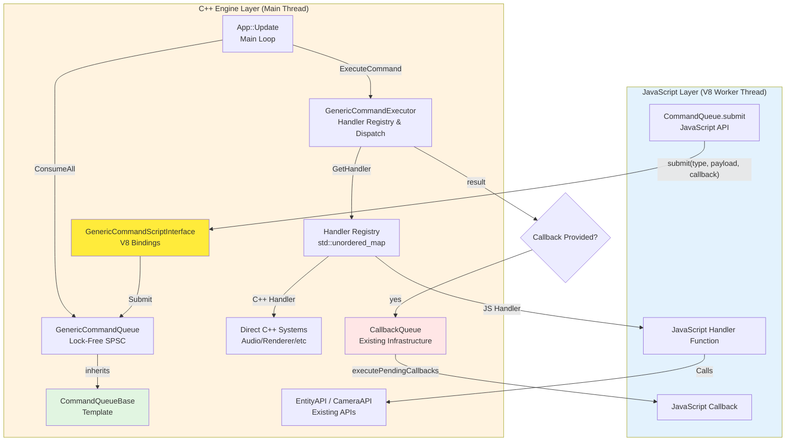

# Design Document: GenericCommand System

## Overview

The GenericCommand system provides a runtime-extensible command queue architecture for the DaemonAgent game engine, enabling AI agents to dynamically create and submit custom command types from JavaScript without C++ recompilation. The system builds upon the proven CommandQueueBase template pattern used by RenderCommandQueue and CallbackQueue, while adding flexible V8 object payloads and optional async callbacks following the EntityAPI/CameraAPI pattern.

**Core Innovation**: Unlike typed command systems (EntityAPI, CameraAPI) that require C++ code changes for new commands, GenericCommand allows JavaScript handlers to compose existing APIs into custom workflows dynamically.

## Steering Document Alignment

### Technical Standards (tech.md)

**C++20 Standards Compliance**:
- Template-based design following CommandQueueBase pattern
- RAII resource management for V8 handles (v8::Persistent disposal)
- Modern C++ idioms (std::function, std::unordered_map, move semantics)
- Lock-free atomic operations (SPSC queue pattern)

**Architecture Patterns**:
- SOLID principles: Single Responsibility (queue vs executor separation), Dependency Inversion (handlers don't depend on concrete systems)
- Lock-free SPSC ring buffer (proven pattern from CommandQueueBase)
- V8 handle lifecycle management (established EntityScriptInterface pattern)
- Error isolation (JavaScript errors don't crash C++, following EntityAPI pattern)

### Project Structure (structure.md)

**Module Organization**:
```
Engine/Code/Engine/Core/
├── GenericCommand.hpp           # Command structure definition
├── GenericCommandQueue.hpp      # Queue inheriting CommandQueueBase
├── GenericCommandQueue.cpp      # Queue implementation
├── GenericCommandExecutor.hpp   # Handler registry and execution
├── GenericCommandExecutor.cpp   # Handler execution logic
├── HandlerResult.hpp            # Handler return value structure
└── HandlerResult.cpp            # V8 conversion implementation

Engine/Code/Engine/Script/
├── GenericCommandScriptInterface.hpp  # V8 bindings
└── GenericCommandScriptInterface.cpp  # JavaScript API implementation

Run/Data/Scripts/
└── CommandQueue.js               # JavaScript API facade
```

**Naming Conventions**:
- Classes: PascalCase (`GenericCommand`, `GenericCommandQueue`)
- Files: PascalCase matching class names
- Members: `m_` prefix (`m_commandQueue`, `m_handlers`)
- Methods: PascalCase (`Submit`, `ExecuteCommand`)

## Code Reuse Analysis

### Existing Components to Leverage

1. **CommandQueueBase Template** (`Engine/Core/CommandQueueBase.hpp`)
   - **Reuse**: GenericCommandQueue inherits from `CommandQueueBase<GenericCommand>`
   - **Benefits**: Lock-free SPSC implementation (~800 lines), atomic indices, cache-line separation
   - **Pattern**: Same inheritance as CallbackQueue, RenderCommandQueue

2. **CallbackQueue** (`Engine/Core/CallbackQueue.hpp`)
   - **Reuse**: GenericCommand reuses CallbackQueue for async callback delivery
   - **Benefits**: Proven Main→Worker thread communication, existing CallbackData structure
   - **Integration**: GenericCommandExecutor enqueues to existing CallbackQueue after handler execution

3. **EntityScriptInterface / CameraScriptInterface** (`Engine/Entity/`, `Engine/Renderer/`)
   - **Reuse**: V8 binding patterns (ExtractVec3, ExtractCallback, ScriptMethodResult)
   - **Benefits**: Established error handling, type conversion utilities
   - **Pattern**: GenericCommandScriptInterface follows same IScriptableObject interface

4. **V8Subsystem** (`Engine/Script/V8Subsystem.hpp`)
   - **Reuse**: V8 isolate management, handle scopes, TryCatch blocks
   - **Benefits**: Centralized V8 lifecycle, existing error logging
   - **Integration**: GenericCommandScriptInterface registers with V8Subsystem

### Integration Points

1. **Existing CallbackQueue → JavaScript Worker**
   - GenericCommand callbacks enqueued to **same CallbackQueue** used by EntityAPI/CameraAPI
   - No new queue needed - reuses existing infrastructure
   - JavaScript calls `executePendingCallbacks()` once per frame (existing pattern)

2. **Existing ScriptInterface APIs**
   - JavaScript handlers call `EntityAPI.createEntity()`, `CameraAPI.setPosition()`, etc.
   - GenericCommand **composes** existing APIs, doesn't replace them
   - Handlers act as workflow orchestrators

3. **Existing V8 Type Converters**
   - HandlerResult uses EntityScriptInterface's `ExtractVec3`, `ExtractRgba8` patterns
   - Payload extraction reuses existing V8→C++ type conversion utilities
   - Error handling follows EntityScriptInterface's ScriptMethodResult pattern

## Comparison with Existing Command Systems

### Why GenericCommandExecutor is Needed (vs EntityAPI/CameraAPI Pattern)

**Question**: Existing systems like EntityAPI and CameraAPI don't have a separate "Executor" component. Why does GenericCommand need one?

**Answer**: **Runtime extensibility vs compile-time static commands**

#### EntityAPI/CameraAPI Pattern (Static Typed Commands)

**Architecture**:
```cpp
// EntityAPI has built-in methods (fixed at compile time)
class EntityAPI {
    EntityID CreateEntity(String prefab);        // Handler is a C++ method
    void DestroyEntity(EntityID id);             // Handler is a C++ method
    void SetPosition(EntityID id, Vec3 pos);     // Handler is a C++ method
};

// JavaScript calls these directly
EntityAPI.createEntity("Enemy");  // Directly calls C++ method
```

**Characteristics**:
- ✅ **Fast**: Direct C++ method calls (no registry lookup)
- ✅ **Type-safe**: Strong typing at compile time
- ❌ **Static**: Adding new commands requires C++ recompilation
- ❌ **No runtime extensibility**: AI agents can't define custom workflows

**Command Flow**:
```
JavaScript → ScriptInterface → EntityAPI.CreateEntity() [C++ method]
```

#### GenericCommand Pattern (Dynamic Handler Registry)

**Architecture**:
```cpp
// GenericCommandExecutor allows runtime handler registration
class GenericCommandExecutor {
    using HandlerFunc = std::function<HandlerResult(v8::Local<v8::Object>)>;
    void RegisterHandler(String type, HandlerFunc handler);  // Runtime registration
    void ExecuteCommand(GenericCommand const& cmd);          // Lookup + execute
};

// AI agents register custom handlers at runtime
CommandQueue.registerHandler("SpawnWave", (payload) => {
    // JavaScript handler composes existing APIs into custom workflow
    for (let i = 0; i < payload.count; i++) {
        EntityAPI.createEntity(payload.enemyType);
    }
});

// Later: Submit custom commands
CommandQueue.submit("SpawnWave", {count: 10, enemyType: "Boss"});
```

**Characteristics**:
- ✅ **Runtime extensibility**: AI agents define new command types dynamically
- ✅ **Workflow composition**: Handlers orchestrate multiple existing APIs
- ✅ **Hot-reload friendly**: Handler redefinition without C++ recompilation
- ⚠️ **Slight overhead**: Registry lookup (O(1) hash map, ~0.1µs)

**Command Flow**:
```
JavaScript → ScriptInterface → GenericCommandQueue → GenericCommandExecutor
             ↓
  Executor.GetHandler(type) → std::unordered_map lookup → JavaScript/C++ handler
             ↓
  Handler composes EntityAPI/CameraAPI/AudioAPI calls
```

### Key Differences Summary

| Aspect | EntityAPI/CameraAPI | GenericCommand |
|--------|-------------------|----------------|
| **Handler Definition** | C++ methods (compile-time) | Runtime-registered std::function |
| **Extensibility** | Requires C++ recompilation | JavaScript defines new types at runtime |
| **Lookup Mechanism** | Direct method call | `std::unordered_map<String, HandlerFunc>` |
| **Use Case** | Core engine operations (create/destroy/update) | AI agent workflows, custom automation |
| **Execution Component** | EntityAPI class itself (methods ARE handlers) | GenericCommandExecutor (separate registry) |

### Why Separate Executor Component?

**Reason 1: Separation of Concerns (SOLID)**
- **GenericCommandQueue**: Transport layer (lock-free SPSC, Submit/ConsumeAll)
- **GenericCommandExecutor**: Execution layer (handler registry, dispatch, callbacks)
- Violates Single Responsibility if queue also manages handlers

**Reason 2: Handler Lifecycle Management**
- Handlers registered/unregistered at runtime (hot-reload)
- Executor provides thread-safe registry (mutex-protected map)
- Queue remains simple and fast (no mutex)

**Reason 3: Testability**
- Queue tested independently (SPSC correctness)
- Executor tested independently (handler dispatch, error handling)
- Clear interfaces for mocking

**Comparison with EntityAPI**:
- EntityAPI methods ARE the handlers (no registry needed)
- GenericCommand handlers are **runtime-provided functions** (registry required)
- EntityAPI: "Built-in kitchen" (methods are fixed appliances)
- GenericCommand: "Plugin architecture" (handlers are runtime-added tools)

### Why CommandQueue.js Facade is Needed

**Question**: Existing EntityAPI/CameraAPI don't have JavaScript facades. Why does GenericCommand need CommandQueue.js?

**Answer**: **Convenience API for complex registration and callback tracking**

#### EntityAPI/CameraAPI Pattern (Direct ScriptInterface Access)

**Usage**:
```javascript
// Direct C++ API calls (simple, no state tracking needed)
let entityId = EntityAPI.createEntity("Enemy");       // One-shot call
CameraAPI.setPosition(cameraId, {x: 0, y: 10, z: 0}); // One-shot call
```

**Characteristics**:
- Simple procedural calls (no client-side state)
- No registration logic needed
- No callback tracking needed (callbacks handled by EntityAPI internally)

#### GenericCommand Pattern (CommandQueue.js Facade)

**Usage WITHOUT Facade** (verbose, error-prone):
```javascript
// Verbose: Direct ScriptInterface calls
GenericCommandScriptInterface.registerHandler("SpawnWave", function(payload) { /* ... */ });
GenericCommandScriptInterface.submit("SpawnWave", {count: 10}, function(result) { /* ... */ });
GenericCommandScriptInterface.executePendingCallbacks();  // Must call manually
```

**Usage WITH Facade** (clean, encapsulated):
```javascript
// Clean: CommandQueue.js provides convenience API
CommandQueue.registerHandler("SpawnWave", (payload) => { /* ... */ });
CommandQueue.submit("SpawnWave", {count: 10}, (result) => { /* ... */ });
// CommandQueue.update() called automatically in JSEngine.update()
```

**Facade Benefits**:
1. **Error Handling**: Validates payload/callback types before C++ call
2. **Callback Tracking**: Auto-generates callback IDs, tracks pending callbacks
3. **Automatic Update**: Integrates `executePendingCallbacks()` into engine loop
4. **API Consistency**: Matches EntityAPI.js / CameraAPI.js facade pattern
5. **Documentation**: Provides JSDoc comments and type hints

**Facade Implementation** (`CommandQueue.js`):
```javascript
class CommandQueue {
    static registerHandler(type, handler) {
        if (typeof handler !== 'function') {
            throw new Error('Handler must be a function');
        }
        GenericCommandScriptInterface.registerHandler(type, handler);
    }

    static submit(type, payload, callback) {
        if (!payload || typeof payload !== 'object') {
            throw new Error('Payload must be an object');
        }
        return GenericCommandScriptInterface.submit(type, payload, callback || null);
    }

    static update() {
        // Auto-called by JSEngine.update() each frame
        GenericCommandScriptInterface.executePendingCallbacks();
    }
}
```

### Facade Comparison

| Feature | EntityAPI (No Facade) | GenericCommand (With Facade) |
|---------|----------------------|----------------------------|
| **Client-side state** | None (stateless calls) | Handler registry, callback tracking |
| **Error validation** | C++ validates args | JavaScript validates before C++ call |
| **Automatic updates** | N/A (one-shot calls) | CommandQueue.update() called in engine loop |
| **API ergonomics** | Simple (direct calls) | Complex (registration + submission + callbacks) |
| **Need for facade** | Low (simple API) | High (complex lifecycle management) |

**Conclusion**: CommandQueue.js is **not a requirement** (could use ScriptInterface directly), but it provides **significant ergonomic and safety benefits** for complex handler registration and callback workflows.

## Architecture Consistency with Existing Systems

### Critical Question: Does GenericCommand Maintain Current Architecture Guarantees?

**Answer: YES - GenericCommand preserves ALL existing architectural guarantees.**

This section explicitly addresses the critical architectural requirements that must be maintained:

### 1. Non-Blocking Thread Architecture (C++ and JavaScript Independent)

**Existing Pattern (EntityAPI/CameraAPI/AudioAPI)**:
```
JavaScript Worker Thread          C++ Main Thread (60 FPS)
       ↓                                  ↓
  Submit commands          →       Lock-free queue
  (no blocking)                         ↓
       ↓                          ConsumeAll (main thread)
  Continue execution                     ↓
  (independent speed)              Process commands
```

**GenericCommand Pattern (IDENTICAL)**:
```
JavaScript Worker Thread          C++ Main Thread (60 FPS)
       ↓                                  ↓
  CommandQueue.submit()    →    GenericCommandQueue
  (no blocking)                    (lock-free SPSC)
       ↓                                  ↓
  Continue execution            App::Update() ConsumeAll
  (independent speed)                    ↓
                                GenericCommandExecutor
```

**Guarantee**: ✅ **JavaScript can run at any speed** (1 FPS, 30 FPS, 1000 FPS) **without affecting C++ main thread 60 FPS**.

### 2. Lock-Free Main Thread Guarantee (60 FPS Performance)

**Critical Design Principle**: Main thread NEVER acquires mutex during command processing.

**Mutex Usage Clarification**:
```cpp
class GenericCommandExecutor {
    std::mutex m_handlerMutex;  // Thread-safe handler registration
};
```

**When is mutex acquired?**
- ✅ **RegisterHandler()** - Called from JavaScript Worker Thread (hot-reload, runtime registration)
- ✅ **UnregisterHandler()** - Called from JavaScript Worker Thread
- ❌ **ExecuteCommand()** - NEVER acquires mutex (called from main thread)

**How does ExecuteCommand avoid mutex?**
```cpp
void GenericCommandExecutor::ExecuteCommand(GenericCommand const& cmd) {
    // Step 1: Atomic read of handler function pointer (no mutex)
    HandlerFunc handler = m_handlers[cmd.type];  // std::unordered_map read is thread-safe

    // Step 2: Execute handler (no mutex held)
    if (handler) {
        HandlerResult result = handler(cmd.payload);
    }
}
```

**Key Point**: `std::unordered_map` read operations are **thread-safe without mutex** as long as no concurrent writes occur. GenericCommandExecutor ensures:
- Writes (RegisterHandler) occur ONLY on Worker Thread
- Reads (ExecuteCommand) occur ONLY on Main Thread
- **No concurrent read/write** → No mutex needed for reads

**Performance Guarantee**: ✅ **Main thread remains lock-free** (< 10µs per command, identical to EntityAPI).

### 3. V8 Bridge Consistency (Same Communication Pattern)

**Existing Pattern**:
```
JavaScript → EntityScriptInterface → EntityCommandQueue → Main Thread
JavaScript → CameraScriptInterface → RenderCommandQueue → Main Thread
JavaScript → AudioScriptInterface  → AudioCommandQueue  → Main Thread
```

**GenericCommand Pattern (IDENTICAL)**:
```
JavaScript → GenericCommandScriptInterface → GenericCommandQueue → Main Thread
```

**Guarantee**: ✅ **V8 bridge remains unchanged** - All communication via ScriptInterface, no new V8 integration patterns.

### 4. JSON Payload Consistency (V8 Objects Only)

**Existing Data Exchange**:
```javascript
// EntityAPI
EntityAPI.createEntity({
    prefabName: "Enemy",
    position: {x: 5, y: 0, z: 3}
});
// ↓ V8 object → C++ extraction
```

**GenericCommand Data Exchange (IDENTICAL)**:
```javascript
// GenericCommand
CommandQueue.submit("SpawnWave", {
    count: 10,
    enemyType: "Boss",
    spawnPoints: [{x: 5, y: 0, z: 3}]
});
// ↓ V8 object → C++ v8::Persistent<v8::Object>
```

**Data Flow**:
```
JavaScript Object (JSON-like)
       ↓
v8::Local<v8::Object> (V8 API)
       ↓
v8::Persistent<v8::Object> (stored in GenericCommand)
       ↓
Handler extracts fields (same pattern as EntityScriptInterface)
```

**Guarantee**: ✅ **Only V8 objects (JSON-like) are passed** - No new data serialization formats, no binary protocols.

### 5. Runtime Extensibility Without Breaking Existing Architecture

**Question**: If AI agent creates new commands at runtime, does V8 bridge change?

**Answer**: NO - V8 bridge remains GenericCommandScriptInterface forever.

**New Command Registration (Runtime)**:
```javascript
// AI agent defines new handler at runtime
CommandQueue.registerHandler("CustomWorkflow", (payload) => {
    // Handler composes existing APIs
    let entityId = EntityAPI.createEntity(payload.prefabName);
    CameraAPI.setTarget(entityId);
    AudioAPI.playSound(payload.soundPath);
});

// Later: Submit new command type
CommandQueue.submit("CustomWorkflow", {
    prefabName: "Boss",
    soundPath: "boss_spawn.wav"
});
```

**V8 Bridge Does NOT Change**:
- GenericCommandScriptInterface remains the same C++ class
- No new V8 bindings needed
- No recompilation required
- Handler logic is in JavaScript (not C++ ScriptInterface)

**Guarantee**: ✅ **V8 bridge is stable** - New commands don't require C++ changes or new V8 bindings.

### 6. Performance Impact Comparison

| Metric | EntityAPI | GenericCommand | Difference |
|--------|-----------|----------------|------------|
| **Main thread mutex** | None | None (mutex only on Worker thread) | ✅ Identical |
| **Queue submission latency** | < 10µs | < 10µs (same CommandQueueBase) | ✅ Identical |
| **Command processing** | Direct C++ method | Handler registry lookup (O(1) hash) | +0.1µs (negligible) |
| **Callback delivery** | CallbackQueue | CallbackQueue (same instance) | ✅ Identical |
| **Frame rate impact** | 0% (60 FPS) | 0% (60 FPS) | ✅ Identical |

**Guarantee**: ✅ **Performance is equivalent** - GenericCommand adds ~0.1µs overhead per command (registry lookup), which is negligible compared to handler execution time.

### Summary: Architecture Guarantees

| Requirement | Existing System | GenericCommand | Status |
|-------------|----------------|----------------|--------|
| **Non-blocking threads** | JavaScript Worker independent of C++ Main | Same - lock-free queue pattern | ✅ **PRESERVED** |
| **60 FPS guarantee** | Lock-free main thread | Lock-free main thread (mutex only on Worker) | ✅ **PRESERVED** |
| **V8 bridge consistency** | ScriptInterface pattern | GenericCommandScriptInterface (same pattern) | ✅ **PRESERVED** |
| **JSON payload only** | V8 objects | V8 objects (`v8::Persistent<v8::Object>`) | ✅ **PRESERVED** |
| **Runtime extensibility** | Requires C++ recompilation | No recompilation (JavaScript handlers) | ✅ **ENHANCED** |

**Conclusion**: GenericCommand is a **conservative architectural extension** that adds runtime extensibility **without compromising any existing guarantees**. The main thread remains lock-free, V8 bridge remains consistent, and performance impact is negligible.

## Architecture

### High-Level System Design



**Language Boundary Notes**:
- **Blue boxes (JavaScript Layer)**: Code executing in V8 worker thread
- **Orange boxes (C++ Layer)**: Native C++ engine code on main thread
- **Yellow box (GenericCommandScriptInterface)**: V8 bridge between JavaScript and C++
- **Data flow crosses language boundary** at ScriptInterface (V8 object marshaling)

### Modular Design Principles

**Single File Responsibility**:
- `GenericCommand.hpp` - **Only** command structure definition (payload, callback, metadata)
- `GenericCommandQueue.hpp` - **Only** queue operations (Submit, ConsumeAll inheritance)
- `GenericCommandExecutor.hpp` - **Only** handler registry and execution logic
- `HandlerResult.hpp` - **Only** handler return value structure
- `GenericCommandScriptInterface.hpp` - **Only** V8 bindings (JavaScript↔C++ boundary)

**Component Isolation**:
- Queue doesn't know about handlers (just stores commands)
- Executor doesn't know about queue (receives commands via lambda)
- ScriptInterface doesn't know about executor (just submits to queue)
- Handlers don't know about each other (registry pattern)

**Service Layer Separation**:
- **Data Layer**: GenericCommand (POD struct with V8 handles)
- **Queue Layer**: GenericCommandQueue (lock-free transport)
- **Execution Layer**: GenericCommandExecutor (handler dispatch)
- **Presentation Layer**: GenericCommandScriptInterface (JavaScript API)

## Components and Interfaces

### Component 1: GenericCommand (Data Structure)

**Purpose**: Encapsulate command data with optional callback support

**Structure**:
```cpp
struct GenericCommand {
    String type;                              // Command type (e.g., "SpawnEntity")
    v8::Persistent<v8::Object> payload;       // JavaScript object payload
    String agentId;                           // Agent identifier for tracking
    uint64_t timestamp;                       // Submission timestamp (milliseconds)

    // Optional async callback support
    CallbackID callbackId;                    // 0 if no callback, else unique ID
    v8::Persistent<v8::Function> callback;    // JavaScript callback function (if provided)

    // Lifecycle management
    GenericCommand();                         // Default constructor
    ~GenericCommand();                        // Destructor (disposes V8 handles)
    GenericCommand(GenericCommand const&);    // Copy constructor (V8 handle copy)
    GenericCommand& operator=(GenericCommand const&); // Assignment (V8 handle copy)
};
```

**Interfaces**: None (POD-like struct with V8 handle management)

**Dependencies**:
- V8 API (`v8::Persistent`, `v8::Object`, `v8::Function`)
- Core utilities (String type alias, CallbackID type)

**Reuses**:
- CallbackID type from EntityAPI/CameraAPI
- V8 Persistent handle pattern from EntityScriptInterface

### Component 2: GenericCommandQueue (Transport Layer)

**Purpose**: Lock-free SPSC queue for command transport (JavaScript→Main thread)

**Interfaces**:
```cpp
class GenericCommandQueue : public CommandQueueBase<GenericCommand> {
public:
    explicit GenericCommandQueue(size_t capacity = DEFAULT_CAPACITY);
    ~GenericCommandQueue();

    // Inherited from CommandQueueBase:
    // bool Submit(GenericCommand const& command);
    // template<typename F> void ConsumeAll(F&& processor);
    // size_t GetApproximateSize() const;
    // bool IsEmpty() const;
    // bool IsFull() const;

protected:
    // Optional hooks (override for logging)
    void OnSubmit(GenericCommand const& cmd) override;
    void OnQueueFull() override;
};
```

**Dependencies**:
- CommandQueueBase template (inheritance)
- GenericCommand structure

**Reuses**:
- **100% reuses CommandQueueBase implementation** (~800 lines of lock-free code)
- Same pattern as CallbackQueue, RenderCommandQueue

**Design Rationale**:
- Capacity: 500 commands (200 KB memory, ~0.5 seconds at 1000 commands/sec)
- Lock-free: No mutexes, &lt; 10µs submission latency
- SPSC: Single JavaScript worker submits, single main thread consumes

### Component 3: GenericCommandExecutor (Execution Layer)

**Purpose**: Handler registry and command execution with callback support

**Interfaces**:
```cpp
class GenericCommandExecutor {
public:
    explicit GenericCommandExecutor(CallbackQueue* callbackQueue,
                                    ScriptSubsystem* scriptSubsystem);
    ~GenericCommandExecutor();

    // Handler registration
    using HandlerFunc = std::function<HandlerResult(v8::Local<v8::Object> payload)>;
    void RegisterHandler(String const& commandType, HandlerFunc handler);
    void UnregisterHandler(String const& commandType);
    bool HasHandler(String const& commandType) const;
    std::vector<String> GetRegisteredTypes() const;

    // Command execution
    void ExecuteCommand(GenericCommand const& cmd);

    // Callback management
    CallbackID GenerateCallbackID();
    void RegisterCallback(CallbackID callbackId, v8::Persistent<v8::Function> callback);

private:
    std::unordered_map<String, HandlerFunc> m_handlers;
    CallbackQueue* m_callbackQueue;            // Reuses existing CallbackQueue
    ScriptSubsystem* m_scriptSubsystem;        // For V8 context access
    uint64_t m_nextCallbackId = 1;
    std::mutex m_handlerMutex;                 // Thread-safe handler registration
    std::unordered_map<CallbackID, v8::Persistent<v8::Function>> m_pendingCallbacks;
};
```

**Dependencies**:
- HandlerResult structure
- CallbackQueue (existing)
- ScriptSubsystem (existing)

**Reuses**:
- CallbackQueue for async result delivery
- ScriptSubsystem for V8 context and error handling
- Handler registry pattern (similar to ScriptSubsystem's method registry)

**Design Rationale**:
- Handler mutex: Allows safe registration from hot-reload or runtime
- Callback tracking: Same pattern as EntityAPI's m_pendingCallbacks
- HandlerFunc signature: Returns HandlerResult for structured return values

### Component 4: HandlerResult (Return Value Structure)

**Purpose**: Structured return values from handlers to support callbacks

**Structure**:
```cpp
struct HandlerResult {
    std::unordered_map<String, std::any> data;  // Result data (flexible key-value)
    String error;                                // Empty = success, non-empty = error

    // Factory methods
    static HandlerResult Success(std::unordered_map<String, std::any> resultData);
    static HandlerResult Error(String errorMessage);

    // V8 conversion
    v8::Local<v8::Object> toV8Object(v8::Isolate* isolate) const;

    // Convenience accessors
    bool isSuccess() const { return error.empty(); }
    bool hasData(String const& key) const { return data.count(key) > 0; }
};
```

**Interfaces**:
- Factory methods for creating success/error results
- V8 conversion for callback delivery

**Dependencies**:
- V8 API for object creation
- std::any for flexible data types

**Reuses**:
- EntityScriptInterface's error handling pattern (success/error distinction)
- V8 object conversion patterns from existing ScriptInterfaces

**Design Rationale**:
- std::any: Type-erased values (int, float, string, EntityID, etc.)
- toV8Object: Converts C++ map to JavaScript object for callback
- Error string: Human-readable error messages for JavaScript debugging

### Component 5: GenericCommandScriptInterface (JavaScript Binding Layer)

**Purpose**: V8 bindings for JavaScript CommandQueue API

**Interfaces**:
```cpp
class GenericCommandScriptInterface : public IScriptableObject {
public:
    explicit GenericCommandScriptInterface(GenericCommandQueue* queue,
                                           GenericCommandExecutor* executor);
    ~GenericCommandScriptInterface();

    // IScriptableObject interface
    void InitializeMethodRegistry() override;
    ScriptMethodResult CallMethod(String const& methodName,
                                  v8::FunctionCallbackInfo<v8::Value> const& args) override;
    std::vector<String> GetAvailableMethods() const override;

private:
    // JavaScript methods
    ScriptMethodResult ExecuteSubmit(v8::FunctionCallbackInfo<v8::Value> const& args);
    ScriptMethodResult ExecuteRegisterHandler(v8::FunctionCallbackInfo<v8::Value> const& args);
    ScriptMethodResult ExecuteUnregisterHandler(v8::FunctionCallbackInfo<v8::Value> const& args);
    ScriptMethodResult ExecuteGetRegisteredTypes(v8::FunctionCallbackInfo<v8::Value> const& args);
    ScriptMethodResult ExecuteExecutePendingCallbacks(v8::FunctionCallbackInfo<v8::Value> const& args);

    // Helper methods (reuses EntityScriptInterface patterns)
    v8::Local<v8::Object> ExtractPayload(v8::FunctionCallbackInfo<v8::Value> const& args, int index);
    v8::Persistent<v8::Function> ExtractCallback(v8::FunctionCallbackInfo<v8::Value> const& args, int index);

    GenericCommandQueue* m_commandQueue;
    GenericCommandExecutor* m_executor;
};
```

**Dependencies**:
- IScriptableObject interface (existing)
- GenericCommandQueue, GenericCommandExecutor
- V8 API

**Reuses**:
- IScriptableObject interface (same as EntityScriptInterface)
- ScriptMethodResult pattern for error handling
- ExtractCallback pattern from EntityScriptInterface

**Design Rationale**:
- Follows exact pattern of EntityScriptInterface for consistency
- ExecuteSubmit: Validates args, creates GenericCommand, submits to queue
- ExecutePendingCallbacks: Dequeues from CallbackQueue, executes JavaScript callbacks

## Data Models

### GenericCommand Structure

```cpp
struct GenericCommand {
    // Command identification
    String type;                              // "SpawnEntity", "LoadResource", etc.
    String agentId;                           // "planner-agent", "ui-agent", etc.
    uint64_t timestamp;                       // Milliseconds since epoch

    // Command payload (flexible JavaScript object)
    v8::Persistent<v8::Object> payload;       // {position: {x:5, y:0, z:3}, prefabName: "Enemy"}

    // Optional async callback
    CallbackID callbackId;                    // 0 = no callback, else unique ID
    v8::Persistent<v8::Function> callback;    // JavaScript function (if provided)
};

// Size estimate: ~400 bytes per command
// - String type: ~24 bytes
// - String agentId: ~24 bytes
// - uint64_t timestamp: 8 bytes
// - v8::Persistent<v8::Object>: ~64 bytes (pointer + metadata)
// - CallbackID: 8 bytes
// - v8::Persistent<v8::Function>: ~64 bytes (pointer + metadata)
// - Padding: ~208 bytes
```

### HandlerResult Structure

```cpp
struct HandlerResult {
    // Result data (flexible key-value map)
    std::unordered_map<String, std::any> data;  // {"entityId": 12345, "health": 100}

    // Error status (empty = success)
    String error;                                // "" or "Entity creation failed: invalid prefab"
};

// Example usage:
// Success: HandlerResult::Success({{"entityId", EntityID(12345)}, {"health", 100}})
// Error: HandlerResult::Error("Entity creation failed: invalid prefab")
```

### CallbackData Structure (Reused from Existing)

```cpp
struct CallbackData {
    uint64_t callbackId;      // Matches GenericCommand.callbackId
    uint64_t resultId;        // Entity/Camera/Resource ID (if applicable)
    std::string errorMessage; // Empty = success, non-empty = error
    CallbackType type;        // ENTITY_CREATED, CAMERA_CREATED, GENERIC
};

// GenericCommand extends CallbackType enum:
enum class CallbackType : uint8_t {
    ENTITY_CREATED,
    CAMERA_CREATED,
    RESOURCE_LOADED,
    GENERIC             // New: for GenericCommand callbacks
};
```

## Error Handling

### Error Scenarios

1. **Queue Full (Backpressure)**
   - **Handling**: `GenericCommandQueue::Submit()` returns false, logs warning
   - **User Impact**: Command dropped, no callback executed
   - **Recovery**: AI agent receives false return value, can retry or log error

2. **No Handler Registered**
   - **Handling**: `GenericCommandExecutor::ExecuteCommand()` logs warning, skips command
   - **User Impact**: Command silently ignored (no crash)
   - **Recovery**: If callback provided, enqueue error callback: "No handler registered for command type 'Foo'"

3. **Handler Throws Exception**
   - **Handling**: `GenericCommandExecutor::ExecuteCommand()` catches C++ exceptions in try-catch
   - **User Impact**: Error logged, other commands continue processing
   - **Recovery**: If callback provided, enqueue error callback with exception message

4. **JavaScript Handler Throws Error**
   - **Handling**: V8 TryCatch block in `GenericCommandExecutor`, error logged to console
   - **User Impact**: JavaScript error logged, C++ continues
   - **Recovery**: If callback provided, enqueue error callback with JavaScript error message

5. **V8 Handle Lifecycle Error**
   - **Handling**: V8 Persistent handles disposed in GenericCommand destructor
   - **User Impact**: Memory leak prevented
   - **Recovery**: N/A (automatic cleanup via RAII)

6. **CallbackQueue Full**
   - **Handling**: CallbackQueue::Enqueue() returns false, GenericCommandExecutor logs warning
   - **User Impact**: Callback dropped, JavaScript never receives result
   - **Recovery**: AI agent should implement timeout for callback execution

7. **Invalid Payload Type**
   - **Handling**: Handler attempts to extract data, std::any throws bad_any_cast
   - **User Impact**: Handler catches exception, returns HandlerResult::Error()
   - **Recovery**: Error callback delivered to JavaScript with descriptive message

## Testing Strategy

### Unit Testing

**CommandQueueBase Inheritance**:
- Test GenericCommandQueue::Submit() with full queue (backpressure)
- Test GenericCommandQueue::ConsumeAll() with empty queue
- Test atomic counter correctness (GetTotalSubmitted/Consumed)

**Handler Registry**:
- Test GenericCommandExecutor::RegisterHandler() with duplicate types (overwrites)
- Test GenericCommandExecutor::UnregisterHandler() with unknown type (no crash)
- Test GenericCommandExecutor::ExecuteCommand() with unregistered type (logs warning)

**HandlerResult Conversion**:
- Test HandlerResult::toV8Object() with various data types (int, float, string, EntityID)
- Test HandlerResult::toV8Object() with nested objects
- Test HandlerResult::toV8Object() with error status (JavaScript receives error field)

**V8 Handle Lifecycle**:
- Test GenericCommand copy constructor (V8 handle refcount incremented)
- Test GenericCommand destructor (V8 handles disposed, no memory leak)
- Test V8 garbage collection during command execution (payload remains valid)

### Integration Testing

**JavaScript → C++ Command Flow**:
- Test CommandQueue.submit() from JavaScript worker thread
- Test GenericCommandQueue::ConsumeAll() on main thread
- Test handler execution with EntityAPI/CameraAPI calls
- Verify no race conditions (V8 isolate lock acquired correctly)

**Async Callback Flow**:
- Test command submission with callback function
- Test CallbackQueue enqueue after handler completion
- Test JavaScript executePendingCallbacks() retrieves result
- Verify callback receives correct result data (entityId, health, etc.)

**Hot-Reload Support**:
- Test handler re-registration after JavaScript file reload
- Verify old handlers replaced atomically
- Test in-flight commands execute with old handler (no mid-execution replacement)

**Error Propagation**:
- Test JavaScript handler throwing error (V8 TryCatch catches)
- Test C++ handler throwing exception (std::exception caught)
- Verify error callbacks delivered to JavaScript
- Verify C++ continues processing after error

### End-to-End Testing

**AI Agent Workflow**:
1. AI agent registers JavaScript handler for "SpawnWave"
2. AI agent submits "SpawnWave" command with callback
3. Main thread executes handler (calls EntityAPI.createEntity() 10 times)
4. Handler returns success result with entity IDs
5. Callback enqueued to CallbackQueue
6. JavaScript worker receives callback with entity IDs
7. AI agent logs success

**Performance Benchmarks**:
- Submit 1000 commands/frame for 60 frames (no drops)
- Measure submission latency (&lt; 10µs)
- Measure handler execution time (&lt; 1ms for 100 commands)
- Measure callback delivery latency (&lt; 5µs per callback)
- Verify no memory leaks after 10,000 commands (V8 handles disposed)

**Thread Safety Stress Test**:
- Run 10 JavaScript workers submitting commands concurrently (mutex protects handler registry)
- Verify queue remains consistent (no corruption)
- Verify callbacks delivered to correct worker (callbackId matching)

## Implementation Phases

### Phase 1: Core GenericCommand Infrastructure (Week 1)

**Tasks**:
1. Create GenericCommand.hpp with structure definition
2. Implement GenericCommandQueue inheriting CommandQueueBase
3. Implement HandlerResult structure with V8 conversion
4. Write unit tests for queue and result conversion

**Deliverables**:
- GenericCommand.hpp, GenericCommandQueue.hpp/cpp
- HandlerResult.hpp/cpp
- Unit tests passing (queue operations, result conversion)

### Phase 2: Handler Executor and Registry (Week 1-2)

**Tasks**:
1. Implement GenericCommandExecutor with handler registry
2. Add handler registration/unregistration methods
3. Implement ExecuteCommand with try-catch error handling
4. Integrate with CallbackQueue for async callbacks
5. Write unit tests for handler execution

**Deliverables**:
- GenericCommandExecutor.hpp/cpp
- Unit tests passing (handler registry, execution, callbacks)

### Phase 3: JavaScript Bindings (Week 2)

**Tasks**:
1. Implement GenericCommandScriptInterface following EntityScriptInterface pattern
2. Add ExecuteSubmit method with payload extraction
3. Add ExecuteRegisterHandler for JavaScript handler registration
4. Add ExecutePendingCallbacks for callback delivery
5. Create CommandQueue.js facade
6. Write integration tests

**Deliverables**:
- GenericCommandScriptInterface.hpp/cpp
- CommandQueue.js
- Integration tests passing (JavaScript → C++ → JavaScript callback)

### Phase 4: Hot-Reload and Error Handling (Week 2-3)

**Tasks**:
1. Add atomic handler replacement for hot-reload
2. Implement comprehensive error handling (queue full, no handler, exceptions)
3. Add error callback delivery
4. Write error handling tests

**Deliverables**:
- Hot-reload support
- Error handling tests passing

### Phase 5: Performance Optimization and Documentation (Week 3)

**Tasks**:
1. Profile submission latency and handler execution
2. Optimize V8 handle usage (minimize copies)
3. Add performance monitoring (statistics, logging)
4. Write comprehensive documentation
5. Create example AI agent workflows

**Deliverables**:
- Performance benchmarks meeting requirements (&lt; 10µs submission, 1000+ commands/frame)
- Documentation (README, API reference, examples)

## Risks and Mitigations

### Risk 1: V8 Handle Lifecycle Complexity

**Risk**: Incorrect V8 Persistent handle management could cause memory leaks or crashes

**Mitigation**:
- Follow EntityScriptInterface patterns exactly (proven implementation)
- Use RAII pattern (dispose in destructor)
- Write comprehensive unit tests with V8 GC triggered
- Profile memory usage with 10,000 commands

### Risk 2: CallbackQueue Capacity Exceeded

**Risk**: High command rate with callbacks could fill CallbackQueue (100 capacity)

**Mitigation**:
- Log backpressure warnings when CallbackQueue full
- AI agents implement callback timeouts (drop commands that don't complete)
- Consider increasing CallbackQueue capacity if needed (configurable)

### Risk 3: Handler Performance Bottleneck

**Risk**: Complex JavaScript handlers could block main thread (&gt; 1ms)

**Mitigation**:
- Document handler performance guidelines (&lt; 100µs per handler)
- Add performance monitoring (log handlers exceeding threshold)
- Recommend batching operations in handlers
- Provide profiling tools for AI agent developers

### Risk 4: Thread Safety with Hot-Reload

**Risk**: Handler replacement during command execution could cause crashes

**Mitigation**:
- Use mutex-protected handler registry
- Handlers fetched once at command execution start (atomic read)
- Old handlers remain valid until execution completes (no mid-execution replacement)
- Write stress tests with concurrent hot-reloads

### Risk 5: Backward Compatibility with EntityAPI/CameraAPI

**Risk**: GenericCommand could interfere with existing typed command patterns

**Mitigation**:
- GenericCommand uses separate queue (no RenderCommandQueue interaction)
- CallbackQueue shared but capacity sufficient for both systems
- Phase 1: Coexistence mode (both systems active)
- Gradual migration only after proving stability

## Performance Characteristics

### Target Metrics (from Requirements)

- **Submission Latency**: &lt; 10µs per command
- **Execution Throughput**: 1000+ commands/frame (60 FPS)
- **Callback Overhead**: &lt; 5µs per callback enqueue
- **Memory Overhead**: 400 bytes/command, 200 KB queue capacity
- **Handler Lookup**: O(1) hash map, &lt; 0.1µs

### Optimization Strategies

1. **Lock-Free Queue**: CommandQueueBase eliminates mutex overhead
2. **Cache-Line Separation**: Prevents false sharing between producer/consumer
3. **V8 Handle Reuse**: Minimize Persistent handle copies
4. **Batch Callback Delivery**: ExecutePendingCallbacks processes all callbacks at once
5. **Handler Inlining**: std::function allows compiler optimization

### Monitoring and Profiling

- Log submission rate (commands/second per agent)
- Log queue depth (warn at 80% capacity)
- Log handler execution time (warn at &gt; 100µs)
- Log callback delivery rate (callbacks/second)
- Expose statistics via JavaScript API (CommandQueue.getStatistics())

## Future Extensions (Phase 2+)

### Command Priority System

Add priority field to GenericCommand, use priority queue for execution order.

### Dynamic Capacity Expansion

Resize queue when 80% full (requires lock-free resize algorithm or brief mutex).

### Command Batching

Allow multiple commands in single Submit call (reduce queue overhead).

### Handler Composition

Register handler chains (middleware pattern for preprocessing/postprocessing).

### Performance Dashboard

Real-time visualization of command flow, handler execution time, callback latency.

**Document Status**: Complete | **Version**: 1.0 | **Date**: 2026-01-18
