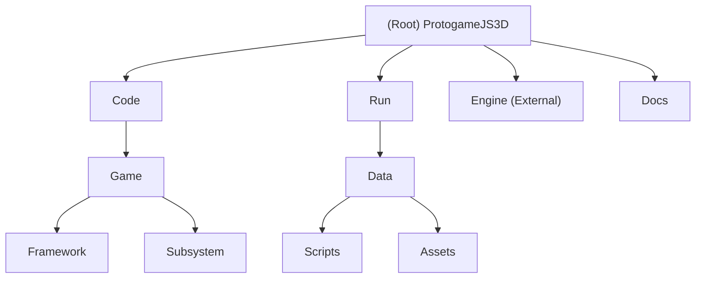

<!-- OPENSPEC:START -->
# OpenSpec Instructions

These instructions are for AI assistants working in this project.

Always open `@/openspec/AGENTS.md` when the request:
- Mentions planning or proposals (words like proposal, spec, change, plan)
- Introduces new capabilities, breaking changes, architecture shifts, or big performance/security work
- Sounds ambiguous and you need the authoritative spec before coding

Use `@/openspec/AGENTS.md` to learn:
- How to create and apply change proposals
- Spec format and conventions
- Project structure and guidelines

Keep this managed block so 'openspec update' can refresh the instructions.

<!-- OPENSPEC:END -->

# ProtogameJS3D - Dual-Language Game Engine

## Changelog
- **2025-10-30**: Multi-language agent architecture implementation
  - Created KĀDI protocol agent system for Python and TypeScript
  - Implemented calculator agents demonstrating cross-language communication
  - Established agent registry and comprehensive documentation
  - Integrated with multi-agents-collaboration workflow (M5-T2)
- **2025-10-27**: M4-T8 async architecture refactoring completed
  - Moved EntityAPI, EntityScriptInterface, EntityStateBuffer to Engine/Entity/
  - Moved CameraAPI, CameraScriptInterface, CameraStateBuffer to Engine/Renderer/
  - Moved StateBuffer template to Engine/Core/
  - Removed HighLevelEntityAPI facade (SOLID: Dependency Inversion Principle)
  - App now directly uses EntityAPI and CameraAPI
  - Removed deprecated JavaScript files (CameraSystem.js, RendererSystem.js, old interfaces)
  - Improved code reusability across projects
- **2025-09-20**: Initial AI context documentation created with adaptive scanning strategy

## Project Vision

ProtogameJS3D (originally FirstV8) is a cutting-edge research project demonstrating **dual-language game engine architecture** through seamless integration of the **Google V8 JavaScript Engine** with a **C++ game engine foundation (DaemonEngine)**. This project bridges high-performance C++ engine systems with flexible JavaScript game logic, enabling rapid prototyping while maintaining production-level performance.

## Architecture Overview

### Dual-Language Integration Model
```
Windows Application Entry
├── C++ Engine Foundation (DaemonEngine)
│   ├── Core Subsystems (Performance Critical)
│   ├── Entity System (Engine/Entity/)
│   ├── DirectX Rendering Pipeline
│   ├── FMOD Audio System
│   └── Resource Management
├── V8 JavaScript Runtime
│   ├── Game Logic Layer
│   ├── Hot-Reload System
│   └── Chrome DevTools Integration
└── Bidirectional Script Interface
    ├── C++ → JavaScript Bindings (EntityScriptInterface, CameraScriptInterface)
    └── JavaScript → C++ Callbacks
```

### Runtime Execution Flow
```
C++ Main Loop (App.cpp):
├── BeginFrame()
├── Update() ──→ V8::Execute(JSEngine.update()) ──→ JSGame Systems
│   ├── EntityAPI.update() (Engine-level entity management)
│   └── CameraAPI.update() (Engine-level camera control)
├── Render() ──→ V8::Execute(JSEngine.render()) ──→ JSGame Rendering
│   └── CameraAPI.render() (Engine-level camera rendering)
└── EndFrame()
```

## Module Structure Diagram



## Module Index

| Module | Path | Type | Description |
|--------|------|------|-------------|
| **Game Application** | `Code/Game` | C++ Application | Main executable with dual-language architecture and V8 integration |
| **JavaScript Logic** | `Run/Data/Scripts` | JavaScript Module | Game logic, system registration framework, input handling, and hot-reload support |
| **Game Assets** | `Run/Data` | Assets Module | 3D models, HLSL shaders, textures, audio files, and configuration |
| **Engine Foundation** | `../Engine` | C++ Library (External) | DaemonEngine core systems including Entity, Camera, V8Subsystem, rendering, and platform abstraction |
| **Documentation** | `Docs` | Documentation | Project documentation and research papers |

## Key Technologies

### Core Framework
- **Google V8 JavaScript Engine** v13.0.245.25 - Latest JavaScript runtime
- **DaemonEngine** - Custom C++ game engine foundation
- **Microsoft Visual Studio 2022** - C++20 development environment
- **DirectX Graphics API** - Windows graphics pipeline
- **FMOD Audio Engine** - Professional audio system

### Development Features
- **Hot-Reload System** - JavaScript changes without C++ recompilation
- **Chrome DevTools Integration** - Full debugging support for JavaScript
- **Dual-Language Debugging** - Visual Studio for C++, Chrome DevTools for JavaScript
- **Entity System** - Engine-level entity management with async state buffers
- **Camera System** - Engine-level camera control with script interfaces
- **Professional Build Pipeline** - MSBuild with automated V8 deployment

## Architecture Principles

### SOLID Principles Applied
- **Dependency Inversion**: App depends on EntityAPI/CameraAPI abstractions (Engine), not concrete implementations
- **Single Responsibility**: Entity and Camera logic separated into dedicated Engine modules
- **Interface Segregation**: Clean script interfaces (EntityScriptInterface, CameraScriptInterface)
- **Open/Closed**: Systems extensible through JavaScript without modifying C++ core

### Cross-Repository Design
- **Engine Repository**: Reusable systems (Entity, Camera, Core utilities)
- **Game Repository**: Game-specific application logic and assets
- **Clear Boundaries**: Script interfaces provide clean separation between layers

## Running and Development

### Prerequisites
- Visual Studio 2022 with C++ development workload
- Windows 10/11 (x64)
- NuGet Package Manager

### Quick Start
1. **Open Solution**: `ProtogameJS3D.sln` in Visual Studio 2022
2. **Build Configuration**: Select `Debug|x64` or `Release|x64`
3. **Build Solution**: Build → Build Solution (Ctrl+Shift+B)
4. **Run Application**:
   ```bash
   cd Run
   ProtogameJS3D_Debug_x64.exe  # or ProtogameJS3D_Release_x64.exe
   ```

### Development Workflow
1. **C++ Engine Development**: Modify files in `Code/Game/` and reference `Engine/`
   - Entity system in Engine repository: `Engine/Entity/`
   - Camera system in Engine repository: `Engine/Renderer/`
2. **JavaScript Game Logic**: Edit files in `Run/Data/Scripts/` (hot-reload enabled)
3. **Asset Management**: Add resources to `Run/Data/` subdirectories
4. **Configuration**: Modify `Run/Data/GameConfig.xml` for runtime settings

## Testing Strategy

### Current Testing Approach
- **Manual Integration Testing** - Visual testing of dual-language integration
- **JavaScript System Testing** - Runtime system registration and hot-reload verification
- **Performance Profiling** - C++/JavaScript interop performance analysis

### Test Files
- `Run/Data/Scripts/test_scripts.js` - JavaScript functionality testing
- Interactive testing through F1 key toggle functionality
- Chrome DevTools integration for runtime debugging

## Coding Standards

### C++ Standards (Engine/Game)
- **C++20 Standards** - Modern C++ features with full conformance
- **SOLID Principles** - Clean architecture patterns
- **RAII Patterns** - Resource management with automatic cleanup
- **Hungarian Notation** - Consistent naming conventions
- **Professional Documentation** - Academic-grade code documentation

### JavaScript Standards (Game Logic)
- **ES6+ Standards** - Modern JavaScript features
- **Modular Architecture** - Class-based system organization
- **Hot-Reload Compatibility** - File-based reload support
- **Chrome DevTools Integration** - Debugging-friendly code structure
- **System Registration Pattern** - Consistent API for runtime modifications

## AI Usage Guidelines

### Dual-Language Development Considerations
1. **Performance Boundaries** - Keep performance-critical code in C++
2. **Hot-Reload Design** - Structure JavaScript for safe runtime reloading
3. **Type Safety** - Careful handling of C++/JavaScript type conversions
4. **Error Isolation** - JavaScript errors should not crash C++ engine
5. **Memory Management** - Respect RAII patterns and V8 garbage collection

### AI Agent Integration Points
- **JavaScript System Registration** - Runtime system addition/modification
- **Input System Separation** - Isolated file for input handling logic
- **Asset Pipeline Configuration** - Dynamic asset loading and management
- **Chrome DevTools Integration** - Professional debugging environment
- **Entity Management** - Use EntityAPI through script interface
- **Camera Control** - Use CameraAPI through script interface
- **Multi-Agent Collaboration** - KĀDI protocol for cross-language agent communication

## Multi-Language Agent Architecture

### Overview

ProtogameJS3D supports a comprehensive multi-language agent system using the **KĀDI protocol**, enabling seamless communication between agents written in different programming languages (Python, TypeScript, and future languages).

### Agent Ecosystem

```
┌──────────────────────────────────────────────────────┐
│          ProtogameJS3D Game Engine                    │
│       (JavaScript via V8 Runtime)                     │
└───────────────────┬──────────────────────────────────┘
                    │ KĀDI Protocol (WebSocket)
                    ▼
┌──────────────────────────────────────────────────────┐
│                KĀDI Broker                            │
│  • Agent-to-agent routing                            │
│  • Message threading                                  │
│  • Event pub/sub system                              │
└─┬─────────────┬─────────────┬────────────────────────┘
  │             │             │
  ▼             ▼             ▼
┌────────┐  ┌───────────┐  ┌───────────┐
│Python  │  │TypeScript │  │Future     │
│Agents  │  │Agents     │  │Agents     │
│        │  │           │  │(Go/Rust)  │
└────────┘  └───────────┘  └───────────┘
```

### Available Agents

| Agent | Language | Status | Purpose |
|-------|----------|--------|---------|
| **Calculator** | Python | ✅ Active | Mathematical operations |
| **Calculator** | TypeScript | ✅ Active | Mathematical operations |
| **Planner** | Python | 🚧 Planned | Workflow orchestration |
| **UI-UX-Designer** | TypeScript | 🚧 Planned | Design generation |

### Cross-Language Communication

Agents communicate regardless of implementation language:

```python
# Python → TypeScript
calculator = await client.load('calculator', 'broker')
result = await calculator.add({'a': 5, 'b': 3})  # Calls TS agent
```

```typescript
// TypeScript → Python
const calculator = await client.load('calculator', 'broker');
const result = await calculator.multiply({ a: 6, b: 7 }); // Calls Python agent
```

### Integration with Workflow

Based on `.claude/multi-agents-collaboration.md`:

1. **Requirement Planning** → Planner Agent (Python)
2. **Frontend Tasks** → UI-UX-Designer Agent (TypeScript)
3. **Code Generation** → Code Generator Agent
4. **Testing** → Test Generator Agent

All agents coordinate via event-driven architecture with pattern-based pub/sub.

### Quick Start

```bash
# Start KĀDI broker
cd kadi-broker && npm run dev

# Start Python agent
cd agents/python/calculator-agent && python agent.py

# Start TypeScript agent
cd agents/typescript/calculator-agent && npm start
```

### Documentation

- [Multi-Language Agents Guide](agents/README.md)
- [Agent Implementation Planning](.claude/plan/multi-language-agents.md)
- [Agent Registry](agents/registry.json)
- [M5-T2: Agent Communication Protocol](.claude/plan/M5/development.md#m5-t2-agent-to-agent-communication-protocol)

### Recommended AI Modifications
- Extend JavaScript systems in `Run/Data/Scripts/`
- Add new subsystems through system registration API
- Modify input handling in `InputSystem.js`
- Create new game logic without touching C++ engine code
- Use CameraAPI.js for camera operations (new unified interface)

## Related Documentation
- [Game Module Details](./Code/Game/CLAUDE.md) - C++ application architecture
- [JavaScript Logic Details](./Run/Data/Scripts/CLAUDE.md) - JavaScript framework and systems
- [Assets and Configuration](./Run/Data/CLAUDE.md) - Game assets and runtime configuration
- [Engine Documentation](../Engine/CLAUDE.md) - Engine foundation and systems
- [Engine Entity Module](../Engine/Code/Engine/Entity/CLAUDE.md) - Entity system architecture
- [Project README](./Docs/README.md) - Complete project documentation

---

**Project Status**: Active Research Project | **Build Status**: Passing (Debug/Release) | **Documentation**: Academic Grade

*Built with passion for advancing game development research and education*
